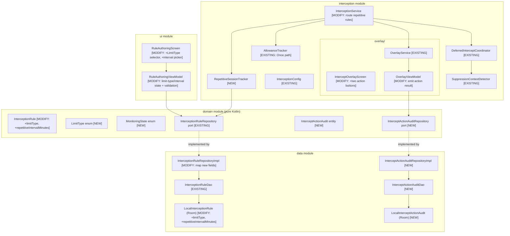
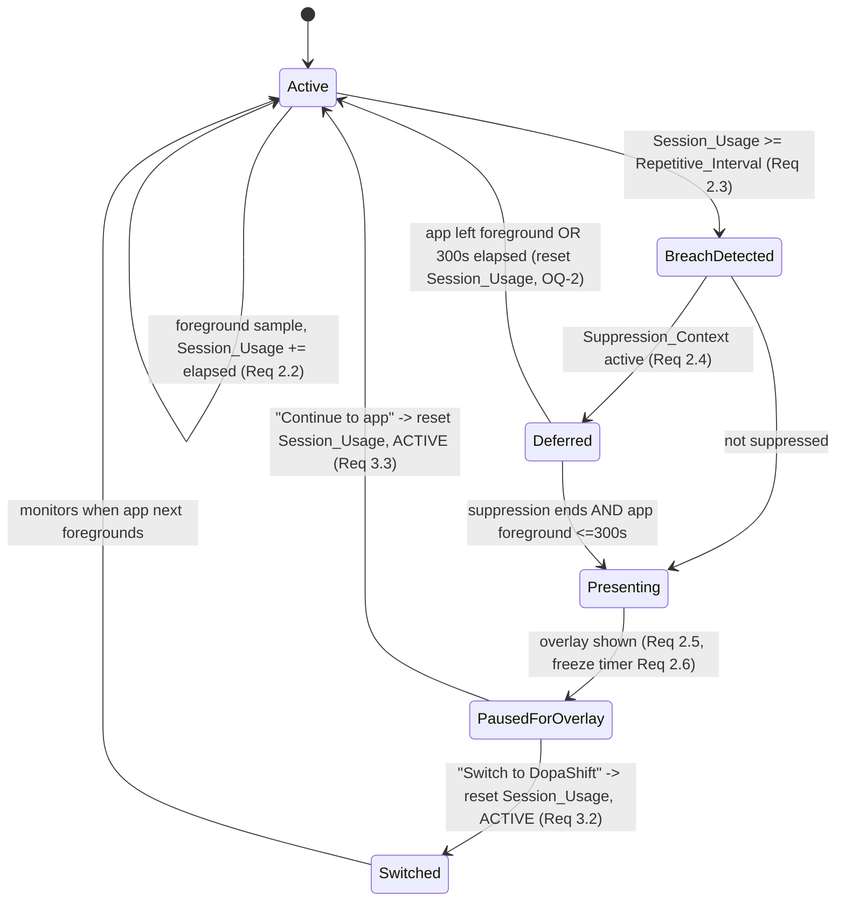

# Design Document: Repetitive App-Limit Interception

## Overview

This feature adds a **`Repetitive` limit type** to the DopaShift Android Screen-Time Interception Engine. The existing engine (see the `screen-time-interception-engine` spec) samples the foreground app, accumulates elapsed time against a Rule's single daily allowance (`Once`), and presents an Intercept_Screen when the allowance is depleted. This feature introduces a second enforcement pattern: a Rule may instead interrupt the user **every N minutes** of continued foreground use, freezing the timer while the overlay is visible and resetting the per-cycle counter after each dismissal.

The bulk of the runtime plumbing already exists — the foreground service, sampling loop, permission handling, Suppression_Context deferral, and the overlay window. This design describes the **actual current architecture** and then labels each component **[EXISTING]**, **[MODIFY]**, or **[NEW]** so implementation planning targets real deltas, not a rewrite. The net-new surface is small and well-contained: a `Limit_Type`/`Repetitive_Interval` on the Rule, a per-interval `Session_Usage` accumulator with a `PAUSED_FOR_OVERLAY` state, and two explicit overlay actions with local-only audit logging.

### Current state at a glance

| Capability | Requirement(s) | Status |
|---|---|---|
| Foreground sampling loop (foreground service, 3–30s configurable, default 5s) | 2.1 | **[EXISTING]** `InterceptionService`, `InterceptionConfig` |
| Per-app/day accumulation + depletion detection (`Once`) | (parent `Once` path) | **[EXISTING]** `AllowanceTracker` |
| Suppression_Context detection + 300s deferral | 2.4 | **[EXISTING]** `SuppressionContextDetector`, `DeferredInterceptCoordinator` (from `screen-time-interception-engine`) |
| Full-screen overlay Intercept_Screen | 3.1 | **[EXISTING]** `overlay/*` |
| Domain `InterceptionRule` entity + repository port | 1.7, 1.8 | **[MODIFY]** — add `limitType` + `repetitiveIntervalMinutes` |
| `LocalInterceptionRule` (Room) + DAO | 1.7 | **[MODIFY]** — add columns + migration |
| `Limit_Type` selector + interval picker in authoring UI | 1.1–1.6 | **[NEW]** — no repetitive authoring UI exists |
| Per-interval `Session_Usage` accumulation + `PAUSED_FOR_OVERLAY` state | 2.2–2.7 | **[NEW]** — `RepetitiveSessionTracker` |
| Two explicit overlay actions ("Continue to app" / "Switch to DopaShift") | 3.1–3.3 | **[MODIFY]** — overlay currently records engagement, not these two actions |
| Local-only intercept-action audit log | 3.4, 3.5 | **[NEW]** — `InterceptActionAuditRepository` |
| Localized action labels (en/hi/mr) | 3.6 | **[MODIFY]** — add strings |

## Architecture

The feature spans the three Android Clean Architecture layers. Dependency direction is `ui → domain ← data` and `interception → {domain, data}`. Repository ports live in `domain`; implementations live in `data`. The `interception` module hosts the runtime engine and overlay and depends on the domain ports.



### Key architectural decisions

1. **Extend the existing `InterceptionRule` rather than add a parallel entity [MODIFY].** Per OQ-3, one active Rule per app package. Adding `limitType: LimitType` and `repetitiveIntervalMinutes: Int?` to the existing entity keeps a single source of truth and reuses all existing user-scoping and CRUD. `Once` Rules leave `repetitiveIntervalMinutes` null.
2. **Isolate repetitive-cycle state in a dedicated `RepetitiveSessionTracker` [NEW]** instead of overloading `AllowanceTracker`. The daily-allowance tracker accumulates monotonically toward a per-day ceiling; the repetitive tracker accumulates toward a per-cycle interval, must freeze during `PAUSED_FOR_OVERLAY`, and resets to 0 on resume. These are different lifecycles; separating them keeps each independently testable and leaves the shipped `Once` path untouched.
3. **Model `Monitoring_State` explicitly as a domain enum [NEW]** (`ACTIVE`, `PAUSED_FOR_OVERLAY`, `SUPPRESSED`). The pause-and-freeze behavior (Requirement 2.5, 2.6) is safety-relevant for fairness (time on the overlay must not count), so the state transition is explicit and testable rather than an implicit boolean.
4. **Reuse the existing Suppression_Context deferral [EXISTING].** Requirement 2.4 is exactly the parent engine's `SuppressionContextDetector` + `DeferredInterceptCoordinator` behavior; the repetitive path routes breach events through the same coordinator instead of duplicating deferral logic.
5. **Log intercept actions to a local-only audit table [NEW], never synced.** Requirement 3.4/3.5 requires an aggregated, on-device audit entry with no remote transmission. A dedicated `InterceptActionAudit` entity + repository keeps this separate from raw telemetry and is structurally prevented from entering any sync path.

## Module / Package Layout

```
domain/  (pure Kotlin — no Android deps)
  entity/InterceptionRule.kt                    [MODIFY: +limitType, +repetitiveIntervalMinutes]
  entity/LimitType.kt                           [NEW enum: Once, Repetitive]
  entity/MonitoringState.kt                     [NEW enum: ACTIVE, PAUSED_FOR_OVERLAY, SUPPRESSED]
  entity/InterceptActionAudit.kt                [NEW]
  repository/InterceptionRuleRepository.kt      [EXISTING]
  repository/InterceptActionAuditRepository.kt  [NEW port]

data/
  local/entity/LocalEntities.kt                 [MODIFY: LocalInterceptionRule +2 columns; +LocalInterceptActionAudit]
  local/dao/InterceptionRuleDao.kt              [EXISTING]
  local/dao/InterceptActionAuditDao.kt          [NEW]
  repository/InterceptionRuleRepositoryImpl.kt  [MODIFY: map new fields]
  repository/InterceptActionAuditRepositoryImpl.kt [NEW]

interception/
  InterceptionService.kt                        [MODIFY: route repetitive rules through RepetitiveSessionTracker]
  RepetitiveSessionTracker.kt                   [NEW]
  overlay/InterceptOverlayScreen.kt             [MODIFY: +two action buttons]
  overlay/OverlayViewModel.kt                   [MODIFY: emit InterceptAction result]

ui/
  interception/RuleAuthoringScreen.kt           [MODIFY: +LimitType selector, +interval picker]
  interception/RuleAuthoringViewModel.kt        [MODIFY: limit-type/interval state + validation]
  interception/RuleAuthoringUiState.kt          [MODIFY: +limitType, +repetitiveIntervalMinutes, +intervalError]
```

## Components and Interfaces

### `InterceptionRule` **[MODIFY]** — `com.dopashift.domain.entity` (pure Kotlin)
Adds the limit-type dimension to the existing entity:
```kotlin
data class InterceptionRule(
    val id: UUID,
    val userId: UUID,
    val appPackageName: String,
    val dailyLimitMinutes: Int,                 // used when limitType == Once (1..480)
    val limitType: LimitType = LimitType.Once,  // Req 1.1, 1.2
    val repetitiveIntervalMinutes: Int? = null, // non-null iff Repetitive (1..120) — Req 1.4, 1.5
    val enabled: Boolean,
    val pausedForDate: LocalDate?,
    val createdAt: Instant
) {
    init {
        require(dailyLimitMinutes in 1..480) { "daily limit out of range" }
        when (limitType) {
            LimitType.Once -> require(repetitiveIntervalMinutes == null) { "Once rule must not set interval" }
            LimitType.Repetitive -> require(repetitiveIntervalMinutes in 1..120) { "interval out of range 1..120" }
        }
    }
}
```

### `LimitType` / `MonitoringState` **[NEW]** — `com.dopashift.domain.entity`
```kotlin
enum class LimitType { Once, Repetitive }
enum class MonitoringState { ACTIVE, PAUSED_FOR_OVERLAY, SUPPRESSED }
```

### `InterceptActionAudit` **[NEW]** — `com.dopashift.domain.entity`
```kotlin
enum class InterceptActionType { CONTINUE, SWITCH_TO_DOPASHIFT }
data class InterceptActionAudit(
    val id: UUID,
    val userId: UUID,
    val appPackageName: String,
    val actionType: InterceptActionType,
    val recordedAt: Instant
)   // local-only; never synced (Req 3.4, 3.5)
```

### `InterceptActionAuditRepository` **[NEW port]** — `com.dopashift.domain.repository`
```kotlin
interface InterceptActionAuditRepository {
    suspend fun append(userId: UUID, audit: InterceptActionAudit): Result<Unit>
    suspend fun listForUser(userId: UUID): List<InterceptActionAudit>
}
```
`append` writes on-device only; the implementation has no network dependency (Req 3.5). User-scoped like all Rule operations.

### `RepetitiveSessionTracker` **[NEW]** — `@Singleton` — `com.dopashift.interception`
Owns per-`Repetitive`-Rule cycle state:
```kotlin
class RepetitiveSessionTracker {
    // Req 2.2: accumulate only while ACTIVE
    fun onForeground(pkg: String, elapsedSeconds: Long): SessionResult
    // Req 2.5: freeze on overlay present
    fun markPausedForOverlay(pkg: String)
    // Req 2.7: reset + resume after dismissal and app return
    fun onOverlayDismissedAndReturned(pkg: String)
    fun stateOf(pkg: String): MonitoringState
}
sealed interface SessionResult {
    data object Accumulating : SessionResult
    data object Paused : SessionResult          // no accumulation (PAUSED_FOR_OVERLAY)
    data object IntervalBreached : SessionResult // Session_Usage >= interval -> trigger overlay
    data object NotRepetitive : SessionResult
}
```
Accumulates `Session_Usage` while the Rule is `ACTIVE` (2.2), signals `IntervalBreached` when usage ≥ interval (2.3), refuses to accumulate while `PAUSED_FOR_OVERLAY` (2.6), and on `onOverlayDismissedAndReturned` sets state `ACTIVE` and resets `Session_Usage` to 0 (2.7). Per OQ-2, foreground loss during a deferred interception also resets `Session_Usage`.

### `InterceptionService` **[MODIFY]** — `com.dopashift.interception`
On each sample, for a `Repetitive` Rule it calls `RepetitiveSessionTracker.onForeground`; on `IntervalBreached` it routes through the existing `DeferredInterceptCoordinator` (Suppression_Context check + 300s deferral, Req 2.4), then presents the overlay and calls `markPausedForOverlay` (2.5). On overlay action it calls `onOverlayDismissedAndReturned` (2.7). `Once` Rules keep flowing through `AllowanceTracker` unchanged.

### `InterceptOverlayScreen` / `OverlayViewModel` **[MODIFY]** — `com.dopashift.interception.overlay`
The overlay gains the two explicit primary actions "Continue to app" and "Switch to DopaShift" (3.1). `OverlayViewModel` emits an `InterceptAction` result the service consumes to route the correct behavior (3.2, 3.3) and to append the audit entry (3.4). Action labels are read from `strings.xml` (3.6).

### `RuleAuthoringViewModel` / `RuleAuthoringScreen` / `RuleAuthoringUiState` **[MODIFY]** — `ui`
Adds the mandatory Limit_Type selector defaulting to `Once` (1.1, 1.2). When `Once`, shows the existing 1–480 daily-limit input (1.3); when `Repetitive`, shows an interval picker constrained to 1–120 whole minutes (1.4, 1.5), rejecting invalid entries while retaining the last valid value and surfacing the range message (1.6). On save, persists `limitType`, `repetitiveIntervalMinutes`, and initial counters via `InterceptionRuleRepository` (1.7); a failed write preserves prior state and surfaces an error (1.8). All new strings localized (en/hi/mr).

## Data Models

### `LocalInterceptionRule` (Room) **[MODIFY]** — table `interception_rules`
Add two columns:
- `limitType: String` (`ONCE` | `REPETITIVE`, default `ONCE`)
- `repetitiveIntervalMinutes: Int?` (null for `Once`)

Requires a Room schema-version bump and migration:
```sql
ALTER TABLE interception_rules ADD COLUMN limitType TEXT NOT NULL DEFAULT 'ONCE';
ALTER TABLE interception_rules ADD COLUMN repetitiveIntervalMinutes INTEGER;
```

### `LocalInterceptActionAudit` (Room) **[NEW]** — table `intercept_action_audit`
`id`, `userId` (indexed), `appPackageName`, `actionType` (`CONTINUE` | `SWITCH_TO_DOPASHIFT`), `recordedAt`. Local-only; excluded from every sync path (Req 3.5). New DAO `InterceptActionAuditDao` with user-scoped `insert` and `listByUser`.

### `Session_Usage` state **[NEW]** (in-memory in `RepetitiveSessionTracker`)
```kotlin
data class RepetitiveSessionState(
    val packageName: String,
    val intervalSeconds: Int,
    val sessionUsageSeconds: Long,   // 0..intervalSeconds
    val monitoringState: MonitoringState
)
```
Ephemeral and per-cycle; not persisted (a cycle counter is meaningless across a process restart). Reset to 0 on overlay dismissal + app return, and on foreground loss during deferral (OQ-2).

## State Machine: Repetitive Interception Cycle



## Error Handling

| Failure | Handling | Requirement |
|---|---|---|
| Room write fails on Rule save (limit type / interval) | Repository returns `Result.failure`; prior persisted state untouched; UI surfaces localized error | 1.8 |
| Invalid Repetitive_Interval entered | Rejected; last valid value retained; localized "1–120 whole minutes" message shown | 1.6 |
| Suppression_Context active at interval breach | Presentation deferred up to 300s via existing coordinator; never shown while suppressed | 2.4 |
| App leaves foreground during deferral | Deferred intercept discarded; `Session_Usage` reset to 0 (OQ-2) | 2.7 |
| Overlay `addView` fails | Existing `OverlayService` fail-safe: stops itself; no stuck window | 3.1 |
| Audit-log write fails | Retried on next action cycle; failure never blocks the overlay action itself (action UX is not gated on audit) | 3.4 |

All exceptions logged via Timber with framework-level PII redaction; package names in the audit log are on-device only and never emitted to remote logs at info level.

## Localization

All new user-facing strings live in `res/values/strings.xml` (en) with matching `res/values-hi/` and `res/values-mr/` entries, per project localization rules; missing translations fall back to English (Req 3.6). Strings requiring localization (added in the same change):
- Rule_Authoring_Screen: Limit_Type selector labels ("Once" / "Repetitive"), interval-picker label, "Interval must be between 1 and 120 whole minutes" message.
- Intercept_Screen action labels: "Continue to app", "Switch to DopaShift".

## Security & Privacy

- **User scoping:** `limitType`/`repetitiveIntervalMinutes` reads and writes flow through the existing user-scoped `InterceptionRuleRepository` (parent Req 3.8); the new `InterceptActionAuditRepository` is likewise scoped by authenticated `userId`.
- **Local-only audit (Req 3.5):** `InterceptActionAudit` has no DTO and is not referenced by any sync component; individual intercept-interaction records never leave the device.
- **No new permissions:** reuses the already-granted `PACKAGE_USAGE_STATS` and `SYSTEM_ALERT_WINDOW`; identity from the existing Keycloak/OIDC session.

## Testing Strategy

Consistent with the workspace: **Kotest** property-based tests (≥100 iterations) for the pure logic, plus JUnit/example tests and instrumented tests for UI and system integration. This feature is a strong PBT candidate — `Session_Usage` accumulation, interval validation, the pause/reset lifecycle, and audit-log purity are pure(ish) functions over generated inputs with clear invariants. Overlay rendering, the authoring screen, and the Room migration use unit/instrumented tests. Reuse existing `TestFakes`, injectable `java.time.Clock` + `ZoneId`. Each property test is tagged `// Feature: android-app-limit-repitative, Property {N}`. The 80% JaCoCo gate applies.

## Correctness Properties

*A property is a characteristic or behavior that should hold true across all valid executions of the system — a formal statement bridging human-readable specifications and machine-verifiable guarantees.*

### Property 1: Limit-type selector defaults to Once
*For any* newly opened Rule_Authoring_Screen for a new Rule, the selected Limit_Type equals `Once`.
**Validates: Requirements 1.1, 1.2**

### Property 2: Repetitive-interval validation (accept in range, reject-and-retain)
*For any* prior valid interval and *any* candidate value, the value is accepted only if it is a whole number in 1–120 minutes inclusive; otherwise it is rejected and the stored interval remains equal to the prior valid value, with the range message exposed.
**Validates: Requirements 1.5, 1.6**

### Property 3: Rule persistence round-trip with limit type
*For any* valid Rule (`Once` or `Repetitive`), saving then reloading it preserves `limitType` and `repetitiveIntervalMinutes` (null for `Once`, 1..120 for `Repetitive`), and a save whose store write fails leaves the prior persisted state unchanged.
**Validates: Requirements 1.7, 1.8**

### Property 4: Session_Usage accumulates only while ACTIVE
*For any* sequence of foreground increments for a `Repetitive` Rule, `Session_Usage` equals the sum of increments applied while the Monitoring_State is `ACTIVE` and is unchanged by any increment applied while `PAUSED_FOR_OVERLAY`.
**Validates: Requirements 2.2, 2.6**

### Property 5: Interval breach triggers presentation within one sampling interval
*For any* `Repetitive` Rule whose `Session_Usage` reaches or exceeds its interval, a presentation is triggered within one sampling interval, subject to the Suppression_Context check.
**Validates: Requirements 2.3, 2.4**

### Property 6: Overlay present pauses accumulation
*For any* interval breach that results in the overlay being presented, the Rule's Monitoring_State becomes `PAUSED_FOR_OVERLAY` and no elapsed time is added to `Session_Usage` or any daily counter until dismissal.
**Validates: Requirements 2.5, 2.6**

### Property 7: Dismissal resets and resumes
*For any* Rule in `PAUSED_FOR_OVERLAY`, once the overlay is dismissed and the Monitored_App returns to the foreground, the Monitoring_State returns to `ACTIVE` and `Session_Usage` equals 0.
**Validates: Requirements 2.7**

### Property 8: Continue action routing
*For any* "Continue to app" tap, the overlay is removed, focus returns to the Monitored_App, `Session_Usage` is reset to 0, and Monitoring_State is `ACTIVE`.
**Validates: Requirements 3.1, 3.3**

### Property 9: Switch action routing
*For any* "Switch to DopaShift" tap, the overlay is removed, the DopaShift main activity is launched, `Session_Usage` is reset to 0, and Monitoring_State remains `ACTIVE`.
**Validates: Requirements 3.1, 3.2**

### Property 10: Every action writes exactly one local audit entry, never transmitted
*For any* executed overlay action, exactly one `InterceptActionAudit` entry is appended locally with the correct package and action type, and the produced record is absent from any sync payload.
**Validates: Requirements 3.4, 3.5**

## Requirements Traceability

| Requirement (AC) | Design component(s) | Status |
|---|---|---|
| 1.1 mandatory Once/Repetitive selector | `RuleAuthoringViewModel`, `RuleAuthoringScreen` | MODIFY (Property 1) |
| 1.2 default Once | `RuleAuthoringViewModel` | MODIFY (Property 1) |
| 1.3 Once shows 1–480 daily input | `RuleAuthoringScreen` | EXISTING |
| 1.4 Repetitive shows interval picker | `RuleAuthoringScreen` | NEW |
| 1.5 interval constrained 1–120 | `RuleAuthoringViewModel`, `InterceptionRule.init` | MODIFY (Property 2) |
| 1.6 reject invalid interval, retain + message | `RuleAuthoringViewModel` | NEW (Property 2) |
| 1.7 persist limit type + interval + counters | `InterceptionRuleRepositoryImpl`, `LocalInterceptionRule` | MODIFY (Property 3) |
| 1.8 save failure preserves state + error | `InterceptionRuleRepositoryImpl` | EXISTING contract (Property 3) |
| 2.1 sample 3–30s, default 5s | `InterceptionService`, `InterceptionConfig` | EXISTING |
| 2.2 accumulate Session_Usage while ACTIVE | `RepetitiveSessionTracker` | NEW (Property 4) |
| 2.3 breach → present within one interval | `RepetitiveSessionTracker`, `InterceptionService` | NEW (Property 5) |
| 2.4 suppression check + 300s defer | `SuppressionContextDetector`, `DeferredInterceptCoordinator` | EXISTING (Property 5) |
| 2.5 present → PAUSED_FOR_OVERLAY | `RepetitiveSessionTracker`, `InterceptionService` | NEW (Property 6) |
| 2.6 no accumulation while paused | `RepetitiveSessionTracker` | NEW (Property 4, 6) |
| 2.7 dismiss + return → ACTIVE + reset | `RepetitiveSessionTracker`, `InterceptionService` | NEW (Property 7) |
| 3.1 two action controls | `InterceptOverlayScreen` | MODIFY (Property 8, 9) |
| 3.2 Switch action routing | `OverlayViewModel`, `InterceptionService` | MODIFY (Property 9) |
| 3.3 Continue action routing | `OverlayViewModel`, `InterceptionService` | MODIFY (Property 8) |
| 3.4 append local audit entry | `InterceptActionAuditRepository`, `LocalInterceptActionAudit` | NEW (Property 10) |
| 3.5 no remote transmission of records | `InterceptActionAuditRepositoryImpl` | NEW (Property 10) |
| 3.6 localized action labels (en/hi/mr) | `strings.xml` (values, values-hi, values-mr) | MODIFY |

### Open questions carried from requirements

- **OQ-1:** Repetitive_Interval capped at 120 minutes for v1; longer cycles are better served by a `Once` daily limit.
- **OQ-2:** On foreground loss during a deferred interception, `Session_Usage` is reset to 0 (`RepetitiveSessionTracker` handles the reset), consistent with Requirement 2.7.
- **OQ-3:** One active Rule per app package for v1; the Limit_Type selector edits the single Rule rather than creating a second one.
