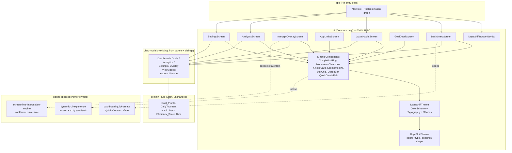
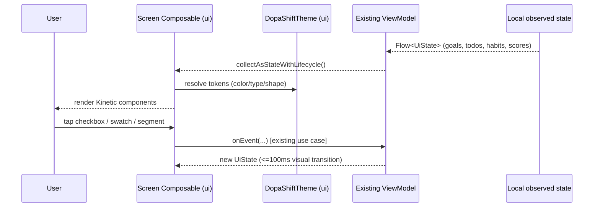

# Design Document

## High-Fidelity Android UI Experience (DopaShift Kinetic)

**Spec ID:** `android-ui-upgrade`
**Platform:** Android_App (Jetpack Compose + Material 3)
**Parent spec:** `.kiro/specs/dopa-shift/design.md`
**Requirements:** `.kiro/specs/android-ui-upgrade/requirements.md`
**Design tokens:** `.kiro/specs/android-ui-upgrade/design_requirement_android.md`
**Status:** Draft for review

---

## Overview

This design specifies the Android **presentation layer** for the seven primary DopaShift screens, realized in Jetpack Compose + Material 3 against the **DopaShift Kinetic** design system. It is a refinement of parent Requirement 17 (Professional UI/UX Design Standard): it changes how existing state is rendered, not what data exists.

The central design principle is **presentation-only, no parallel data path**. Every screen consumes state exposed by existing parent and sibling use cases (creation flows from `dashboard-quick-create`, interception scheduling from `screen-time-interception-engine`, motion/accessibility standards from `dynamic-ui-experience`). This spec adds a shared **design-system layer** (tokens → Compose theme), a set of **reusable Kinetic components**, and **seven screen composables with their view-models' rendering contracts** — it introduces no repositories, no Room entities, and no endpoints.

### Design Goals and Constraints

| Concern | Decision |
|---|---|
| Token authority | A single Compose `DopaShiftTheme` maps the `design_requirement_android.md` tokens to Material 3 `ColorScheme`, `Typography`, and `Shapes`; screens never use raw literals (AUI-8.1) |
| No parallel data path | Screens render state from existing use cases/view-models; this spec adds only stateless/stateful composables and their UI-state contracts (Assumption 4) |
| Reuse of sibling behavior | The FAB opens `dashboard-quick-create`; the overlay renders state from `screen-time-interception-engine`; motion/a11y follow `dynamic-ui-experience` (AUI-1.7, AUI-2, AUI-3) |
| Offline-first rendering | Analytics renders a partial-data/offline banner; every screen renders from locally observed state without a network round-trip (AUI-6.2) |
| Accessibility | 48dp Touch_Target minimum, content descriptions for all interactive/informational icons, monospace numerics to avoid jitter (AUI-8.3–8.5) |
| Localization | All copy from `en/hi/mr` string resources; no hardcoded user-facing strings (AUI-8.6, parent Req 12) |
| Security | Screens display only data scoped to the authenticated user; password flows delegate to Keycloak; no secret/token/PII rendered in logs (AUI-7.5, parent Req 22) |

### Requirements Coverage Map

| Requirement | Addressed by design section |
|---|---|
| AUI-1 Home Dashboard | Screen Composables → `DashboardScreen`; Kinetic Components (ring, checkbox, FAB) |
| AUI-2 Intercept Overlay | Screen Composables → `InterceptOverlayScreen`; Overlay State Contract |
| AUI-3 App Limits & Rules | Screen Composables → `AppLimitsScreen`; Segmented control |
| AUI-4 Goals & Habits | Screen Composables → `GoalsHabitsScreen`; Goal summary card |
| AUI-5 Goal Detail & Roadmap | Screen Composables → `GoalDetailScreen`; Roadmap progress |
| AUI-6 Analytics & Efficiency | Screen Composables → `AnalyticsScreen`; Bar chart color logic |
| AUI-7 Settings & Global Nav | Screen Composables → `SettingsScreen`, `DopaShiftBottomNavBar` |
| AUI-8 Design conformance | Design System Layer; Kinetic Components; Accessibility |
| AUI-9 Verification | Correctness Properties, Testing Strategy |

---

## Architecture

### Module Placement (Android Multi-Module Clean Architecture)

This feature lives almost entirely in the **`ui`** module (Compose only), respecting the existing dependency direction `app → [domain, data, ui, sync, interception]`. No new module is introduced and `domain` stays pure Kotlin.



**Placement rules honored:**
- `domain` is untouched — no new models, no framework imports.
- `ui` gains the `DopaShiftTheme`, the token object, the reusable Kinetic components, the seven screen composables, and the bottom nav bar.
- View-models are the existing ones owned by the parent and sibling specs; this spec defines only the **UI-state shapes those screens render** (contracts), not new business logic.
- The `interception` module continues to own overlay lifecycle; the overlay *composable* here renders the state it exposes (AUI-2).
- The `app` module hosts the `NavHost` wiring the four bottom-nav destinations.

### Screen render flow (offline-first, state-driven)



---

## Design System Layer

The single source of truth is the token file `design_requirement_android.md`. The `ui` module exposes those tokens to Compose so no screen uses a raw literal (AUI-8.1).

```kotlin
// ui/theme — maps design_requirement_android.md tokens to Compose

object DopaShiftTokens {
    // Surfaces
    val background = Color(0xFF0B0F17)
    val surface = Color(0xFF131B28)
    val surfaceElevated = Color(0xFF1A2436)
    val surfaceBorder = Color(0x1AFFFFFF)   // 10% white, 1dp stroke
    // Accents
    val primaryBlue = Color(0xFF2563EB)
    val momentumTeal = Color(0xFF14B8A6)
    val momentumTealContainer = Color(0x1A14B8A6)
    val warningAmber = Color(0xFFF59E0B)
    val dangerCoral = Color(0xFFEF4444)
    val scrimOverlay = Color(0xE60B0F17)
    // Text tiers
    val textPrimary = Color(0xFFF8FAFC)
    val textSecondary = Color(0xFF94A3B8)
    val textCompleted = Color(0xFF475569)
    val chartNoData = Color(0xFF1E293B)

    // Shape & rhythm
    val cardRadius = 16.dp
    val controlRadius = 12.dp
    val buttonRadius = 14.dp
    val touchTargetMin = 48.dp
    val listRowMinHeight = 56.dp
    val primaryButtonHeight = 52.dp
    val cardPadding = 16.dp
}

@Composable
fun DopaShiftTheme(content: @Composable () -> Unit) {
    val colorScheme = darkColorScheme(
        primary = DopaShiftTokens.primaryBlue,
        secondary = DopaShiftTokens.momentumTeal,
        surface = DopaShiftTokens.surface,
        background = DopaShiftTokens.background,
        onSurface = DopaShiftTokens.textPrimary,
        error = DopaShiftTokens.dangerCoral,
    )
    MaterialTheme(
        colorScheme = colorScheme,
        typography = DopaShiftTypography,   // Hanken Grotesk / Inter / JetBrains Mono roles
        shapes = DopaShiftShapes,           // 16dp cards, 12–14dp controls, full pills
        content = content,
    )
}
```

---

## Kinetic Components and Interfaces

Reusable, token-driven composables shared across screens. All meet the 48dp Touch_Target and expose semantics/content descriptions for TalkBack (AUI-8.3, AUI-8.5).

```kotlin
// ui/components

/** Circular progress meter; numeric center in JetBrains Mono (AUI-1.1, AUI-4.1, AUI-8.4). */
@Composable
fun CompletionRing(
    percent: Int,                 // 0..100, integer only
    size: Dp = 64.dp,
    trackColor: Color = DopaShiftTokens.surfaceElevated,
    progressColor: Color = DopaShiftTokens.momentumTeal,
    contentDescription: String,
)

/** 24dp box in a 48dp hit area; teal-checked + haptic on toggle (AUI-1.3, AUI-5.3). */
@Composable
fun MomentumCheckbox(
    checked: Boolean,
    onCheckedChange: (Boolean) -> Unit,
    label: String,
    struckThroughWhenChecked: Boolean = true,
)

/** 16dp radius, 1dp surfaceBorder stroke, zero elevation (AUI-8.2). */
@Composable
fun KineticCard(
    modifier: Modifier = Modifier,
    accentStroke: Color? = null,   // e.g. momentumTeal 1.5dp for the anchor habit
    content: @Composable ColumnScope.() -> Unit,
)

/** Material 3 segmented two-option pill; selected = teal bg + dark text (AUI-3.3). */
@Composable
fun SegmentedPill(
    options: List<String>,
    selectedIndex: Int,
    onSelect: (Int) -> Unit,
)

/** Rounded status/keyword/category chip on surfaceElevated (AUI-4.1, AUI-5.2). */
@Composable
fun KineticChip(text: String, accent: Color = DopaShiftTokens.momentumTeal)

/** Horizontal usage bar with label + mono value + percent (AUI-6.5). */
@Composable
fun UsageBar(label: String, value: String, fraction: Float, color: Color)

/** 56dp primary FAB; opens the dashboard-quick-create surface (AUI-1.7, AUI-4.3). */
@Composable
fun QuickCreateFab(onClick: () -> Unit)
```

### Screen Composables and their UI-State contracts

Each screen is a stateless composable driven by a UI-state object produced by an existing view-model. This spec owns only the **shape of the rendered state**, not its production.

```kotlin
// ui/screens

@Composable fun DashboardScreen(state: DashboardUiState, on: DashboardActions)
@Composable fun InterceptOverlayScreen(state: OverlayUiState, on: OverlayActions)
@Composable fun AppLimitsScreen(state: AppLimitsUiState, on: AppLimitsActions)
@Composable fun GoalsHabitsScreen(state: GoalsUiState, on: GoalsActions)
@Composable fun GoalDetailScreen(state: GoalDetailUiState, on: GoalDetailActions)
@Composable fun AnalyticsScreen(state: AnalyticsUiState, on: AnalyticsActions)
@Composable fun SettingsScreen(state: SettingsUiState, on: SettingsActions)

/** Global bottom nav across Home, Goals, Analytics, Settings (AUI-7.6). */
@Composable fun DopaShiftBottomNavBar(current: TopDestination, onNavigate: (TopDestination) -> Unit)

enum class TopDestination { HOME, GOALS, ANALYTICS, SETTINGS }
```

```kotlin
// ui/state — rendering contracts (no business logic)

data class DashboardUiState(
    val greeting: String,
    val streakDays: Int,
    val efficiencyPercent: Int,          // Efficiency_Score, integer
    val anchorHabit: AnchorHabitUi?,     // current-day Habit_Track checkpoint
    val focusTodos: List<TodoRowUi>,
    val activeGoals: List<GoalCardUi>,
)

data class OverlayUiState(
    val targetAppName: String,
    val cooldownSeconds: Int,            // supplied by screen-time-interception-engine
    val continueEnabled: Boolean,        // == (cooldownSeconds == 0)
    val rescueHabit: AnchorHabitUi?,
    val pendingTasks: List<TodoRowUi>,   // up to 3
)

data class AppLimitsUiState(
    val query: String,
    val installedApps: List<InstalledAppUi>,
    val limitType: LimitType,            // ONCE | REPETITIVE
    val intervalPreset: IntervalPreset?, // shown only when REPETITIVE
    val activeRules: List<RuleRowUi>,    // renders Rule
)

data class AnalyticsUiState(
    val range: DateRange,                // LAST_7 | LAST_30 | LAST_90
    val offlineOrPartial: Boolean,       // drives the warning banner (AUI-6.2)
    val summary: SummaryMetrics,         // average/highest/lowest/daysTracked
    val dailyBars: List<DailyBarUi>,     // score + category color
    val categoryUsage: List<UsageBarUi>,
)

data class SettingsUiState(
    val avatar: AvatarUi,
    val displayName: String,
    val accentSwatches: List<AccentSwatch>,   // 12 swatches
    val selectedAccent: AccentSwatch,
)

enum class LimitType { ONCE, REPETITIVE }
enum class DateRange { LAST_7, LAST_30, LAST_90 }
enum class DailyBarCategory { PRODUCTIVE, DISTRACTING, NO_DATA }
```

---

## Screen-Specific Design Notes

### Home Dashboard (AUI-1)
Header `KineticCard` hosts the streak `KineticChip` (amber), greeting (`sans-serif-black` 22sp), sub-caption, and a 64dp `CompletionRing` for the efficiency score. The Primary Anchor uses a `KineticCard(accentStroke = momentumTeal 1.5dp)` with a `MomentumCheckbox` that fires a haptic and a ≤100ms strikethrough transition (AUI-1.3). Today's Focus is a `KineticCard` with an inline quick-add row plus `TodoRowUi` rows; the `QuickCreateFab` and `DopaShiftBottomNavBar` are hosted by the screen scaffold.

### Intercept Overlay (AUI-2)
Rendered full-screen over the blocked app on a `scrimOverlay` background. The `continueEnabled` flag is derived directly from `cooldownSeconds == 0`, so the secondary button's disabled state is a pure function of state supplied by `screen-time-interception-engine` (AUI-2.7). The composable does not run the countdown timer itself — it renders the value it is given.

### App Limits & Rules (AUI-3)
A `SegmentedPill` toggles `LimitType`; the interval preset chips render **only** when `limitType == REPETITIVE` (AUI-3.4). Rule rows render the `Rule` domain model; `Edit`/`Pause today`/`Delete` are 48dp targets that dispatch to the `screen-time-interception-engine` view-model.

### Goals & Habits (AUI-4) and Goal Detail (AUI-5)
Goal cards render `GoalCardUi` with a mini `CompletionRing`, category chip, keyword chips, streak dot-matrix, and roadmap line. Goal Detail renders the checklist with `MomentumCheckbox` rows (56dp), inline add, and a roadmap progress bar computed as `completed / 30` (AUI-5.5).

### Analytics (AUI-6)
`DateRange` drives a `SegmentedPill`. The daily bar chart maps each `DailyBarUi.category` to a token color: `PRODUCTIVE → momentumTeal`, `DISTRACTING → dangerCoral`, `NO_DATA → chartNoData` (AUI-6.4). The offline/partial banner renders in a `dangerCoral` container when `offlineOrPartial` is true.

### Settings & Navigation (AUI-7)
Twelve `AccentSwatch`es render as circular color chips; the selected one shows a double-ring checkmark. Selecting a swatch dispatches an accent-seed change consumed by `DopaShiftTheme` so the accent propagates app-wide (AUI-7.4). The password card's inputs delegate to the Keycloak flow (AUI-7.5). `DopaShiftBottomNavBar` renders the four destinations with the active one in a `momentumTeal` pill.

---

## Data Models

**No new domain or persistence models are introduced.** All screens render existing parent domain models (`Goal_Profile`, `DailyTodoItem`, `Habit_Track`, `Efficiency_Score`, `Rule`). The `*UiState` and `*Ui` types above are **presentation-only view models** that live in the `ui` module and are mapped from domain models by the existing view-models. They hold no persistence identity and emit no `Change_Log` events.

---

## Correctness Properties

*A property is a characteristic that should hold across all valid executions. Most of this spec's criteria are UI-layout/rendering concerns validated by Compose UI and instrumented tests rather than property-based tests; the few input-varying rendering rules are stated as properties below.*

### Property 1: Continue Button Gated Strictly by Cooldown

*For any* `OverlayUiState`, the secondary "Continue to app" button SHALL be enabled if and only if `cooldownSeconds == 0`; for every positive cooldown value the button SHALL be disabled.

**Validates: Requirements AUI-2.7**

### Property 2: Interval Presets Appear Only in Repetitive Mode

*For any* `AppLimitsUiState`, the interval preset chips SHALL be rendered if and only if `limitType == REPETITIVE`, and SHALL NOT be rendered when `limitType == ONCE`.

**Validates: Requirements AUI-3.3, AUI-3.4**

### Property 3: Roadmap Progress Equals completed/30

*For any* `Habit_Track` with `completedDays` in `0..30`, the rendered roadmap progress fraction SHALL equal `completedDays / 30` and the counter SHALL read `Day currentDay/30`.

**Validates: Requirements AUI-5.5**

### Property 4: Daily Bar Color Matches Category

*For any* daily score bar, its rendered color SHALL be `momentumTeal` when `PRODUCTIVE`, `dangerCoral` when `DISTRACTING`, and `chartNoData` when `NO_DATA` — no other mapping SHALL occur.

**Validates: Requirements AUI-6.4**

### Property 5: Efficiency Ring Renders an Integer Percentage

*For any* `Efficiency_Score` in `0..100`, the Completion_Ring center SHALL render the value as an integer percentage (no fractional digits) in JetBrains Mono.

**Validates: Requirements AUI-1.1, AUI-8.4**

### Property 6: Completed Items Are Struck Through and Dimmed

*For any* `DailyTodoItem` or checklist item, when its completion state is true the row SHALL render at 50% opacity with strikethrough in the completed-text color, and when false it SHALL render normally.

**Validates: Requirements AUI-1.5, AUI-5.3**

### Property 7: Accent Selection Propagates App-Wide

*For any* accent swatch selected in Settings, the resolved accent seed SHALL be applied to the shared theme so every subsequently composed screen reads the same accent.

**Validates: Requirements AUI-7.4**

### Property 8: Every Interactive Control Meets the Touch Target

*For any* interactive control rendered by these screens, its hit area SHALL be at least 48dp × 48dp.

**Validates: Requirements AUI-8.3**

---

## Error Handling

| Category | Trigger | Strategy | User Experience |
|---|---|---|---|
| Offline / partial analytics data | No connectivity or incomplete range (AUI-6.2) | Render warning banner from `offlineOrPartial` flag; still render available data | Non-blocking `dangerCoral` banner; charts show what is available |
| Missing anchor habit | No active `Habit_Track` for today | Render the goal-dependent section as an inline prompt (defer to `dashboard-quick-create`) | Prompt to start a habit, never a blank card |
| Avatar upload too large | Photo > 5MB (AUI-7.1) | Reject client-side before upload; surface inline error | Inline size-limit message; prior avatar retained |
| Password change | User edits password fields (AUI-7.5) | Delegate entirely to Keycloak; never store credentials locally | Keycloak-managed flow; no local secret handling |
| Empty goal/task lists | Zero entities to render | Render inline prompts, not whole-screen errors | Contextual prompt surface (owned by `dashboard-quick-create`) |
| Missing localized string | Absent `hi`/`mr` resource | Fall back to `en` resource | Text renders in English fallback, never a resource key |

### Error Handling Principles
- Rendering is a pure function of the supplied UI-state; screens never fabricate data on error (Assumption 4).
- No error surface logs secrets, tokens, or PII; redaction is enforced at the logging layer (parent Req 22).
- All error copy is drawn from localized string resources (AUI-8.6).

---

## Testing Strategy

### Testing Approach
- **Compose UI tests** verify rendering of each screen's states, component content and ordering, Touch_Target sizes, and semantics/content descriptions.
- **Property-based tests** (Kotest, JVM) verify the input-varying rendering rules stated as Properties 1–8, using pure state→derivation helpers (e.g. `continueEnabled = cooldown == 0`, `barColor(category)`, `progressFraction(completed)`).
- **Instrumented tests** verify haptic invocation and strikethrough transitions on checkbox toggle (AUI-1.3, AUI-5.3) and cross-screen accent propagation (AUI-7.4).
- **Accessibility checks** verify 100% Touch_Target conformance (AUI-8.3) via the Accessibility Scanner / `assertTouchWidthIsAtLeast`.

This satisfies AUI-9.1 (a test per criterion, tagged with the criterion id, e.g. `AUI-2.7`).

### Property-Based Testing Configuration
- **Library:** Kotest Property Testing (Kotlin), run on JVM against pure derivation helpers extracted from the composables so no emulator is needed.
- **Minimum iterations:** 100 per property test.
- **Tag format:** `Feature: android-ui-upgrade, Property {N}: {property_text}`.
- **Mapping:** each of the 8 correctness properties maps to exactly one property-based test.

### Property-to-Test and AUI-9 Coverage Map

| Property | PBT focus | AUI-9 clause |
|---|---|---|
| P1 continue gating | `continueEnabled == (cooldown == 0)` for all cooldown values | 9.4 |
| P2 interval presets | Presets present iff `REPETITIVE` | 9.5 |
| P3 roadmap fraction | `completed/30` for all `0..30` | 9.6 |
| P4 bar color | Category → token color mapping | 9.7 |
| P5 integer percent | No fractional digits for all `0..100` | 9.2 |
| P6 completed styling | Opacity + strikethrough follows completion flag | — |
| P7 accent propagation | Selected seed read by theme | 9.8 |
| P8 touch target | ≥48dp for all interactive controls | 9.9 |

### Example / UI Tests (non-PBT criteria)

| Test kind | Criteria covered |
|---|---|
| Compose UI — Dashboard | AUI-1.1, AUI-1.2, AUI-1.4, AUI-1.6, AUI-1.7, AUI-1.8 |
| Instrumented — habit checkbox | AUI-1.3, AUI-5.3 |
| Compose UI — Overlay | AUI-2.1–2.6, AUI-2.8 |
| Compose UI — App Limits | AUI-3.1, AUI-3.2, AUI-3.5 |
| Compose UI — Goals / Detail | AUI-4.1–4.4, AUI-5.1–5.4 |
| Compose UI — Analytics | AUI-6.1, AUI-6.2, AUI-6.3, AUI-6.5, AUI-6.6 |
| Compose UI — Settings / Nav | AUI-7.1, AUI-7.2, AUI-7.3, AUI-7.5, AUI-7.6 |
| Design conformance | AUI-8.1, AUI-8.2, AUI-8.5, AUI-8.6 |

### Test Layer Matrix

| Layer | Framework | Scope | Coverage target |
|---|---|---|---|
| UI derivation (pure) | JUnit5 + Kotest (PBT) | State→render derivations (Properties 1–8) | 80% line coverage of helpers |
| Compose UI | Compose UI Test | Screen renderings, component content, semantics | 70% line coverage |
| Instrumented | Espresso / Compose instrumented | Haptics, transitions, accent propagation | Per-AC |
| Accessibility | Accessibility Scanner / assertions | Touch_Target and content descriptions | 100% interactive controls |

### CI Gate (AUI-9.10)
Every suite above runs in CI. Any failing test fails the build; no criterion in this spec is marked complete on a red build (parent Req 21 AC13). Touch_Target conformance (AUI-9.9), cooldown gating (AUI-9.4), and bar-color mapping (AUI-9.7) are treated as blocking.

### Why Most Criteria Are Not Property-Based
Layout, iconography, copy, and static-appearance criteria (the majority of AUI-1 through AUI-8) do not vary meaningfully with generated input and are validated by Compose UI, instrumented, and accessibility tests. Only the state→render derivations with a meaningful input space are expressed as properties.
