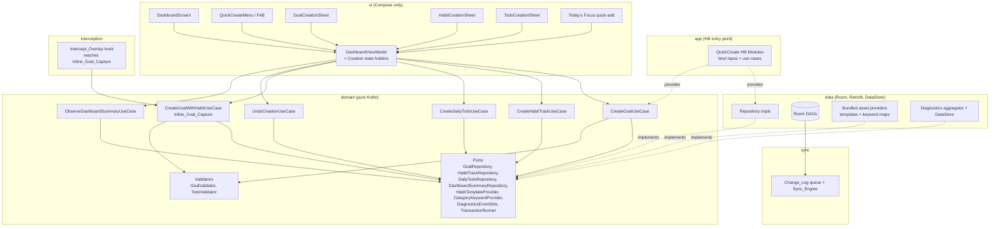
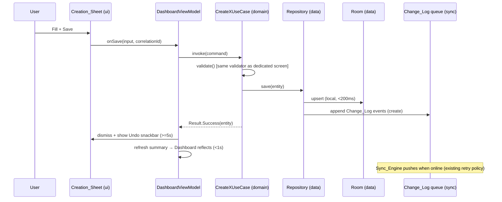
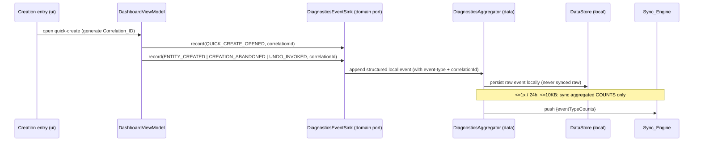
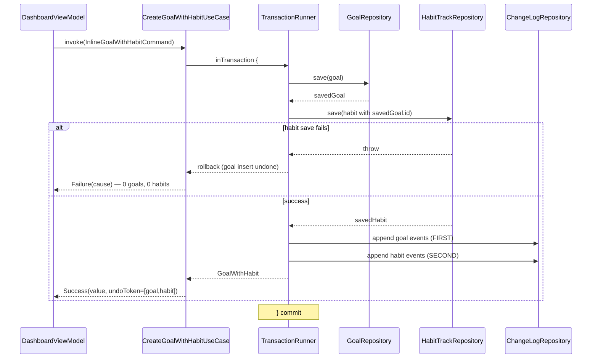

# Design Document

## Dashboard Quick-Create: Goals, Habits, and Daily To-Dos

**Spec ID:** `dashboard-quick-create`
**Platform:** Android_App
**Parent spec:** `.kiro/specs/dopa-shift/design.md`
**Requirements:** `.kiro/specs/dashboard-quick-create/requirements.md`
**Status:** Draft for review

---

## Overview

This design turns the Android Dashboard into a first-class creation surface. A user can create a `Goal_Profile`, a `Habit_Track`, or a `DailyTodoItem` without leaving the Dashboard — including the case where the user skipped onboarding and has **zero** goals. It closes the parent spec's "zero-goal dead end" (parent Req 1 AC4 / Req 17 AC4 / Req 20 AC11) by introducing **Inline_Goal_Capture**: the client creates the required goal inline instead of bypassing the no-orphan-references invariant.

The central design principle is **no parallel path**. Every Dashboard creation flow drives the *same* domain use cases and the *same* validation rules already used by the dedicated Goals, Habits, and Daily Tasks screens (DQC-1.10, DQC-1.11). Persistence goes to local Room first, and every mutation emits `Change_Log` events through the existing `Sync_Engine` (DQC-6.1). The Dashboard adds entry points, sheet UI, state-holders, and one composite use case (Inline_Goal_Capture) — it does not add a second data path.

### Design Goals and Constraints

| Concern | Decision |
|---------|----------|
| No divergent data path | Reuse parent use cases (`CreateGoalUseCase`, `CreateHabitTrackUseCase`, `CreateDailyTodoUseCase`) and `Change_Log` emission verbatim (DQC-6.1) |
| Offline-first | Local Room write within 200 ms; `Change_Log` enqueued regardless of connectivity (DQC-2.8, DQC-4.2) |
| No orphan references | Inline_Goal_Capture wraps goal + dependent in one local transaction, rolls back on failure, and orders goal `Change_Log` events first (DQC-3.3, DQC-3.4, DQC-6.2) |
| API-layer invariant preserved | The Backend still rejects a `Habit_Track`/rule with absent/invalid `goalId`; the client satisfies it by creating the goal first (DQC-5.5) |
| Undo is sync-safe | Undo issues a real delete through the use case → `Change_Log` deletion event, never a local-only rollback (DQC-1.7) |
| Offline habit authoring | Bundled 30-day templates and category→keyword maps ship in the APK; LLM mode is optional and degrades gracefully (Assumption 3, DQC-3.5–3.9) |
| Privacy | Only aggregated diagnostic counts sync (≤10 KB/24 h); LLM calls send only goal name/description/keywords (DQC-6.5, DQC-2.4) |
| Security | OAuth2/OIDC via Keycloak; every read/write scoped by authenticated `user_id`; client validation is a usability layer over server-side validation (DQC-1.11, DQC-5.5) |

### Requirements Coverage Map

| Requirement | Addressed by design section |
|---|---|
| DQC-1 Entry points | Architecture, Components (`QuickCreateMenu`, `DashboardViewModel`, quick-add), Undo Mechanism |
| DQC-2 Goal creation | Components (`GoalCreationSheet`, `CreateGoalUseCase`), Category→Keyword bundle, LLM Suggestion |
| DQC-3 Habit w/o goal | Inline_Goal_Capture, Habit Authoring Modes |
| DQC-4 To-Do creation | Components (quick-add + `TodoCreationSheet`), Data Models |
| DQC-5 Zero/Partial state | Dashboard State Resolution |
| DQC-6 Sync & traceability | Change_Log Emission & Ordering, Correlation & Diagnostics |
| DQC-7 Verification | Correctness Properties, Testing Strategy |

---

## Architecture

### Module Placement (Android Multi-Module Clean Architecture)

The feature respects the existing dependency direction `app → [domain, data, ui, sync, interception]`, with every feature module depending on `domain`. No new module is introduced.



**Placement rules honored:**
- `domain` stays pure Kotlin — no Android/Room/Hilt imports. It defines use cases, ports, and validators. Existing parent use cases are reused; only `CreateGoalWithHabitUseCase`, `UndoCreationUseCase`, and `ObserveDashboardSummaryUseCase` are new here.
- `data` implements the repository ports over Room DAOs, DataStore, and bundled APK assets (`HabitTemplateProvider`, `CategoryKeywordProvider`).
- `ui` is Compose-only: the FAB `Quick_Create_Menu`, the three `Creation_Sheet`s (Material 3 `ModalBottomSheet`), the Today's-Focus quick-add, and Hilt-injected state holders.
- `sync` owns the `Change_Log` queue and `Sync_Engine`; the feature calls into it via ports, never reimplements it.
- `interception` reuses `CreateGoalWithHabitUseCase` so Inline_Goal_Capture is reachable from the overlay (DQC-5.10).

### Creation Sequence (Offline-First, Same Path as Dedicated Screens)



### Correlation & Diagnostics Flow (DQC-6.3–6.5)



---

## Components and Interfaces

All interfaces below live in the Android `domain` module (pure Kotlin) unless noted. Types reuse the parent domain models (`GoalProfile`, `HabitTrack`, `HabitCheckpoint`, `DailyTodoItem`, `ChangeLogEntry`) verbatim.

### Domain: Use Cases

```kotlin
// === domain module — pure Kotlin, no framework imports ===

/** Reused from parent spec; the Dashboard calls the SAME instance (DQC-1.10). */
interface CreateGoalUseCase {
    suspend operator fun invoke(command: CreateGoalCommand): CreationResult<GoalProfile>
}

interface CreateDailyTodoUseCase {
    suspend operator fun invoke(command: CreateTodoCommand): CreationResult<DailyTodoItem>
}

interface CreateHabitTrackUseCase {
    suspend operator fun invoke(command: CreateHabitCommand): CreationResult<HabitTrack>
}

/**
 * Inline_Goal_Capture (DQC-3.2, DQC-3.3, DQC-6.2).
 * Creates a Goal_Profile and a dependent Habit_Track as ONE local transaction.
 * On any failure, the whole transaction rolls back (no partial state, no orphan).
 * Goal Change_Log events are emitted BEFORE the habit's.
 */
interface CreateGoalWithHabitUseCase {
    suspend operator fun invoke(command: InlineGoalWithHabitCommand): CreationResult<GoalWithHabit>
}

/**
 * Undo (DQC-1.7). Performs a real delete through the standard use case so a
 * Change_Log DELETION event is emitted through the Sync_Engine — NOT a local rollback.
 * For an Inline_Goal_Capture transaction, undo reverts the whole unit (OQ-3 default).
 */
interface UndoCreationUseCase {
    suspend operator fun invoke(token: UndoToken): CreationResult<Unit>
}

/** Single source for Zero_State vs Partial_State vs populated (DQC-5.3). */
interface ObserveDashboardSummaryUseCase {
    operator fun invoke(userId: UserId): Flow<DashboardSummary>
}
```

### Domain: Commands and Results

```kotlin
data class CreateGoalCommand(
    val userId: UserId,
    val name: String,               // 1-100, unique per user (case-insensitive)
    val category: String,           // 1-50
    val keywords: List<String>,     // 1..20, each 1-50
    val description: String? = null,
    val correlationId: CorrelationId,
    val origin: CreationOrigin = CreationOrigin.DASHBOARD
)

data class CreateTodoCommand(
    val userId: UserId,
    val text: String,               // 1-500, non-blank
    val dayDate: LocalDate,         // current date in user's tz
    val dueDateTime: Instant? = null,
    val reminder: ReminderDraft? = null,
    val correlationId: CorrelationId,
    val origin: CreationOrigin = CreationOrigin.DASHBOARD
)

data class CreateHabitCommand(
    val userId: UserId,
    val goalId: GoalId,             // MUST reference an existing, saved goal
    val authoring: HabitAuthoring,  // TEMPLATE | LLM | MANUAL (resolved to 30 checkpoints)
    val withReminder: Boolean = false,
    val correlationId: CorrelationId,
    val origin: CreationOrigin = CreationOrigin.DASHBOARD
)

data class InlineGoalWithHabitCommand(
    val goal: CreateGoalCommand,    // goal fields collected inline
    val authoring: HabitAuthoring,
    val withReminder: Boolean = false,
    val correlationId: CorrelationId // shared across the whole transaction
)

enum class CreationOrigin { DASHBOARD, DEDICATED_SCREEN, INTERCEPT_OVERLAY }

sealed interface HabitAuthoring {
    data class Template(val templateId: String) : HabitAuthoring
    data class Llm(val generated: List<String>) : HabitAuthoring          // 30 descriptions
    data class Manual(val authored: List<String>) : HabitAuthoring         // may be < 30 (auto-filled)
}

data class GoalWithHabit(val goal: GoalProfile, val habit: HabitTrack)

/** Result carries an UndoToken so the UI can offer a sync-safe Undo (DQC-1.6/1.7). */
sealed interface CreationResult<out T> {
    data class Success<T>(val value: T, val undo: UndoToken) : CreationResult<T>
    data class ValidationError(val fieldErrors: Map<String, String>) : CreationResult<Nothing>
    data class Rejected(val reason: String, val retainedInput: Any?) : CreationResult<Nothing> // sync/back-end rejection (DQC-2.11)
    data class Failure(val cause: Throwable) : CreationResult<Nothing>
}

data class UndoToken(val entityIds: List<EntityRef>, val correlationId: CorrelationId)
data class EntityRef(val type: String, val id: UUID)
```

### Domain: Repository & Service Ports

```kotlin
// Reused parent ports (GoalRepository, DailyTodoRepository, HabitTrackRepository, ChangeLogRepository)
// are used as-is. New ports introduced by this feature:

/** Single-query dashboard state feed; backed locally, refreshable from GET /v1/dashboard/summary. */
interface DashboardSummaryRepository {
    fun observe(userId: UserId): Flow<DashboardSummary>
    suspend fun refresh(userId: UserId)
}

/** Runs a block as one atomic local (Room) transaction. Implemented in `data`. */
interface TransactionRunner {
    suspend fun <T> inTransaction(block: suspend () -> T): T
}

/** Bundled APK content (Assumption 3) — offline, no endpoint in v1. */
interface HabitTemplateProvider {
    fun templatesForCategory(category: String): List<HabitTemplate> // each has 30 checkpoints
    fun defaultTemplate(category: String): HabitTemplate
}

interface CategoryKeywordProvider {
    fun presetCategories(): List<String>                 // Career Growth, Fitness, ... (DQC-2.2)
    fun suggestedKeywords(category: String): List<String> // DQC-2.3
}

/** Optional LLM suggestions; absent config => feature disabled at UI (DQC-2.5, DQC-3.7). */
interface GoalSuggestionService {
    val isConfigured: Boolean
    // sends ONLY name/description/keywords (DQC-2.4, parent Req 15 AC7)
    suspend fun suggestKeywordsAndDescription(name: String, description: String?, keywords: List<String>): SuggestionResult
    suspend fun generateHabitPlan(goalName: String, category: String, keywords: List<String>): HabitPlanResult // 30 days
}

/** Structured local diagnostics; only aggregated counts sync (DQC-6.4, DQC-6.5). */
interface DiagnosticsEventSink {
    suspend fun record(event: DiagnosticEventType, correlationId: CorrelationId, meta: Map<String, String> = emptyMap())
}

enum class DiagnosticEventType { QUICK_CREATE_OPENED, ENTITY_CREATED, CREATION_ABANDONED, UNDO_INVOKED }
```

### Domain: Validators (shared usability layer)

```kotlin
/** Same rules used by dedicated screens (DQC-1.11). Client-side only mirrors server-side. */
object GoalValidator {
    const val NAME_MAX = 100; const val CATEGORY_MAX = 50
    const val KEYWORD_MAX_LEN = 50; const val KEYWORDS_MAX = 20
    fun validate(name: String, category: String, keywords: List<String>, existingNamesLower: Set<String>): Map<String, String>
}

object TodoValidator {
    const val TEXT_MAX = 500; const val DAILY_CAP = 100
    fun validate(text: String, todayCount: Int): Map<String, String>
}
```

### UI: Composables and State Holders (`ui` module, Compose + Material 3)

```kotlin
// DashboardScreen hosts the FAB, Quick_Create_Menu, sheets, and Today's Focus quick-add.
@Composable fun DashboardScreen(viewModel: DashboardViewModel)

// Persistent FAB reachable in every scroll position/window size (DQC-1.1); expands to
// exactly three labeled+iconed actions in order: New Goal, New Habit, New To-Do (DQC-1.2).
@Composable fun QuickCreateMenu(state: QuickCreateMenuState, onAction: (QuickCreateAction) -> Unit)

@Composable fun GoalCreationSheet(state: GoalSheetState, callbacks: GoalSheetCallbacks)   // DQC-2
@Composable fun HabitCreationSheet(state: HabitSheetState, callbacks: HabitSheetCallbacks) // DQC-3 (hosts Inline_Goal_Capture step)
@Composable fun TodoCreationSheet(state: TodoSheetState, callbacks: TodoSheetCallbacks)     // DQC-4 full sheet
@Composable fun TodaysFocusQuickAdd(state: QuickAddState, onSubmit: (String) -> Unit)       // DQC-1.4, DQC-4.2

// Renders Zero_State / Partial_State inline prompts (DQC-5.2, DQC-5.3, DQC-5.6)
@Composable fun DashboardBody(summary: DashboardSummary, onPrompt: (CreationPrompt) -> Unit)
```

```kotlin
@HiltViewModel
class DashboardViewModel @Inject constructor(
    private val createGoal: CreateGoalUseCase,
    private val createTodo: CreateDailyTodoUseCase,
    private val createHabit: CreateHabitTrackUseCase,
    private val createGoalWithHabit: CreateGoalWithHabitUseCase,
    private val undo: UndoCreationUseCase,
    private val observeSummary: ObserveDashboardSummaryUseCase,
    private val diagnostics: DiagnosticsEventSink,
    private val templates: HabitTemplateProvider,
    private val keywords: CategoryKeywordProvider,
    private val suggestions: GoalSuggestionService,
    private val correlationIds: CorrelationIdFactory,
) : ViewModel() {
    val summary: StateFlow<DashboardSummary>          // drives Zero/Partial/populated rendering
    val activeSheet: StateFlow<ActiveSheet>           // None | Goal | Habit | Todo
    val snackbar: SharedFlow<UndoSnackbar>            // Undo action visible >=5s (DQC-1.6)
    // openQuickCreate() generates Correlation_ID at origin (DQC-6.3) and records QUICK_CREATE_OPENED
    // saveGoal/saveTodo/saveHabit route to the SAME use cases the dedicated screens use
    // onUndo(token) calls UndoCreationUseCase -> emits Change_Log deletion (DQC-1.7)
    // dismissSheetWithUnsavedInput() triggers confirm-discard (DQC-1.9)
}
```

### DI Wiring (`app` module, Hilt + KSP)

```kotlin
@Module @InstallIn(SingletonComponent::class)
abstract class QuickCreateRepositoryModule {
    @Binds abstract fun bindDashboardSummaryRepo(impl: RoomDashboardSummaryRepository): DashboardSummaryRepository
    @Binds abstract fun bindTransactionRunner(impl: RoomTransactionRunner): TransactionRunner
    @Binds abstract fun bindTemplateProvider(impl: AssetHabitTemplateProvider): HabitTemplateProvider
    @Binds abstract fun bindKeywordProvider(impl: AssetCategoryKeywordProvider): CategoryKeywordProvider
    @Binds abstract fun bindDiagnostics(impl: DataStoreDiagnosticsSink): DiagnosticsEventSink
}

@Module @InstallIn(SingletonComponent::class)
object QuickCreateUseCaseModule {
    // CreateGoal/Todo/Habit use cases are provided by the parent feature module and reused here.
    @Provides fun provideInlineUseCase(
        goalRepo: GoalRepository, habitRepo: HabitTrackRepository,
        changeLog: ChangeLogRepository, tx: TransactionRunner
    ): CreateGoalWithHabitUseCase = CreateGoalWithHabitInteractor(goalRepo, habitRepo, changeLog, tx)
}
```

---

## Inline_Goal_Capture: Atomic Transaction Design

This is the core mechanism that closes the zero-goal dead end without weakening the no-orphan invariant.

### Behavior

1. When the user selects **New Habit** with zero active goals, the habit sheet's first step is `Inline_Goal_Capture` collecting the minimum valid goal fields (DQC-2.1 = name, category, ≥1 keyword) — no blocking error, no navigation away (DQC-3.2).
2. On save, `CreateGoalWithHabitUseCase` runs inside `TransactionRunner.inTransaction { }`:
   - Validate goal fields (same `GoalValidator`) and resolve the habit's 30 checkpoints from the chosen authoring mode.
   - Persist the `GoalProfile` to Room.
   - Persist the `HabitTrack` (+ 30 `HabitCheckpoint`s) to Room referencing the just-saved `goalId`.
   - Append `Change_Log` events: **all goal events first, then all habit events** (DQC-6.2).
3. If **any** step fails (habit resolution, checkpoint persistence, constraint violation), the transaction aborts and Room rolls back the goal insert too — zero `GoalProfile` and zero `HabitTrack` persisted (DQC-3.3). No `Change_Log` events are committed for the aborted unit.
4. The client never writes a `HabitTrack` with a missing/unsaved `goalId` at any point (DQC-3.4). The Backend still enforces the same invariant on sync (DQC-5.5).



**Ordering guarantee (DQC-6.2):** `Change_Log` events are appended within the same transaction in a fixed order — goal `create` events, then habit `create` events — so a replay on another device never sees a habit before its goal exists.

**Atomicity note (Backend Delta 1):** A local Room transaction is atomic on-device. Across the network boundary, atomicity is achieved via the additive `POST /v1/goals` nested `habitTrack` payload (committed in one server transaction). The client-side ordering above guarantees that even without the nested endpoint, sync replay is never transiently orphaned.

---

## Dashboard State Resolution (Zero / Partial / Populated)

A single `DashboardSummary` drives rendering so the UI never issues more than one network call for state (Backend Delta 2, DQC-5.3).

```kotlin
data class DashboardSummary(
    val userId: UserId,
    val activeGoalCount: Int,
    val todayTodoCount: Int,
    val activeHabitCount: Int,
    val onboardingStatus: OnboardingStatus  // COMPLETED | SKIPPED | NOT_STARTED
) {
    val isZeroState: Boolean
        get() = activeGoalCount == 0 && todayTodoCount == 0 && activeHabitCount == 0
    fun sectionState(section: DashboardSection): SectionRenderState = when (section) {
        DashboardSection.GOALS  -> if (activeGoalCount > 0) SectionRenderState.POPULATED else SectionRenderState.INLINE_PROMPT
        DashboardSection.TODOS  -> if (todayTodoCount  > 0) SectionRenderState.POPULATED else SectionRenderState.INLINE_PROMPT
        DashboardSection.HABITS -> if (activeHabitCount > 0) SectionRenderState.POPULATED else SectionRenderState.INLINE_PROMPT
    }
}

enum class DashboardSection { GOALS, TODOS, HABITS }
enum class SectionRenderState { POPULATED, INLINE_PROMPT }
enum class OnboardingStatus { COMPLETED, SKIPPED, NOT_STARTED }
```

**Rendering rules:**
- **Zero_State** (all three counts zero): render three contextual creation prompts — create a goal, add a to-do, start a habit — each directly opening its `Creation_Sheet` (DQC-5.2). A whole-screen empty state is used *only* in Zero_State.
- **Partial_State** (some but not all populated): render populated sections normally and render only empty sections as inline prompts; never a whole-screen empty state (DQC-5.3). Goal-dependent sections remain visible as inline prompts so the capability stays discoverable (DQC-5.6).
- **Populated**: normal Dashboard.
- Entity types created during onboarding do not show Zero_State prompts (DQC-5.7). `OnboardingStatus` is persisted in DataStore and never re-presents onboarding after completion/skip (DQC-5.8); a dismissible "resume onboarding" entry lives in Settings and its dismissal is remembered (DQC-5.9).

The summary is observed as a `Flow`; each successful creation refreshes it so the Dashboard reflects the new entity within 1 second and the user is never navigated away (DQC-1.5, DQC-2.9).

---

## Undo Mechanism (DQC-1.6, DQC-1.7)

- On successful creation, `CreationResult.Success` carries an `UndoToken` listing the created `EntityRef`s. The UI shows a transient snackbar with an **Undo** action available ≥5 seconds.
- Activating Undo calls `UndoCreationUseCase`, which deletes each referenced entity through the **standard delete path** so a `Change_Log` **deletion** event flows through the `Sync_Engine` (parent Req 4 AC4–AC5). This is explicitly **not** a local-only rollback.
- For an Inline_Goal_Capture creation, the token references both the goal and the habit; Undo reverts the whole transaction as created (OQ-3 default), and the confirmation text names both entities.
- Menu/sheet dismissal (back gesture, scrim tap, FAB re-tap) creates nothing (DQC-1.8). Dismissing a sheet with unsaved input prompts confirm-before-discard (DQC-1.9). Abandonment records a `CREATION_ABANDONED` diagnostic event.

---

## Habit Authoring Modes (DQC-3.5–3.9)

The habit sheet offers three modes; all resolve to exactly 30 checkpoints (1–200 chars each) before persistence.

| Mode | Source | Offline? | Behavior |
|---|---|---|---|
| **Template** | `HabitTemplateProvider` (bundled APK asset) | Yes | Pre-fills all 30 checkpoints for the goal category; each individually editable before save (DQC-3.6) |
| **LLM** | `GoalSuggestionService.generateHabitPlan` | Needs config | If no provider configured, mode is disabled with an explanatory label and selection defaults to Template (DQC-3.7). On failure/timeout, falls back to Template, shows the reason non-blockingly, and retains already-entered input (DQC-3.8) |
| **Manual** | User-authored | Yes | If saved with < 30 checkpoints, remaining days auto-fill with the last authored description, disclosed to the user before saving (DQC-3.9) |

On create, the `HabitTrack` start date is the current date in the user's configured time zone, current-day pointer = 1, and the day-1 checkpoint renders on the Dashboard immediately (DQC-3.10). If an active track already exists for the goal, the user is told which track takes precedence in the overlay before saving (DQC-3.11). A daily checkpoint Reminder is offered but not required (DQC-3.12).

**Bundled content packaging (Assumption 3):** templates and category→keyword maps ship as APK assets (e.g., `assets/habit_templates/*.json`, `assets/category_keywords.json`), loaded by `data`-module asset providers. App-authored template text is localizable (`en/hi/mr`, OQ-2 default), distinct from user-generated content which is not translated.

---

## Correlation & Diagnostics (DQC-6.3–6.5)

- A `Correlation_ID` is generated at the point of origin (when the `Quick_Create_Menu` or a sheet opens) and propagated through every downstream use-case call and local write for that action (DQC-6.3). For Inline_Goal_Capture, one `Correlation_ID` spans the whole transaction.
- `DiagnosticsEventSink` records structured local events — `QUICK_CREATE_OPENED`, `ENTITY_CREATED`, `CREATION_ABANDONED`, `UNDO_INVOKED` — each with the `Correlation_ID` and a machine-parseable `event-type` field (DQC-6.4).
- Raw diagnostic records **never** sync. The `DiagnosticsAggregator` in `data` rolls events into per-type counts and syncs an aggregated summary at most once per 24 hours with a payload ≤10 KB (DQC-6.5). While offline, all events queue and sync on reconnect via the standard retry policy (DQC-6.6).
- Conflict outcomes on sync (an entity superseded/rejected) are surfaced non-blockingly and the losing edit is retained in conflict history (DQC-6.7). A back-end rejection (e.g., name collision from another device) retains the user's input, surfaces the specific reason, and offers correction — never silent discard (DQC-2.11).

**Security:** OAuth2/OIDC via Keycloak only; every repository read/write is scoped by the authenticated `user_id`; client validation is a usability layer over server-side validation (DQC-1.11, DQC-5.5). No secrets, tokens, or PII appear in diagnostic events or logs (redaction at the logging layer).

---

## Data Models

The feature reuses the parent's domain models and Room schema. No new tables are strictly required for creation itself (goals/habits/todos/checkpoints/change_log already exist). Two additive local structures support the Dashboard.

### Reused (parent) — unchanged

`GoalProfile`, `HabitTrack`, `HabitCheckpoint`, `DailyTodoItem`, `ChangeLogEntry`, and their Room entities (`LocalGoal`, `LocalHabitTrack`, `LocalHabitCheckpoint`, `LocalDailyTodo`, `LocalChangeLogEntry`) are used as-is. `Change_Log` create/delete event shapes are unchanged.

### New local structures (Android `data` module)

```kotlin
// Local diagnostic events — LOCAL ONLY, never synced raw (DQC-6.4/6.5).
@Entity(tableName = "quick_create_diagnostics")
data class LocalDiagnosticEvent(
    @PrimaryKey val id: String,
    val eventType: String,        // QUICK_CREATE_OPENED | ENTITY_CREATED | CREATION_ABANDONED | UNDO_INVOKED
    val correlationId: String,
    val entityType: String?,      // GOAL | HABIT | TODO, when applicable
    val occurredAt: Long          // epoch millis
)

// DataStore-backed onboarding + diagnostics-sync state (not a Room table).
data class QuickCreatePrefs(
    val onboardingStatus: OnboardingStatus,       // COMPLETED | SKIPPED | NOT_STARTED (DQC-5.8)
    val resumeOnboardingDismissed: Boolean,       // DQC-5.9
    val lastDiagnosticsSyncAt: Long?              // enforce <=1x / 24h (DQC-6.5)
)
```

### Change_Log event shapes for Inline_Goal_Capture (ordering)

For one Inline_Goal_Capture transaction, appended in this exact order (DQC-6.2):

```
1..n  { entityType: "goal",         entityId: <goalId>,  field: <name|category|keyword|...>, value: <json> }
n+1.. { entityType: "habit_track",  entityId: <habitId>, field: <goalId|startDate|currentDay|...>, value: <json> }
      { entityType: "habit_checkpoint", entityId: <cpId>, field: <dayNumber|description|status>, value: <json> } (x30)
```

An Undo appends deletion events (`value: null`) for the same entities through the standard path (DQC-1.7).

### Backend Deltas (additive, non-breaking)

- `POST /v1/goals` accepts an optional nested `habitTrack` payload committed in one server transaction (server-side atomicity for Inline_Goal_Capture; Backend Delta 1).
- `GET /v1/dashboard/summary` returns per-entity-type counts (`activeGoalCount`, `todayTodoCount`, `activeHabitCount`) sufficient to distinguish Zero_State from Partial_State in one response (Backend Delta 2, DQC-5.3).
- No endpoint is required for bundled habit templates or category→keyword maps in v1 (Backend Delta 3, Assumption 3).

Both endpoints are additive under parent Req 10 AC5 — existing clients and payloads remain valid.


---

## Correctness Properties

*A property is a characteristic or behavior that should hold true across all valid executions of a system — essentially, a formal statement about what the system should do. Properties serve as the bridge between human-readable specifications and machine-verifiable correctness guarantees.*

The properties below were derived from the acceptance-criteria prework analysis and consolidated to eliminate redundancy. UI-layout, timing-only, cross-service, and meta (test-coverage) criteria are validated by unit/UI/integration tests in the Testing Strategy rather than by property-based tests.

### Property 1: Dashboard and Dedicated-Screen Creation Are Equivalent

*For any* valid or invalid creation input and *for any* entity type (goal, habit, to-do), creating that entity with `origin = DASHBOARD` SHALL produce the same acceptance/rejection outcome AND the same set of `Change_Log` events as creating it with `origin = DEDICATED_SCREEN` — the Dashboard is not a parallel implementation.

**Validates: Requirements 1.10, 6.1**

### Property 2: Goal Field Validation and Case-Insensitive Uniqueness

*For any* goal creation input, the system SHALL accept it if and only if the name is 1–100 characters and unique per user (compared case-insensitively), the category is 1–50 characters, and there are between 1 and 20 keywords each 1–50 characters; any input violating a bound or duplicating an existing name (in any letter case) SHALL be rejected with a field-level error.

**Validates: Requirements 1.11, 2.1, 2.6**

### Property 3: To-Do Creation Validity and Invariants

*For any* to-do text, creation SHALL succeed if and only if the text is non-blank (not empty and not whitespace-only) and at most 500 characters; when it succeeds the created `DailyTodoItem` SHALL have no associated goal and a `dayDate` equal to the current date in the user's configured time zone; when it fails the item count and state SHALL be unchanged.

**Validates: Requirements 4.1, 4.3, 4.5, 4.7**

### Property 4: Daily To-Do Cap Is Never Exceeded

*For any* user on *any* day, when 100 `DailyTodoItem`s already exist for that day, a further creation attempt SHALL be rejected — the per-user per-day count SHALL never exceed 100.

**Validates: Requirements 4.6**

### Property 5: Offline Local Persistence and Change_Log Enqueue

*For any* valid entity created from the Dashboard while offline, the entity SHALL be persisted to the local Room store within 200 milliseconds and the corresponding create `Change_Log` events SHALL be enqueued, with no behavior difference other than the sync-pending indicator.

**Validates: Requirements 2.8, 4.2, 4.9**

### Property 6: Inline_Goal_Capture Atomic Rollback

*For any* Inline_Goal_Capture command where dependent `Habit_Track` creation fails for any reason, after the operation the persisted state SHALL contain zero newly created `Goal_Profile`s and zero `Habit_Track`s from that transaction, and no `Change_Log` events from the aborted unit SHALL be committed.

**Validates: Requirements 3.3**

### Property 7: No-Orphan Invariant Across All Creation Paths

*For any* sequence of creation operations from any Dashboard entry point, the persisted store SHALL never contain a `Habit_Track` referencing a non-existent or unsaved `Goal_Profile`.

**Validates: Requirements 3.4**

### Property 8: Change_Log Ordering — Goal Before Dependent

*For any* Inline_Goal_Capture creation, in the emitted `Change_Log` event sequence every event for the `Goal_Profile` SHALL precede every event for the dependent `Habit_Track` (and its checkpoints), so replay on another device is never transiently orphaned.

**Validates: Requirements 6.2**

### Property 9: Undo Emits a Change_Log Deletion Event

*For any* entity created from the Dashboard, invoking Undo SHALL delete the created entity AND emit a corresponding `Change_Log` deletion event through the standard Sync_Engine pipeline — never a local-only rollback.

**Validates: Requirements 1.7**

### Property 10: Habit Authoring Resolves to Exactly 30 Valid Checkpoints

*For any* habit authoring input — a bundled template for any category, or manual authoring of between 1 and 29 checkpoints — the saved `Habit_Track` SHALL contain exactly 30 checkpoints, each with a description of 1–200 characters; for manual authoring with fewer than 30, days beyond the last authored one SHALL equal the last authored description.

**Validates: Requirements 3.6, 3.9**

### Property 11: Habit-Create Invariants

*For any* `Habit_Track` created from the Dashboard, its `startDate` SHALL equal the current date in the user's configured time zone and its current-day pointer SHALL equal 1.

**Validates: Requirements 3.10**

### Property 12: LLM Failure Falls Back to Template Without Losing Input

*For any* LLM plan-generation failure or timeout, the habit authoring mode SHALL fall back to template mode and SHALL retain any input the user already entered in the sheet.

**Validates: Requirements 3.8**

### Property 13: LLM Context Privacy Boundary

*For any* AI suggestion request made from a Creation_Sheet, the request payload SHALL contain only the goal name, goal description, and user-supplied keywords — never raw telemetry, task history, or any other field.

**Validates: Requirements 2.4**

### Property 14: Preset Category Yields Bundled Suggested Keywords

*For any* preset category selected in the goal sheet, the pre-populated suggested keywords SHALL equal the keywords defined for that category in the locally bundled mapping, and each suggestion SHALL be individually editable and removable before saving.

**Validates: Requirements 2.3**

### Property 15: Default Habit Goal Selection Is Most-Recently-Updated

*For any* non-empty set of active `Goal_Profile`s, when the user opens New Habit the default-selected goal SHALL be the one with the most recent `updatedAt`.

**Validates: Requirements 3.1**

### Property 16: Dashboard State Resolution From Counts

*For any* combination of active-goal, today-to-do, and active-habit counts: if all three are zero the Dashboard SHALL render Zero_State (whole-screen prompts); if at least one is non-zero and at least one is zero the Dashboard SHALL render populated sections normally and each empty section as an inline prompt, and SHALL NOT render a whole-screen empty state.

**Validates: Requirements 5.3, 5.6**

### Property 17: One Origin Correlation_ID and Correct Event Type per Action

*For any* Dashboard creation action, all diagnostic events and local writes for that action SHALL carry the single `Correlation_ID` generated at the action's origin; and *for each* of the four action kinds (opened, created, abandoned, undo) the recorded local event SHALL carry the matching machine-parseable event-type field.

**Validates: Requirements 6.3, 6.4**

### Property 18: Diagnostics Sync Is Aggregated and Bounded

*For any* set of locally recorded diagnostic events, the synced diagnostic payload SHALL contain only aggregated counts (no raw event records), SHALL be at most 10 KB, and SHALL be sent at most once per 24 hours.

**Validates: Requirements 6.5**

### Property 19: Backend Rejection Retains Input

*For any* creation rejected by the Backend on sync, the client SHALL retain the user's original input and surface the specific rejection reason for correction — the entity data SHALL NOT be silently discarded.

**Validates: Requirements 2.11**

### Property 20: To-Do Completion Toggle Round-Trip

*For any* `DailyTodoItem`, completing it and then un-completing it SHALL restore its completion state to the original value, and the item SHALL remain retrievable throughout.

**Validates: Requirements 4.8**

---

## Error Handling

### Error Categories and Strategies

| Category | Trigger | Strategy | User Experience |
|---|---|---|---|
| Field validation failure | Name/category/keyword/to-do bounds violated (DQC-2.1, DQC-4.5) | `CreationResult.ValidationError`; save disabled while error present | Inline per-field error; character counter within 20 of limit |
| Duplicate goal name | Case-insensitive name collision (DQC-2.6) | Inline error before submission; disable save | Inline name-field error |
| Inline_Goal_Capture habit failure | Dependent habit save throws (DQC-3.3) | `TransactionRunner` rolls back the whole unit | Non-blocking error; sheet retains input; nothing persisted |
| LLM not configured | No `LLM_Provider` (DQC-2.5, DQC-3.7) | Hide/disable AI action with explanatory label; default habit to Template | AI action visibly disabled, never errors on tap |
| LLM call failure/timeout | Provider error or >10s (DQC-3.8) | Fall back to Template; keep entered input | Non-blocking reason shown; authoring continues |
| Offline | No connectivity (DQC-2.8, DQC-4.9, DQC-6.6) | Local write succeeds; `Change_Log` + diagnostics queued | Sync-pending indicator; full functionality continues |
| Daily to-do cap reached | 100 items for the day (DQC-4.6) | Reject creation; disable input | Message stating the daily limit |
| Backend rejection on sync | e.g., name collision from another device (DQC-2.11) | Retain input; surface specific reason; offer correction | Non-blocking; data never silently discarded |
| Sync conflict | Superseded/rejected by conflict resolution (DQC-6.7) | Parent field-level merge / LWW; losing edit to conflict history | Non-blocking outcome surface; losing edit retrievable |
| Unsaved-input dismissal | Dirty sheet dismissed (DQC-1.9) | Confirm-before-discard prompt | Confirmation dialog; input preserved on cancel |

### Error Handling Principles

- Client-side validation is a **usability layer only**; the Backend re-validates every field and enforces the `goalId` invariant regardless of client state (DQC-1.11, DQC-5.5).
- Failures in Inline_Goal_Capture must leave **no partial state** — the atomic transaction is the single point of truth for rollback (DQC-3.3).
- No error surface logs secrets, tokens, or PII; redaction is enforced at the logging layer (security rules).
- Rejections and conflicts are always **non-blocking** and never discard user input silently (DQC-2.11, DQC-6.7).

---

## Testing Strategy

### Dual Testing Approach

- **Property-based tests** verify the universal domain properties above (validation, atomicity, no-orphan invariant, Change_Log ordering, offline persistence, aggregation bounds).
- **Unit / example tests** verify specific behaviors, conditional UI states, and edge cases (dismissal methods, LLM-disabled state, required-field minimum).
- **Compose UI tests** verify rendering across Zero_State, Partial_State, and populated Dashboards, the FAB/menu content and order, undo affordance visibility, and confirm-before-discard.
- **Integration / contract tests** verify boundary behaviors that cross into the Backend (API-layer `goalId` rejection, conflict surfacing) and timing budgets (sheet ≤300 ms, reflect ≤1 s).

This satisfies DQC-7.1 (a test per criterion, tagged with the criterion id, e.g. `DQC-3.3`).

### Property-Based Testing Configuration

- **Library:** Kotest Property Testing (Kotlin), run on the Android `domain` module (JVM, pure Kotlin — no emulator needed).
- **Minimum iterations:** 100 per property test.
- **Tag format:** `Feature: dashboard-quick-create, Property {N}: {property_text}`.
- **Mapping:** each of the 20 correctness properties maps to exactly one property-based test. Repository ports are backed by in-memory fakes (and a fault-injecting fake for the atomicity/rollback property) so 100+ iterations are cheap and deterministic.

### Property-to-Test and DQC-7 Coverage Map

| Property | PBT test focus | DQC-7 clause |
|---|---|---|
| P1 equivalence | Model-based: Dashboard vs dedicated origin | 7.1 |
| P2 goal validation | Boundary values for name/category/keywords + case-insensitive uniqueness | 7.6 |
| P3 to-do validity | Text bounds, blank rejection, dayDate, no-goal | 7.6 |
| P4 daily cap | Count never exceeds 100 | 7.6 |
| P5 offline persistence | Local write ≤200 ms + `Change_Log` enqueue offline | 7.5 |
| P6 atomic rollback | Injected habit failure ⇒ 0 goals persisted | 7.2 |
| P7 no-orphan | No habit references a missing goal | 7.2 |
| P8 Change_Log ordering | Goal events precede dependent events | 7.7 |
| P9 undo deletion | Deletion `Change_Log` event emitted, not local rollback | 7.4 |
| P10 habit checkpoints | Exactly 30 valid checkpoints (template + manual auto-fill) | 7.6 |
| P11 habit invariants | currentDay==1, startDate==today(tz) | — |
| P12 LLM fallback | Any failure ⇒ template, input retained | — |
| P13 LLM privacy | Payload ⊆ {name, description, keywords} | — |
| P14 preset keywords | Suggestions == bundled mapping | — |
| P15 default selection | Most-recently-updated goal | — |
| P16 state resolution | Zero/Partial/populated from counts | 7.3 |
| P17 correlation/events | One Correlation_ID; correct event-type per kind | — |
| P18 diagnostics bounds | Counts-only, ≤10 KB, ≤1×/24 h | — |
| P19 backend rejection | Input retained; reason surfaced | — |
| P20 completion round-trip | Complete then un-complete restores state | — |

### Example / UI / Integration Tests (non-PBT criteria)

| Test kind | Criteria covered |
|---|---|
| Compose UI — Dashboard renderings | DQC-1.1, DQC-1.2, DQC-1.4, DQC-1.5, DQC-1.9, DQC-5.1, DQC-5.2, DQC-5.6, DQC-5.7, DQC-5.9, DQC-5.10 (DQC-7.3) |
| Compose UI — undo affordance | DQC-1.6, DQC-1.8 |
| Example — goal sheet content / required-field minimum | DQC-2.2, DQC-2.5, DQC-2.7, DQC-2.9, DQC-2.10 |
| Example — habit sheet modes / disclosures | DQC-3.2, DQC-3.5, DQC-3.7, DQC-3.11, DQC-3.12, DQC-5.4 |
| Example — to-do full sheet | DQC-4.4 |
| Integration timing | DQC-1.3 (≤300 ms), DQC-1.5 (≤1 s) |
| Contract (API) | DQC-5.5 (goalId rejection), DQC-6.7 (conflict surfacing) |
| Edge — onboarding persistence | DQC-5.8 |
| Integration — offline diagnostics flush | DQC-6.6 |

### Test Layer Matrix

| Layer | Framework | Scope | Coverage target |
|---|---|---|---|
| Android domain | JUnit5 + Kotest (PBT) | Use cases, validators, Inline_Goal_Capture, diagnostics aggregation | 80% domain line coverage |
| Android UI | Compose UI Test | Dashboard states, FAB/menu, sheets, undo, confirm-discard | 70% line coverage |
| Android instrumented | Espresso / macrobenchmark | Sheet ≤300 ms, reflect ≤1 s timing budgets | Per-AC |
| Contract | API contract tests | `goalId` rejection, conflict surfacing | 100% touched endpoints |

### CI Gate (DQC-7.8)

Every suite above runs in CI. Any failing test fails the build; no criterion in this spec is marked complete on a red build (parent Req 21 AC13). The atomicity test (DQC-7.2), Change_Log ordering test (DQC-7.7), undo-deletion test (DQC-7.4), offline-persistence test (DQC-7.5), and boundary-value tests (DQC-7.6) are treated as blocking.

### Why Some Criteria Are Not Property-Based

- **UI layout / affordance / timing** (DQC-1.1–1.6, 1.8–1.9, 2.2, 2.5, 2.7, 3.5, 3.7, 3.11–3.12, 5.1–5.2, 5.6–5.10): behavior does not vary meaningfully with generated input; validated by Compose UI and instrumentation tests.
- **API-layer / cross-service** (DQC-5.5, DQC-6.7): tests the Backend, not the client's pure logic; validated by contract/integration tests with 1–3 representative cases.
- **Meta / test-suite requirements** (DQC-7.1–7.8): these govern the test suite itself and are satisfied by the tests and CI configuration described above, not by runtime properties.
