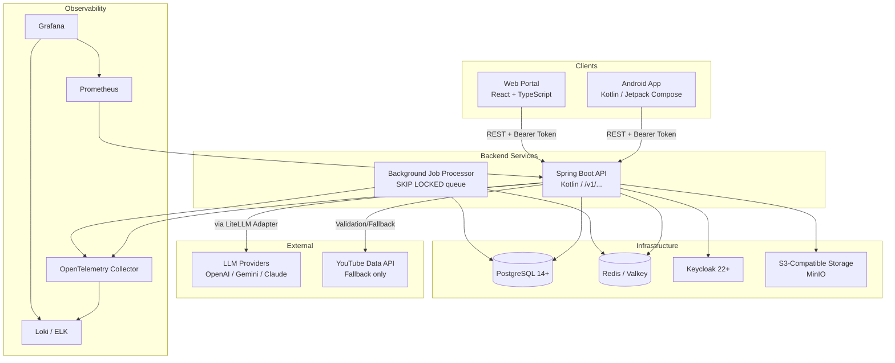
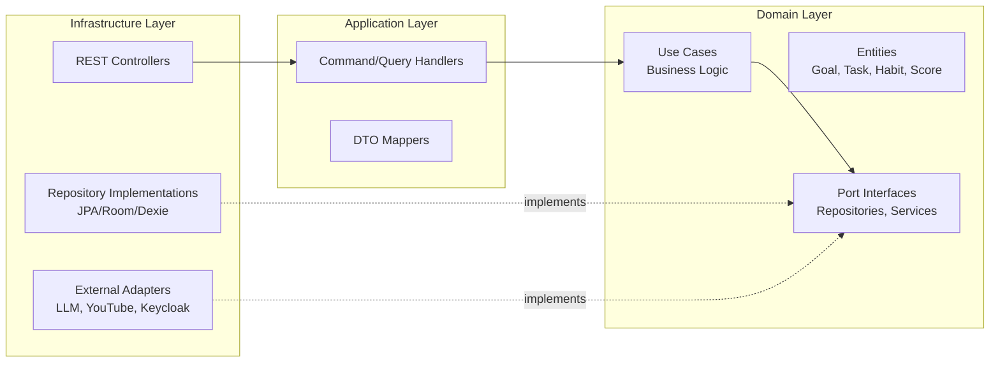
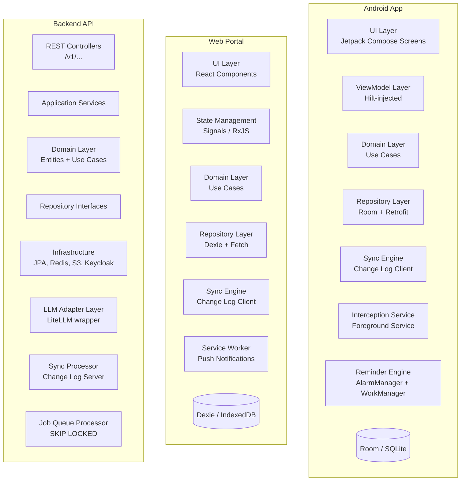
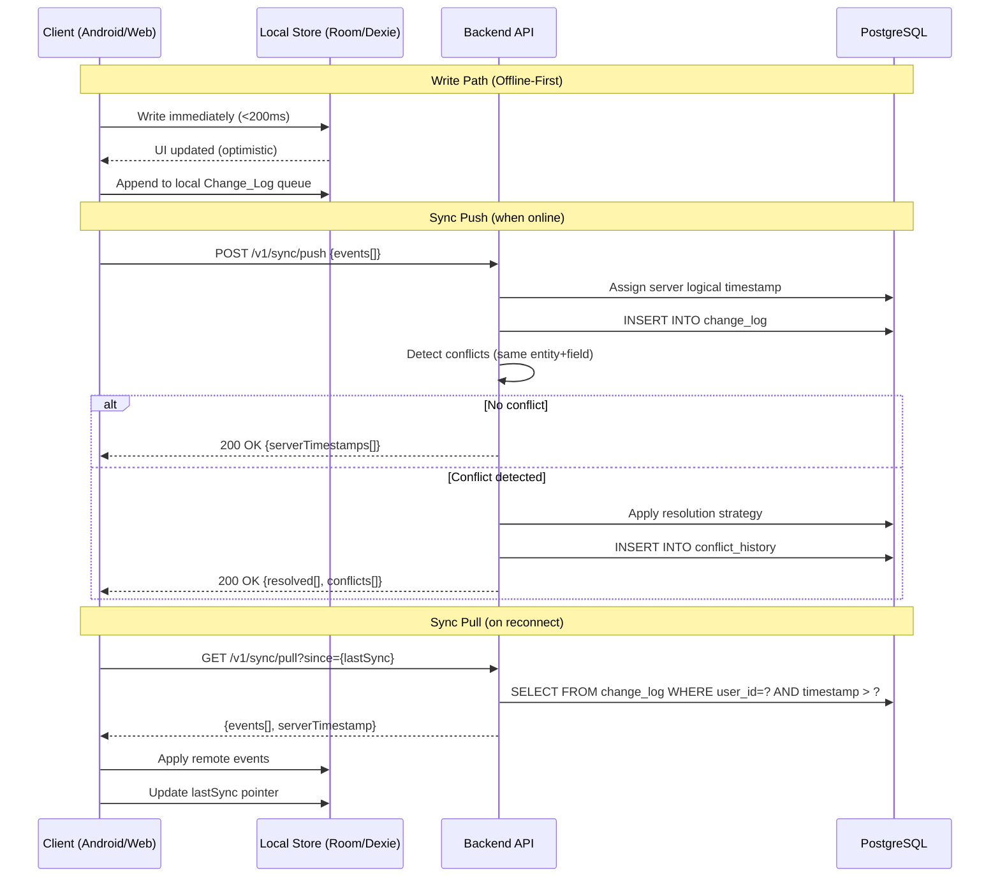
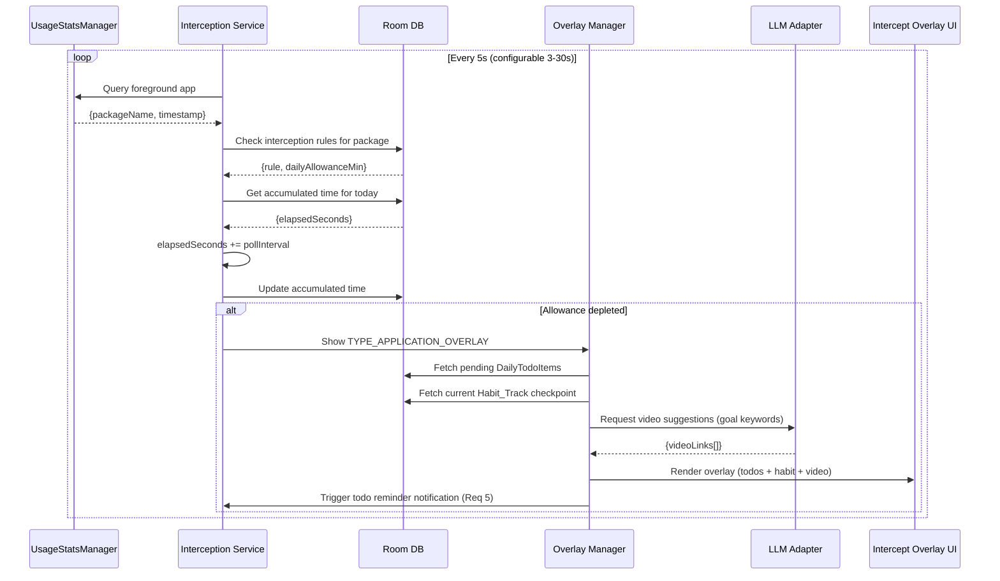
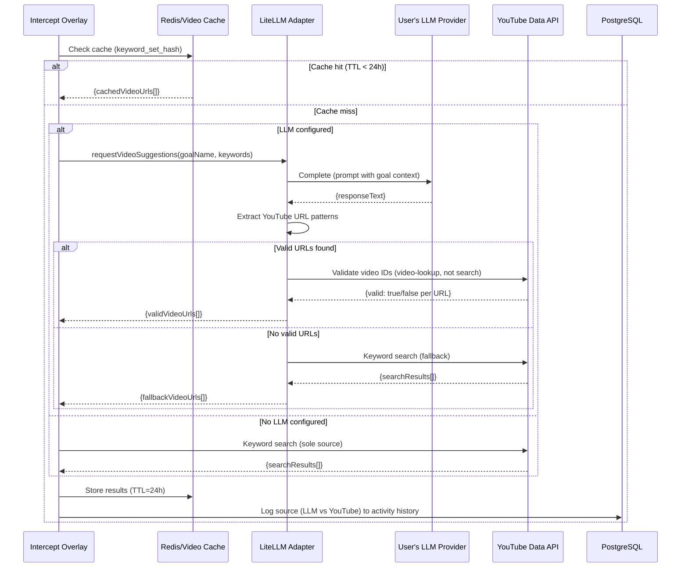
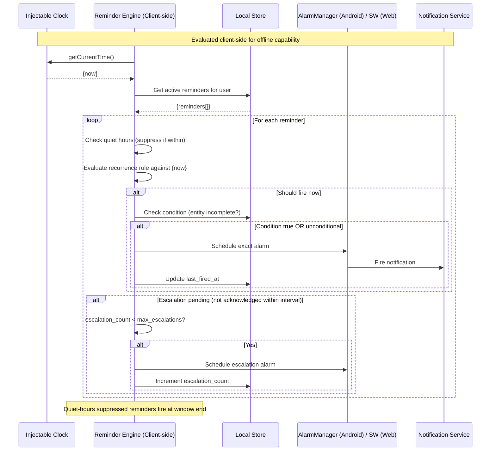
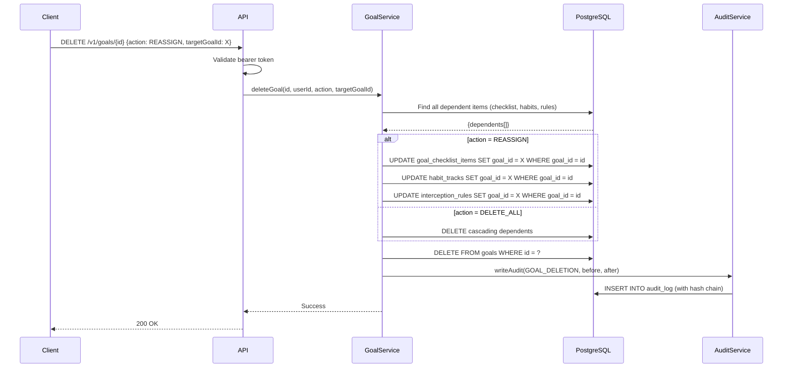
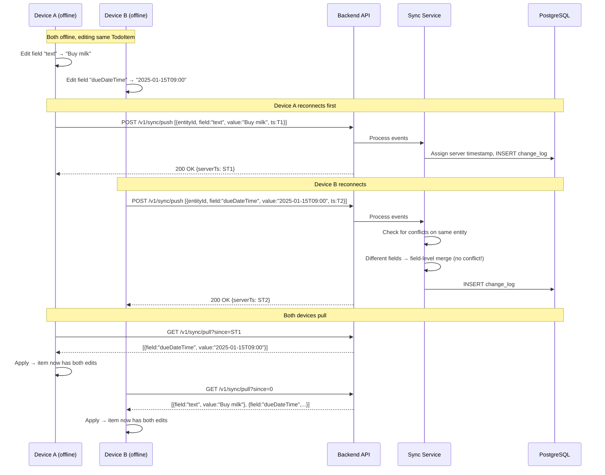
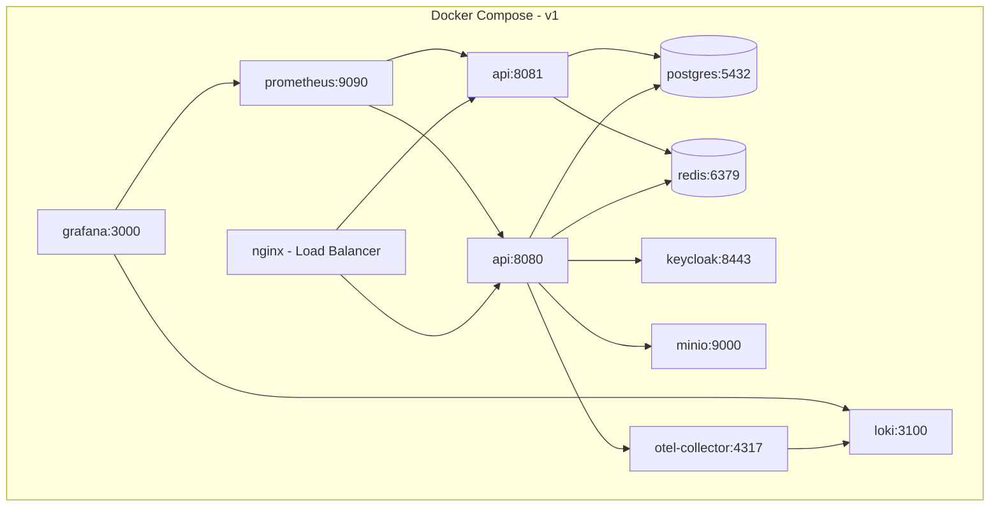

# DopaShift — Design Document

## Overview

DopaShift is a multi-goal life-tracking platform that combines screen-time interception, habit building, task management, and AI-powered content recommendations into a unified offline-first system. The platform spans three clients (Android app, React web portal, future iOS) backed by a single Spring Boot API, all built on cloud-agnostic, self-hostable infrastructure.

The architecture follows Clean/Hexagonal Architecture principles, ensuring domain logic is platform-independent and testable in isolation. The system is designed around an append-only Change_Log for bidirectional sync with field-level conflict resolution, enabling full offline functionality with eventual consistency.

### Key Architectural Drivers

| Driver | Decision |
|--------|----------|
| Offline-first | Local writes are immediate; sync is opportunistic via Change_Log |
| Cloud-agnostic | PostgreSQL, Redis, Keycloak, MinIO — no proprietary cloud APIs |
| Privacy-preserving | Raw telemetry stays local; only aggregated metrics sync |
| BYO-LLM | User-supplied API keys route through a provider-agnostic adapter |
| Horizontal scalability | Stateless API, shared-nothing design, documented scaling path |
| Interceptive UX | Full-screen overlay redirects distraction time toward goals |

### Wireframe References

The visual design follows the **DopaShift Kinetic** design system (see `.kiro/specs/wireframes/dopashift_kinetic/DESIGN.md`), using:
- Color palette: Productive Blue (#0066FF), Momentum Teal (#2DD4BF), Focus Indigo (#6366F1)
- Typography: Hanken Grotesk (headlines), Inter (body), JetBrains Mono (labels)
- 8px spacing rhythm, glassmorphism overlays, M3 tonal elevation

---

## Architecture

### High-Level System Architecture



### Layered Architecture (per Clean/Hexagonal)



**Architectural Constraints (Requirement 14):**
- Domain layer has ZERO imports from Spring, Android SDK, or React
- Repository pattern: domain references only interfaces; implementations live in infrastructure layer
- Strategy pattern: conflict-resolution and OAuth-provider logic are interface-based, extensible without modifying callers
- Reactive propagation: Kotlin Flow (Android), RxJS/signals (Web) — UI subscribes to observable data streams

---

## Components and Interfaces

### Component Diagram



### Core Domain Interfaces (Kotlin)

```kotlin
// === DOMAIN LAYER (no framework imports) ===

// --- Entities ---
data class GoalProfile(
    val id: UUID,
    val userId: UUID,
    val name: String,          // 1-100 chars, unique per user
    val category: String,      // 1-50 chars
    val keywords: List<String>, // max 20, each 1-50 chars
    val createdAt: Instant,
    val updatedAt: Instant,
    val isActive: Boolean = true
)

data class DailyTodoItem(
    val id: UUID,
    val userId: UUID,
    val text: String,          // max 500 chars
    val dueDateTime: Instant?,
    val isCompleted: Boolean = false,
    val createdAt: Instant,
    val updatedAt: Instant,
    val dayDate: LocalDate     // the day this item belongs to
)

data class GoalChecklistItem(
    val id: UUID,
    val goalId: UUID,
    val userId: UUID,
    val text: String,
    val isCompleted: Boolean = false,
    val createdAt: Instant,
    val updatedAt: Instant
)

data class HabitTrack(
    val id: UUID,
    val goalId: UUID,
    val userId: UUID,
    val startDate: LocalDate,
    val currentDay: Int,       // 1-30
    val isFinished: Boolean = false,
    val checkpoints: List<HabitCheckpoint>
)

data class HabitCheckpoint(
    val id: UUID,
    val habitTrackId: UUID,
    val dayNumber: Int,        // 1-30
    val description: String,   // 1-200 chars
    val status: CheckpointStatus,
    val completedAt: Instant?
)

enum class CheckpointStatus { PENDING, COMPLETED, MISSED }

data class EfficiencyScore(
    val id: UUID,
    val userId: UUID,
    val date: LocalDate,
    val productiveSeconds: Long,
    val totalTrackedSeconds: Long,
    val scorePercent: Int?,      // null = unavailable (<60s tracked)
    val computedAt: Instant
)

data class Reminder(
    val id: UUID,
    val userId: UUID,
    val entityType: ReminderEntityType,
    val entityId: UUID,
    val scheduledTime: LocalTime,
    val scheduledDate: LocalDate?,  // null for repeating
    val recurrence: RecurrenceRule?,
    val condition: ReminderCondition?,
    val escalationInterval: Duration,
    val maxEscalations: Int,
    val escalationCount: Int = 0,
    val isActive: Boolean = true
)

enum class ReminderEntityType { DAILY_TODO, GOAL_CHECKLIST, HABIT_CHECKPOINT }

data class RecurrenceRule(
    val type: RecurrenceType,
    val weekdays: Set<DayOfWeek>? = null,
    val intervalDays: Int? = null
)

enum class RecurrenceType { DAILY, SPECIFIC_WEEKDAYS, WEEKLY, MONTHLY, CUSTOM_INTERVAL }

data class ReminderCondition(
    val type: ConditionType
)

enum class ConditionType { ENTITY_INCOMPLETE }

// --- Change Log (Sync Engine) ---
data class ChangeLogEntry(
    val id: UUID,
    val entityId: UUID,
    val entityType: String,
    val field: String,
    val value: String?,         // JSON-encoded field value
    val timestamp: Instant,     // server-assigned logical timestamp
    val deviceId: String,
    val userId: UUID
)

// --- Audit Log ---
data class AuditLogEntry(
    val id: UUID,
    val correlationId: String,
    val userId: UUID,
    val operationType: String,
    val entityId: UUID?,
    val beforeState: String?,   // JSON
    val afterState: String?,    // JSON
    val timestamp: Instant,
    val previousHash: String,
    val entryHash: String
)

// --- Repository Interfaces (Ports) ---
interface GoalRepository {
    suspend fun findById(id: UUID): GoalProfile?
    suspend fun findByUserId(userId: UUID): List<GoalProfile>
    suspend fun findByUserIdAndName(userId: UUID, name: String): GoalProfile?
    suspend fun save(goal: GoalProfile): GoalProfile
    suspend fun delete(id: UUID)
    suspend fun countActiveByUserId(userId: UUID): Int
}

interface DailyTodoRepository {
    suspend fun findById(id: UUID): DailyTodoItem?
    suspend fun findByUserIdAndDate(userId: UUID, date: LocalDate): List<DailyTodoItem>
    suspend fun countByUserIdAndDate(userId: UUID, date: LocalDate): Int
    suspend fun save(item: DailyTodoItem): DailyTodoItem
    suspend fun delete(id: UUID)
}

interface HabitTrackRepository {
    suspend fun findById(id: UUID): HabitTrack?
    suspend fun findActiveByGoalId(goalId: UUID): List<HabitTrack>
    suspend fun findActiveByUserId(userId: UUID): List<HabitTrack>
    suspend fun save(track: HabitTrack): HabitTrack
}

interface ChangeLogRepository {
    suspend fun append(entry: ChangeLogEntry)
    suspend fun findSince(userId: UUID, since: Instant): List<ChangeLogEntry>
    suspend fun countByUserId(userId: UUID): Long
    suspend fun archiveOlderThan(cutoff: Instant)
}

interface AuditLogRepository {
    suspend fun append(entry: AuditLogEntry)
    suspend fun findByCorrelationId(correlationId: String): List<AuditLogEntry>
    suspend fun getLastEntry(): AuditLogEntry?
}

interface ReminderRepository {
    suspend fun findById(id: UUID): Reminder?
    suspend fun findActiveByUserId(userId: UUID): List<Reminder>
    suspend fun findByEntityId(entityId: UUID): List<Reminder>
    suspend fun save(reminder: Reminder): Reminder
    suspend fun delete(id: UUID)
}

interface EfficiencyScoreRepository {
    suspend fun save(score: EfficiencyScore): EfficiencyScore
    suspend fun findByUserIdAndDateRange(userId: UUID, from: LocalDate, to: LocalDate): List<EfficiencyScore>
}

// --- Service Interfaces (Ports) ---
interface LlmProviderService {
    suspend fun requestVideoSuggestions(goalName: String, keywords: List<String>): LlmVideoResponse
    suspend fun requestGoalSuggestions(goalName: String, description: String, keywords: List<String>): LlmSuggestionResponse
    suspend fun validateApiKey(provider: LlmProviderType, apiKey: String): ValidationResult
}

interface VideoValidationService {
    suspend fun validateVideoUrl(url: String): VideoValidationResult
    suspend fun searchByKeywords(keywords: List<String>, locale: UserLocale): List<VideoResult>
}

interface ConflictResolutionStrategy {
    fun resolve(local: ChangeLogEntry, remote: ChangeLogEntry): MergeResult
}

interface NotificationService {
    suspend fun scheduleLocal(reminder: Reminder, userId: UUID)
    suspend fun cancelPending(reminderId: UUID)
    suspend fun sendPush(userId: UUID, notification: PushPayload)
}

interface ProfileStorageService {
    suspend fun uploadPhoto(userId: UUID, data: ByteArray, contentType: String): String
    suspend fun deletePhoto(userId: UUID, objectUrl: String)
}
```

### Strategy Pattern: Conflict Resolution

```kotlin
// Default strategy: server-assigned logical timestamp wins
class LastWriteWinsStrategy : ConflictResolutionStrategy {
    override fun resolve(local: ChangeLogEntry, remote: ChangeLogEntry): MergeResult {
        return if (remote.timestamp > local.timestamp) {
            MergeResult.RemoteWins(supersededEntry = local)
        } else {
            MergeResult.LocalWins(supersededEntry = remote)
        }
    }
}

// Delete-wins strategy (Requirement 4, AC11)
class DeleteWinsStrategy : ConflictResolutionStrategy {
    override fun resolve(local: ChangeLogEntry, remote: ChangeLogEntry): MergeResult {
        val hasDelete = local.value == null || remote.value == null
        return when {
            hasDelete && remote.value == null -> MergeResult.RemoteWins(supersededEntry = local)
            hasDelete && local.value == null -> MergeResult.LocalWins(supersededEntry = remote)
            else -> LastWriteWinsStrategy().resolve(local, remote)
        }
    }
}

sealed class MergeResult {
    data class RemoteWins(val supersededEntry: ChangeLogEntry) : MergeResult()
    data class LocalWins(val supersededEntry: ChangeLogEntry) : MergeResult()
    data class FieldMerge(val merged: Map<String, ChangeLogEntry>) : MergeResult()
}
```

### Adapter Pattern: LLM Provider

```kotlin
// Provider-agnostic adapter (Requirement 15, AC3)
interface LlmAdapter {
    suspend fun complete(prompt: String, maxTokens: Int = 1000): LlmCompletionResult
    suspend fun healthCheck(): Boolean
    val supportsWebBrowsing: Boolean
}

class OpenAiAdapter(private val apiKey: String) : LlmAdapter { /* ... */ }
class GeminiAdapter(private val apiKey: String) : LlmAdapter { /* ... */ }
class ClaudeAdapter(private val apiKey: String) : LlmAdapter { /* ... */ }

// Factory/registry
class LlmAdapterFactory {
    fun create(provider: LlmProviderType, apiKey: String): LlmAdapter = when (provider) {
        LlmProviderType.OPENAI -> OpenAiAdapter(apiKey)
        LlmProviderType.GEMINI -> GeminiAdapter(apiKey)
        LlmProviderType.CLAUDE -> ClaudeAdapter(apiKey)
    }
}
```

---

## Data Models

### PostgreSQL Schema

```sql
-- ============================================================
-- CORE TABLES
-- ============================================================

CREATE TABLE users (
    id UUID PRIMARY KEY DEFAULT gen_random_uuid(),
    keycloak_id VARCHAR(255) UNIQUE NOT NULL,
    display_name VARCHAR(100) NOT NULL,
    email VARCHAR(320) NOT NULL,
    preferred_locale VARCHAR(5) NOT NULL DEFAULT 'en', -- en, hi, mr
    accent_color VARCHAR(7),  -- #RRGGBB or NULL for default
    profile_photo_url TEXT,
    timezone VARCHAR(50) NOT NULL DEFAULT 'UTC',
    quiet_hours_start TIME,
    quiet_hours_end TIME,
    reminder_aggressiveness JSONB, -- global defaults
    created_at TIMESTAMPTZ NOT NULL DEFAULT NOW(),
    updated_at TIMESTAMPTZ NOT NULL DEFAULT NOW()
);

CREATE TABLE goals (
    id UUID PRIMARY KEY DEFAULT gen_random_uuid(),
    user_id UUID NOT NULL REFERENCES users(id) ON DELETE CASCADE,
    name VARCHAR(100) NOT NULL,
    category VARCHAR(50) NOT NULL,
    is_active BOOLEAN NOT NULL DEFAULT TRUE,
    created_at TIMESTAMPTZ NOT NULL DEFAULT NOW(),
    updated_at TIMESTAMPTZ NOT NULL DEFAULT NOW(),
    UNIQUE(user_id, name)
);
CREATE INDEX idx_goals_user_id ON goals(user_id);

CREATE TABLE keywords (
    id UUID PRIMARY KEY DEFAULT gen_random_uuid(),
    goal_id UUID NOT NULL REFERENCES goals(id) ON DELETE CASCADE,
    keyword VARCHAR(50) NOT NULL,
    UNIQUE(goal_id, keyword)
);
CREATE INDEX idx_keywords_goal_id ON keywords(goal_id);

CREATE TABLE goal_checklist_items (
    id UUID PRIMARY KEY DEFAULT gen_random_uuid(),
    goal_id UUID NOT NULL REFERENCES goals(id) ON DELETE CASCADE,
    user_id UUID NOT NULL REFERENCES users(id),
    text VARCHAR(500) NOT NULL,
    is_completed BOOLEAN NOT NULL DEFAULT FALSE,
    created_at TIMESTAMPTZ NOT NULL DEFAULT NOW(),
    updated_at TIMESTAMPTZ NOT NULL DEFAULT NOW()
);
CREATE INDEX idx_goal_checklist_goal_id ON goal_checklist_items(goal_id);
CREATE INDEX idx_goal_checklist_user_id ON goal_checklist_items(user_id);

CREATE TABLE daily_todo_items (
    id UUID PRIMARY KEY DEFAULT gen_random_uuid(),
    user_id UUID NOT NULL REFERENCES users(id) ON DELETE CASCADE,
    text VARCHAR(500) NOT NULL,
    due_date_time TIMESTAMPTZ,
    is_completed BOOLEAN NOT NULL DEFAULT FALSE,
    day_date DATE NOT NULL,
    created_at TIMESTAMPTZ NOT NULL DEFAULT NOW(),
    updated_at TIMESTAMPTZ NOT NULL DEFAULT NOW()
);
CREATE INDEX idx_daily_todo_user_date ON daily_todo_items(user_id, day_date);

CREATE TABLE habit_tracks (
    id UUID PRIMARY KEY DEFAULT gen_random_uuid(),
    goal_id UUID NOT NULL REFERENCES goals(id) ON DELETE CASCADE,
    user_id UUID NOT NULL REFERENCES users(id),
    start_date DATE NOT NULL,
    current_day INT NOT NULL DEFAULT 1,
    is_finished BOOLEAN NOT NULL DEFAULT FALSE,
    created_at TIMESTAMPTZ NOT NULL DEFAULT NOW(),
    updated_at TIMESTAMPTZ NOT NULL DEFAULT NOW()
);
CREATE INDEX idx_habit_tracks_goal ON habit_tracks(goal_id);
CREATE INDEX idx_habit_tracks_user ON habit_tracks(user_id);

CREATE TABLE habit_checkpoints (
    id UUID PRIMARY KEY DEFAULT gen_random_uuid(),
    habit_track_id UUID NOT NULL REFERENCES habit_tracks(id) ON DELETE CASCADE,
    day_number INT NOT NULL CHECK (day_number BETWEEN 1 AND 30),
    description VARCHAR(200) NOT NULL,
    status VARCHAR(10) NOT NULL DEFAULT 'PENDING', -- PENDING, COMPLETED, MISSED
    completed_at TIMESTAMPTZ,
    UNIQUE(habit_track_id, day_number)
);
CREATE INDEX idx_checkpoints_track ON habit_checkpoints(habit_track_id);

-- ============================================================
-- REMINDER SYSTEM
-- ============================================================

CREATE TABLE reminders (
    id UUID PRIMARY KEY DEFAULT gen_random_uuid(),
    user_id UUID NOT NULL REFERENCES users(id) ON DELETE CASCADE,
    entity_type VARCHAR(20) NOT NULL, -- DAILY_TODO, GOAL_CHECKLIST, HABIT_CHECKPOINT
    entity_id UUID NOT NULL,
    scheduled_time TIME NOT NULL,
    scheduled_date DATE,            -- NULL for repeating
    recurrence_type VARCHAR(20),    -- DAILY, SPECIFIC_WEEKDAYS, WEEKLY, MONTHLY, CUSTOM_INTERVAL
    recurrence_weekdays INT[],      -- ISO day-of-week numbers
    recurrence_interval_days INT,
    condition_type VARCHAR(20),     -- NULL or ENTITY_INCOMPLETE
    escalation_interval_minutes INT NOT NULL DEFAULT 15,
    max_escalations INT NOT NULL DEFAULT 3,
    current_escalation_count INT NOT NULL DEFAULT 0,
    is_active BOOLEAN NOT NULL DEFAULT TRUE,
    last_fired_at TIMESTAMPTZ,
    created_at TIMESTAMPTZ NOT NULL DEFAULT NOW(),
    updated_at TIMESTAMPTZ NOT NULL DEFAULT NOW()
);
CREATE INDEX idx_reminders_user ON reminders(user_id);
CREATE INDEX idx_reminders_entity ON reminders(entity_id);

-- ============================================================
-- SYNC ENGINE
-- ============================================================

CREATE TABLE change_log (
    id UUID PRIMARY KEY DEFAULT gen_random_uuid(),
    entity_id UUID NOT NULL,
    entity_type VARCHAR(30) NOT NULL,
    field VARCHAR(100) NOT NULL,
    value JSONB,                    -- NULL represents deletion
    timestamp TIMESTAMPTZ NOT NULL DEFAULT NOW(), -- server-assigned logical timestamp
    device_id VARCHAR(100) NOT NULL,
    user_id UUID NOT NULL REFERENCES users(id)
);
CREATE INDEX idx_change_log_user_ts ON change_log(user_id, timestamp);
CREATE INDEX idx_change_log_entity ON change_log(entity_id);

-- Conflict history (superseded writes retained 90+ days)
CREATE TABLE conflict_history (
    id UUID PRIMARY KEY DEFAULT gen_random_uuid(),
    change_log_id UUID NOT NULL REFERENCES change_log(id),
    superseded_value JSONB,
    superseded_device_id VARCHAR(100),
    superseded_timestamp TIMESTAMPTZ,
    resolution_reason VARCHAR(50) NOT NULL, -- LWW, DELETE_WINS
    created_at TIMESTAMPTZ NOT NULL DEFAULT NOW()
);

-- ============================================================
-- AUDIT & TRACEABILITY
-- ============================================================

CREATE TABLE audit_log (
    id UUID PRIMARY KEY DEFAULT gen_random_uuid(),
    correlation_id VARCHAR(64) NOT NULL,
    user_id UUID NOT NULL,
    operation_type VARCHAR(50) NOT NULL,
    entity_id UUID,
    before_state JSONB,
    after_state JSONB,
    timestamp TIMESTAMPTZ NOT NULL DEFAULT NOW(),
    previous_hash VARCHAR(128),     -- hash chain for tamper-evidence
    entry_hash VARCHAR(128) NOT NULL
);
CREATE INDEX idx_audit_correlation ON audit_log(correlation_id);
CREATE INDEX idx_audit_user ON audit_log(user_id);
CREATE INDEX idx_audit_timestamp ON audit_log(timestamp);

-- ============================================================
-- ANALYTICS
-- ============================================================

CREATE TABLE efficiency_scores (
    id UUID PRIMARY KEY DEFAULT gen_random_uuid(),
    user_id UUID NOT NULL REFERENCES users(id),
    score_date DATE NOT NULL,
    productive_seconds BIGINT NOT NULL,
    total_tracked_seconds BIGINT NOT NULL,
    score_percent INT,             -- NULL = unavailable
    computed_at TIMESTAMPTZ NOT NULL DEFAULT NOW(),
    UNIQUE(user_id, score_date)
);
CREATE INDEX idx_efficiency_user_date ON efficiency_scores(user_id, score_date);

-- ============================================================
-- INTERCEPTION & CONTENT
-- ============================================================

CREATE TABLE interception_rules (
    id UUID PRIMARY KEY DEFAULT gen_random_uuid(),
    user_id UUID NOT NULL REFERENCES users(id) ON DELETE CASCADE,
    goal_id UUID REFERENCES goals(id),
    app_package_name VARCHAR(256),
    site_domain VARCHAR(256),
    daily_allowance_minutes INT NOT NULL CHECK (daily_allowance_minutes BETWEEN 1 AND 480),
    is_active BOOLEAN NOT NULL DEFAULT TRUE,
    created_at TIMESTAMPTZ NOT NULL DEFAULT NOW()
);
CREATE INDEX idx_interception_user ON interception_rules(user_id);

CREATE TABLE video_cache (
    id UUID PRIMARY KEY DEFAULT gen_random_uuid(),
    keyword_set_hash VARCHAR(64) NOT NULL, -- SHA-256 of sorted keywords
    video_url TEXT NOT NULL,
    video_title TEXT,
    source VARCHAR(10) NOT NULL,   -- LLM or YOUTUBE
    goal_id UUID REFERENCES goals(id),
    cached_at TIMESTAMPTZ NOT NULL DEFAULT NOW(),
    expires_at TIMESTAMPTZ NOT NULL
);
CREATE INDEX idx_video_cache_hash ON video_cache(keyword_set_hash);
CREATE INDEX idx_video_cache_expires ON video_cache(expires_at);

-- ============================================================
-- LLM CONFIGURATION
-- ============================================================

CREATE TABLE llm_configurations (
    id UUID PRIMARY KEY DEFAULT gen_random_uuid(),
    user_id UUID NOT NULL UNIQUE REFERENCES users(id) ON DELETE CASCADE,
    provider_type VARCHAR(20) NOT NULL, -- OPENAI, GEMINI, CLAUDE
    api_key_encrypted BYTEA NOT NULL,   -- AES-256 encrypted
    api_key_iv BYTEA NOT NULL,
    is_validated BOOLEAN NOT NULL DEFAULT FALSE,
    validated_at TIMESTAMPTZ,
    created_at TIMESTAMPTZ NOT NULL DEFAULT NOW(),
    updated_at TIMESTAMPTZ NOT NULL DEFAULT NOW()
);

-- ============================================================
-- JOB QUEUE (Postgres-backed, SKIP LOCKED)
-- ============================================================

CREATE TABLE job_queue (
    id UUID PRIMARY KEY DEFAULT gen_random_uuid(),
    job_type VARCHAR(50) NOT NULL,
    payload JSONB NOT NULL,
    status VARCHAR(20) NOT NULL DEFAULT 'PENDING', -- PENDING, PROCESSING, COMPLETED, FAILED
    priority INT NOT NULL DEFAULT 0,
    attempts INT NOT NULL DEFAULT 0,
    max_attempts INT NOT NULL DEFAULT 5,
    scheduled_at TIMESTAMPTZ NOT NULL DEFAULT NOW(),
    started_at TIMESTAMPTZ,
    completed_at TIMESTAMPTZ,
    error_message TEXT,
    created_at TIMESTAMPTZ NOT NULL DEFAULT NOW()
);
CREATE INDEX idx_job_queue_status ON job_queue(status, scheduled_at) WHERE status = 'PENDING';
```

### Room Database Schema (Android — local only)

```kotlin
@Database(
    entities = [
        LocalGoal::class, LocalDailyTodo::class, LocalGoalChecklist::class,
        LocalHabitTrack::class, LocalHabitCheckpoint::class, LocalReminder::class,
        LocalChangeLogEntry::class, LocalEfficiencyScore::class,
        LocalInterceptionRule::class, LocalTelemetryEvent::class,
        LocalSyncState::class
    ],
    version = 1
)
abstract class DopaShiftDatabase : RoomDatabase() {
    abstract fun goalDao(): GoalDao
    abstract fun dailyTodoDao(): DailyTodoDao
    abstract fun habitTrackDao(): HabitTrackDao
    abstract fun reminderDao(): ReminderDao
    abstract fun changeLogDao(): ChangeLogDao
    abstract fun efficiencyDao(): EfficiencyScoreDao
    abstract fun telemetryDao(): TelemetryDao
    abstract fun syncStateDao(): SyncStateDao
}

// Telemetry stays LOCAL ONLY (Requirement 8)
@Entity(tableName = "telemetry_events")
data class LocalTelemetryEvent(
    @PrimaryKey val id: String,
    val appPackageName: String,
    val foregroundSeconds: Long,
    val date: String,           // LocalDate ISO
    val recordedAt: Long        // epoch millis
)
```

### Dexie.js Schema (Web Portal — local only)

```typescript
import Dexie, { Table } from 'dexie';

interface LocalGoal { id: string; userId: string; name: string; category: string; isActive: boolean; /* ... */ }
interface LocalDailyTodo { id: string; userId: string; text: string; isCompleted: boolean; dayDate: string; /* ... */ }
interface LocalHabitTrack { id: string; goalId: string; currentDay: number; isFinished: boolean; /* ... */ }
interface LocalChangeLog { id: string; entityId: string; entityType: string; field: string; value: string | null; timestamp: string; deviceId: string; }
interface LocalSyncState { key: string; lastSyncTimestamp: string; }

class DopaShiftDB extends Dexie {
  goals!: Table<LocalGoal>;
  dailyTodos!: Table<LocalDailyTodo>;
  habitTracks!: Table<LocalHabitTrack>;
  changeLog!: Table<LocalChangeLog>;
  syncState!: Table<LocalSyncState>;

  constructor() {
    super('dopashift');
    this.version(1).stores({
      goals: 'id, userId, name',
      dailyTodos: 'id, userId, dayDate, [userId+dayDate]',
      habitTracks: 'id, goalId, userId',
      changeLog: 'id, [userId+timestamp], entityId',
      syncState: 'key'
    });
  }
}
```

---

## Data Flow Diagrams

### Sync Engine Flow



### Screen-Time Interception Flow



### LLM Video Recommendation Pipeline



### Reminder Evaluation Engine



---

## API Endpoint Design (REST /v1/...)

### Goals

| Method | Endpoint | Description |
|--------|----------|-------------|
| POST | `/v1/goals` | Create a new goal profile |
| GET | `/v1/goals` | List all goals for authenticated user |
| GET | `/v1/goals/{id}` | Get goal detail with keywords and stats |
| PUT | `/v1/goals/{id}` | Update goal (name, category, keywords) |
| DELETE | `/v1/goals/{id}` | Delete goal (body: {action: DELETE_ALL \| REASSIGN, targetGoalId?}) |
| POST | `/v1/goals/{id}/checklist` | Add checklist item to goal |
| GET | `/v1/goals/{id}/checklist` | List goal's checklist items |
| PUT | `/v1/goals/{goalId}/checklist/{itemId}` | Update checklist item |
| DELETE | `/v1/goals/{goalId}/checklist/{itemId}` | Delete checklist item |

### Daily To-Do

| Method | Endpoint | Description |
|--------|----------|-------------|
| POST | `/v1/todos` | Create a daily to-do item |
| GET | `/v1/todos?date={YYYY-MM-DD}` | List todos for a specific day |
| PUT | `/v1/todos/{id}` | Update todo (text, due, completed) |
| DELETE | `/v1/todos/{id}` | Delete a todo |
| GET | `/v1/todos/pending` | Get pending (incomplete) todos |

### Habit Tracks

| Method | Endpoint | Description |
|--------|----------|-------------|
| POST | `/v1/habits` | Create/activate a habit track for a goal |
| GET | `/v1/habits?goalId={id}` | List habit tracks (active by default) |
| GET | `/v1/habits/{id}` | Get habit track with all checkpoints |
| PUT | `/v1/habits/{id}/checkpoints/{day}` | Mark checkpoint completed/missed |
| GET | `/v1/habits/current` | Get current day's checkpoint for overlay |

### Reminders

| Method | Endpoint | Description |
|--------|----------|-------------|
| POST | `/v1/reminders` | Create a reminder |
| GET | `/v1/reminders` | List user's reminders |
| PUT | `/v1/reminders/{id}` | Update reminder configuration |
| DELETE | `/v1/reminders/{id}` | Delete/cancel a reminder |

### Sync

| Method | Endpoint | Description |
|--------|----------|-------------|
| POST | `/v1/sync/push` | Push local change_log events to server |
| GET | `/v1/sync/pull?since={ISO_timestamp}` | Pull change_log events since last sync |
| GET | `/v1/sync/conflicts?since={ISO_timestamp}` | Get conflict history |

### Interception

| Method | Endpoint | Description |
|--------|----------|-------------|
| POST | `/v1/interception/rules` | Create an interception rule |
| GET | `/v1/interception/rules` | List user's interception rules |
| PUT | `/v1/interception/rules/{id}` | Update rule (allowance, active) |
| DELETE | `/v1/interception/rules/{id}` | Delete rule |

### Content / LLM

| Method | Endpoint | Description |
|--------|----------|-------------|
| GET | `/v1/content/video?goalId={id}` | Get video recommendation for goal |
| POST | `/v1/content/suggestions` | Request LLM-powered suggestions |

### Analytics / Dashboard

| Method | Endpoint | Description |
|--------|----------|-------------|
| GET | `/v1/analytics/efficiency?from={date}&to={date}` | Get efficiency scores for range |
| POST | `/v1/analytics/efficiency` | Submit computed daily score |
| GET | `/v1/dashboard/summary` | Aggregated dashboard data |
| GET | `/v1/dashboard/activity?page={n}&size=20` | Paginated activity feed |

### User Profile / Settings

| Method | Endpoint | Description |
|--------|----------|-------------|
| GET | `/v1/profile` | Get user profile |
| PUT | `/v1/profile` | Update profile (locale, accent color, timezone) |
| POST | `/v1/profile/photo` | Upload profile photo (multipart) |
| DELETE | `/v1/profile/photo` | Remove profile photo |
| POST | `/v1/profile/password` | Change password (via Keycloak) |

### LLM Configuration

| Method | Endpoint | Description |
|--------|----------|-------------|
| POST | `/v1/settings/llm` | Configure LLM provider + API key |
| GET | `/v1/settings/llm` | Get current LLM config (key masked) |
| PUT | `/v1/settings/llm` | Update/rotate API key |
| DELETE | `/v1/settings/llm` | Remove LLM configuration |
| POST | `/v1/settings/llm/validate` | Validate API key with provider |

### Auth

| Method | Endpoint | Description |
|--------|----------|-------------|
| POST | `/v1/auth/token` | Exchange auth code for tokens (Keycloak proxy) |
| POST | `/v1/auth/refresh` | Refresh access token |
| POST | `/v1/auth/logout` | Logout / revoke tokens |

---

## Key Sequence Diagrams

### Goal Deletion with Dependency Resolution



### Sync Engine: Offline Edit Merge



---

## Correctness Properties

*A property is a characteristic or behavior that should hold true across all valid executions of a system — essentially, a formal statement about what the system should do. Properties serve as the bridge between human-readable specifications and machine-verifiable correctness guarantees.*

### Property 1: Goal Name Uniqueness Enforcement

*For any* user and any two goal creation attempts with the same name (case-insensitive), the system SHALL accept exactly one and reject the second with a duplicate-name error, regardless of timing or device of origin.

**Validates: Requirements 1.7**

### Property 2: Goal Deletion Leaves No Orphans

*For any* goal deletion (whether with DELETE_ALL or REASSIGN action), after the operation completes, there SHALL be zero Goal_Checklist_Items, Habit_Tracks, or Interception_Rules referencing the deleted goal's ID in the database.

**Validates: Requirements 1.5, 1.6**

### Property 3: Field-Level Merge Preserves Non-Conflicting Edits

*For any* entity and any two offline edits to different fields of that entity from different devices, after sync completes on both devices, both field values SHALL be present — neither edit is lost.

**Validates: Requirements 4.6**

### Property 4: Same-Field Conflict Resolution Is Deterministic

*For any* entity and any two offline edits to the same field from different devices, after sync completes, both devices SHALL converge to the same value (the one with the higher server-assigned logical timestamp), and the losing edit SHALL appear in the conflict history.

**Validates: Requirements 4.7**

### Property 5: Delete Wins Over Edit

*For any* entity that is deleted on one device and edited on another while both are offline, after sync completes, the entity SHALL be deleted on both devices, and the attempted edit SHALL appear in the conflict history.

**Validates: Requirements 4.11**

### Property 6: Daily Allowance Depletion Triggers Overlay

*For any* interception rule with a configured daily allowance, when the accumulated foreground time for the tracked app meets or exceeds the allowance, the system SHALL display the Intercept_Overlay within 2 seconds.

**Validates: Requirements 2.4**

### Property 7: Overlay Minimum Engagement Before Dismissal

*For any* displayed Intercept_Overlay, the overlay SHALL NOT be dismissible until both a minimum of 30 seconds have elapsed AND at least one alternative action (habit checkbox or 10-second video view) has been performed.

**Validates: Requirements 2.5**

### Property 8: Video Recommendation Fallback Chain

*For any* overlay trigger where the LLM is configured, if the LLM response contains no parseable video links or all links fail validation, the system SHALL fall back to YouTube keyword search rather than displaying an error or blank state.

**Validates: Requirements 3.2, 3.3**

### Property 9: LLM Context Privacy Boundary

*For any* LLM call made by the system, the request payload SHALL contain only goal name, goal description, and user-supplied keywords — never full task history, telemetry data, or personally identifiable information beyond those fields.

**Validates: Requirements 15.7**

### Property 10: Efficiency Score Computation Consistency

*For any* set of foreground-time data (productive seconds and total tracked seconds), the efficiency score computed SHALL be identical regardless of which client (Android or Web) performs the computation — the formula `(productive / total) * 100` rounded to nearest integer is deterministic.

**Validates: Requirements 7.5**

### Property 11: Reminder Quiet-Hours Suppression and Delivery

*For any* reminder scheduled to fire during user-configured quiet hours, the notification SHALL NOT be delivered during the quiet window, and SHALL be delivered at the end of the quiet-hours window.

**Validates: Requirements 5.13**

### Property 12: Conditional Reminder Fires Only When Condition Holds

*For any* conditional reminder, if the linked entity is completed before the scheduled fire time, the reminder SHALL NOT fire — it SHALL be cancelled (for one-off) or skip the current occurrence (for repeating).

**Validates: Requirements 5.4, 5.8**

### Property 13: Habit Track Day Advancement Correctness

*For any* Habit_Track, when a checkpoint is marked completed, the current-day pointer SHALL advance to the next uncompleted day, and the completed checkpoint SHALL have a UTC timestamp recorded.

**Validates: Requirements 6.3**

### Property 14: Missed Habit Day Recording

*For any* Habit_Track checkpoint where the user did not check off the micro-habit before midnight in their configured timezone, the system SHALL record that day as MISSED with the date — never skip silently.

**Validates: Requirements 6.4**

### Property 15: Change Log Serialization Round-Trip

*For any* valid domain entity (Goal, DailyTodoItem, GoalChecklistItem, HabitTrack), serializing its fields to Change_Log JSON values and then deserializing them back SHALL produce an equivalent entity.

**Validates: Requirements 4.4, 4.5**

### Property 16: Audit Log Hash Chain Integrity

*For any* sequence of audit log entries, each entry's `previous_hash` field SHALL equal the `entry_hash` of the immediately preceding entry, forming a tamper-evident chain — any modification to a stored entry is detectable.

**Validates: Requirements 18.13**

### Property 17: Daily Todo Item Count Limit

*For any* user on any given day, attempting to create a DailyTodoItem when 100 already exist for that day SHALL be rejected — the count SHALL never exceed 100 per user per day.

**Validates: Requirements 4.2**

### Property 18: Keyword Count and Length Validation

*For any* goal, adding keywords SHALL be rejected if it would result in more than 20 keywords per goal, or if any keyword exceeds 50 characters or is empty.

**Validates: Requirements 1.2**

### Property 19: Sync Push Retry with Exponential Backoff

*For any* sync push that fails due to network error, the system SHALL retry with exponential backoff (1s, 2s, 4s, 8s, 16s) up to 5 attempts, and if all fail, queued changes SHALL be retained locally.

**Validates: Requirements 4.10**

### Property 20: Midnight Allowance Reset

*For any* tracked app/site, when the local clock passes midnight in the user's configured timezone, the accumulated elapsed time SHALL reset to zero — a new daily allowance period begins.

**Validates: Requirements 2.12**

---

## Error Handling

### Error Categories and Strategies

| Category | Strategy | User Experience |
|----------|----------|----------------|
| Network unavailability | Offline-first: local write succeeds, sync queued | Sync-pending indicator; full functionality continues |
| Sync conflict | Field-level merge or LWW with conflict history | Transparent to user; losing edit retrievable for 90 days |
| LLM provider error | Retry 2x (3s delay), then fallback to YouTube search | Non-blocking notification; video pipeline continues |
| API key validation failure | Specific error message (timeout/invalid/rate-limit) | Inline form error; key not saved |
| Storage capacity reached | Notify user; purge data older than 90 days | Warning notification before purge |
| Permission revocation (Android) | Detect within 5s; notify user | Settings-level notification: "Interception disabled" |
| Audit log write failure | Retry 5x (exponential backoff); fire critical alert | Background; user unaffected; ops team alerted |
| Sync pull timeout (>30s) | Allow local writes; retry pull with exponential backoff | Sync indicator; local state remains functional |

### Error Response Format (API)

```json
{
  "error": {
    "code": "GOAL_NAME_DUPLICATE",
    "message": "A goal with this name already exists.",
    "details": {
      "field": "name",
      "value": "Fitness"
    },
    "correlationId": "abc123-def456",
    "timestamp": "2025-01-15T10:30:00Z"
  }
}
```

### Retry Policies

| Operation | Max Retries | Backoff | Timeout |
|-----------|-------------|---------|---------|
| Sync push | 5 | Exponential (1s base, 2x) | 30s per attempt |
| LLM call | 2 | Fixed 3s delay | 10s per call |
| Audit log write | 5 | Exponential (1s base, max 60s) | N/A (background) |
| API key validation | 0 (no retry) | N/A | 10s |
| Video URL validation | 1 | 2s delay | 5s per URL |
| Sync pull (reconnect) | 5 | Exponential (1s base, 2x) | 30s per attempt |

### Circuit Breaker: LLM Provider

When the user's LLM provider fails 3 consecutive calls, the system enters a "fallback mode" for that user's video recommendations for 5 minutes, using YouTube-search-only without attempting LLM calls. After the cooldown, the next overlay trigger attempts the LLM again.

---

## Testing Strategy

### Dual Testing Approach

DopaShift uses both unit/integration tests and property-based tests for comprehensive coverage:

- **Unit tests**: Specific examples, edge cases, error conditions, UI interactions
- **Integration tests**: Real PostgreSQL/Redis via Testcontainers, end-to-end flows, contract validation
- **Property-based tests**: Universal properties across all inputs for domain logic (sync engine, conflict resolution, efficiency scoring, validation rules, reminder evaluation)

### Property-Based Testing Configuration

- **Library**: Kotest Property Testing (Backend/Kotlin), fast-check (Web/TypeScript)
- **Minimum iterations**: 100 per property test
- **Tag format**: `Feature: dopa-shift, Property {N}: {property_text}`
- **Coverage**: Each correctness property maps to exactly one PBT test

### Test Layer Matrix

| Layer | Framework | Scope | Coverage Target |
|-------|-----------|-------|-----------------|
| Backend domain | JUnit5 + Kotest (PBT) | Goal/Task/Habit entities, efficiency scoring, conflict resolution, sync merge | 80% line coverage |
| Backend integration | Testcontainers (PG + Redis) | Repository implementations, API endpoints, sync flows | Per-AC coverage |
| Backend contract | OpenAPI validator | API response schema compliance | 100% endpoint coverage |
| Android UI | Espresso + Compose Test | Overlay rendering, checkbox interactions, permission flows | 70% line coverage |
| Android unit | JUnit5 + Kotest | ViewModel logic, local sync engine, reminder evaluation | 80% domain coverage |
| Web unit | Jest + fast-check (PBT) | Component logic, sync engine, efficiency computation | 70% line coverage |
| Web E2E | Playwright | Full flows, offline scenarios, cross-browser | Critical paths |
| Sync engine | Dedicated deterministic suite | Multi-client offline/online merge scenarios | Scenario-based (not coverage %) |
| Reminder engine | Injectable clock tests | Recurrence, escalation, quiet-hours, condition evaluation | All recurrence types |
| BYO-LLM | Mocked provider responses | Valid response, invalid key, rate-limit, no video links, fallback path | All failure modes |
| Security | OWASP Dep-Check + SAST (Semgrep) | Dependency vulns, code patterns | CI gate |

### Critical Test Suites (Higher Priority)

1. **Sync Engine / Conflict Resolution** (Requirement 4, AC6-AC11): Deterministic suite simulating 2+ clients editing offline, reconnecting in varying orders, asserting merge outcomes match field-level rules.

2. **Reminder Engine** (Requirement 5): Injectable clock allowing fast-forward through multi-day recurrence and escalation without real-time waiting.

3. **Interception Permission Handling** (Requirement 2): Emulator configurations per supported Android API level range.

### CI Pipeline

```
commit/PR → lint + SAST + secret scan → unit tests → integration tests (Testcontainers) 
→ coverage gate (80% backend, 70% client) → dependency vuln scan → contract tests
→ [release branch only] → E2E (Playwright) → Android instrumented suite → build artifacts
```

Any test failure fails the pipeline. No requirement is marked complete on a red build.

---

## Deployment Architecture



**Scaling Path (Requirement 11, AC4):**
- Kubernetes migration at: sustained >500 concurrent req/s OR >3 instances
- Kafka migration at: job queue depth consistently >10,000 OR p95 latency >5s over 10min

All configuration externalized via environment variables (Requirement 9, AC5).
