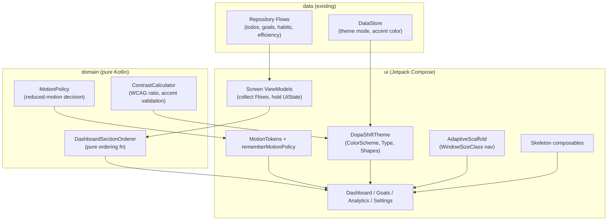
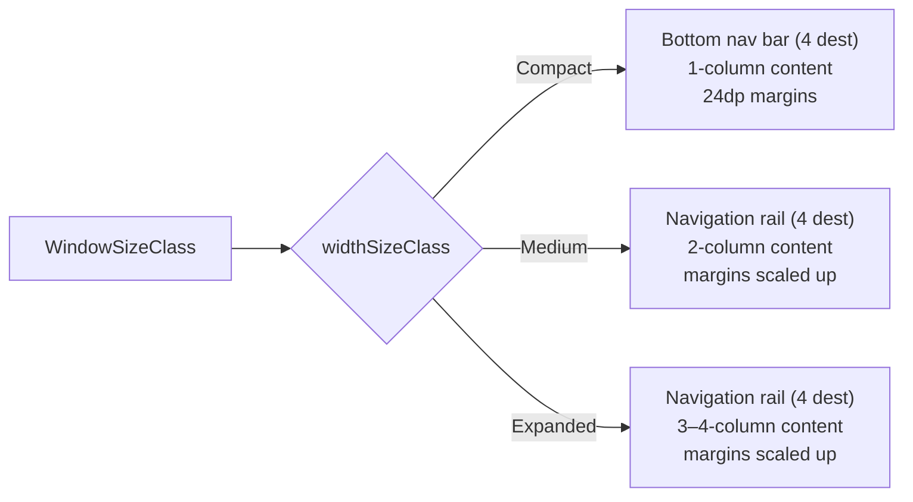
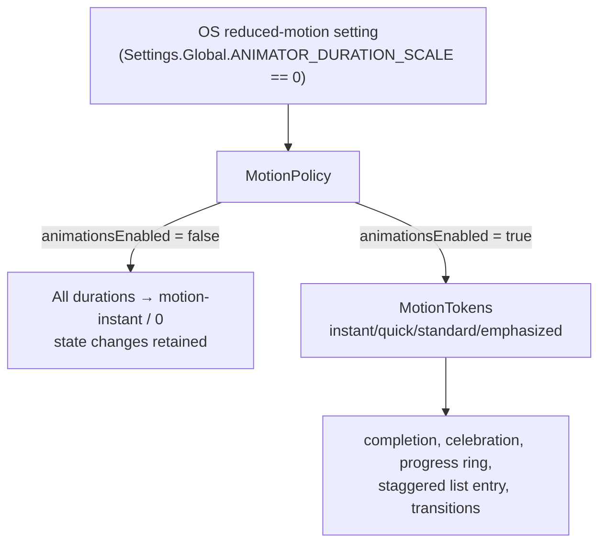
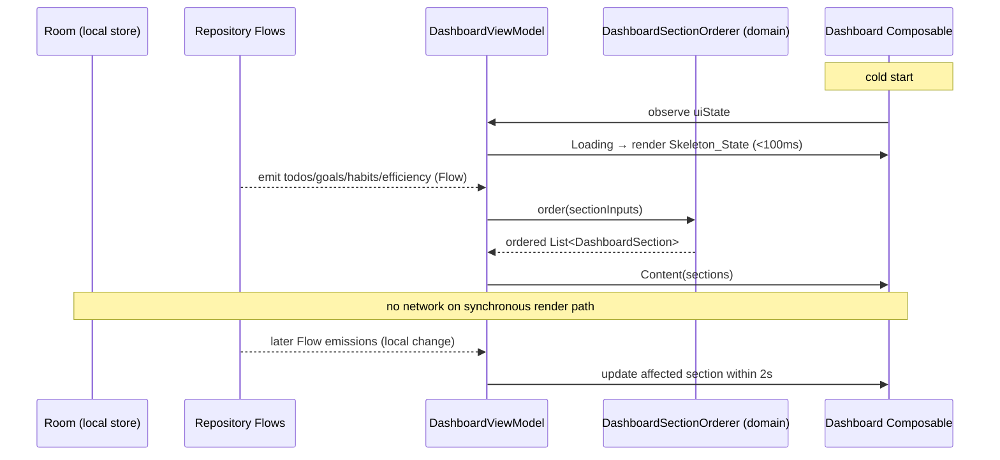
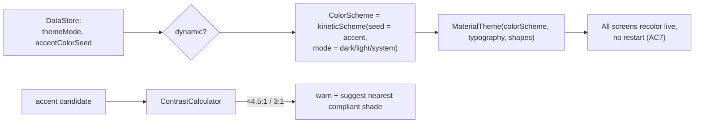

# Dynamic & Professional Android UI Experience — Design Document

**Spec ID:** `dynamic-ui-experience`
**Platform:** Android_App (client-side only)
**Parent spec:** `.kiro/specs/dopa-shift/`
**Requirements:** `.kiro/specs/dynamic-ui-experience/requirements.md` (DUX-1 … DUX-7)
**Status:** Draft for review

---

## Overview

This design turns the behavioral requirements DUX-1 through DUX-7 into a concrete Android implementation plan. Where the parent `dopa-shift` spec establishes *what* the design system looks like at the token level (Requirement 17, the "DopaShift Kinetic" system), this design specifies *how the interface behaves* — how it adapts to window size, how it moves, how the Dashboard reorders itself, how theming propagates, and how each of these is held to a measurable, testable standard.

Three constraints shape every decision here:

1. **Client-side only.** The requirements' "Backend Deltas" section states there is no new API surface or schema change. This design introduces no network contract, no server-side model, and no new Room table beyond indexing changes already implied by the parent. All new logic is UI-layer state, presentation logic, and pure ordering/theming functions.
2. **Tokens are authoritative.** Colors, typography, spacing, and shape come from `.kiro/specs/wireframes/dopashift_kinetic/DESIGN.md`. This design references token *names* and maps them to Compose `MaterialTheme` slots; it never re-defines raw values except where a numeric threshold (a duration, a dp margin, a frame budget) is itself the requirement.
3. **"Dynamic" must not become "distracting."** The motion system is deliberately bounded (a fixed four-token scale, capped celebrations, no re-engagement animation) because the product exists to reduce compulsive engagement. Every animation decision is gated by a performance budget (DUX-6) and a reduced-motion escape hatch (DUX-2, AC9).

### Design Goals

| Goal | Requirement source | How this design meets it |
|---|---|---|
| Adapt fluidly across phone/tablet/foldable | DUX-1 | A single `WindowSizeClass`-driven layout scaffold reused by all top-level screens |
| Satisfying but bounded motion | DUX-2 | A closed `MotionTokens` object; a `MotionPolicy` that collapses to instant under reduced-motion |
| Dashboard that reorders around what matters | DUX-3 | A pure `DashboardSectionOrderer` function, property-tested for determinism |
| Look professionally designed | DUX-4 | A single `DopaShiftTheme` seeded from the user's accent; lint rules ban literals |
| Fully usable with assistive tech | DUX-5 | Semantic modifiers, contrast validation, non-color state encoding |
| Polish without cost | DUX-6 | Macrobenchmark-gated budgets; scoped recomposition; lazy screen loading |
| Every criterion independently verified | DUX-7 | A test-type-per-criterion matrix in the Testing Strategy |

### Module Placement

Per the project's multi-module Android architecture (`app → [domain, data, ui, sync, interception]`), this feature lands almost entirely in the **`ui`** module, with a small, framework-free contribution to **`domain`**:

| Concern | Module | Rationale |
|---|---|---|
| Section-ordering rule, motion policy decision logic | `domain` | Pure Kotlin, no Android deps — makes it unit/property-testable in isolation |
| Composable screens, theme, adaptive scaffold, motion tokens, skeletons | `ui` | Compose-only module per structure rules |
| Observable Flows feeding the Dashboard | `data` (existing) | Reused, not extended; this design only *subscribes* |
| Intercept overlay visual/motion treatment | `interception` + `ui` | Overlay lifecycle stays in `interception`; its visual composition uses `ui` |

---

## Architecture

### Layering



Dependency direction is preserved: `ui → domain` and `ui → data`; `domain` depends on nothing framework-bound. The three pure functions (`DashboardSectionOrderer`, `MotionPolicy`, `ContrastCalculator`) live in `domain` precisely so they can be exercised by fast JVM tests without an emulator.

### Adaptive Layout Strategy (DUX-1)

A single composable, `AdaptiveScaffold`, is the entry point for every top-level screen. It reads the current `WindowSizeClass` (recomputed on configuration change by Compose automatically via `calculateWindowSizeClass(activity)`) and selects the navigation affordance and content grid:



Key decisions:

- **One scaffold, all screens.** DUX-1 AC8 requires Goals, Analytics, and Settings to obey the same rules as the Dashboard. Centralizing the breakpoint logic in `AdaptiveScaffold` guarantees this by construction rather than by repetition.
- **State survives reconfiguration.** DUX-1 AC3 requires scroll position and in-progress input to survive rotation/resize. Screen state is held in `rememberSaveable` (for transient UI like scroll indices and text field contents) and in ViewModels scoped to the navigation entry (for data), so a configuration change re-lays-out without discarding state.
- **Foldable hinge avoidance.** DUX-1 AC7 uses Jetpack WindowManager's `WindowInfoTracker` to observe `FoldingFeature`. When a fold spans the window, `AdaptiveScaffold` reserves the occlusion bounds as padding so primary controls never land under the hinge.
- **Minimum width 320dp.** DUX-1 AC6 is met by making all grids `LazyVerticalGrid`/`FlowRow`-based with a minimum column width, so content reflows rather than clips down to 320dp.

### Motion Architecture (DUX-2)

Motion is expressed through a closed set of tokens and a policy gate:



- **`MotionTokens`** is a Kotlin `object` exposing exactly four `(durationMillis, Easing)` pairs. Any UI animation must draw from it — a lint/detekt rule (DUX-7) forbids literal `tween(...)` durations in Composable code.
- **`MotionPolicy`** is a pure decision object in `domain`. It reads a boolean `reducedMotion` flag (sourced at the UI edge from `Settings.Global.ANIMATOR_DURATION_SCALE`) and returns effective durations. Under reduced motion every decorative duration collapses to `motion-instant` (or zero), while the *state change itself* is preserved — satisfying DUX-2 AC9 and DUX-7 AC6.
- **Bounded rewards.** Completion feedback (AC3) is a single `motion-quick` animation plus one light haptic. The 7-day streak celebration (AC4) is capped at 1500ms, non-blocking, dismissible by any touch, and fired at most once per milestone. Excluded patterns (autoplay, infinite scroll, re-engagement timers) from AC13 are simply never implemented and are guarded by a checklist item in the Testing Strategy.

### Dashboard Composition (DUX-3)

The Dashboard render path is strictly local and reactive:



- **No network on render.** DUX-3 AC10 forbids any network request on the Dashboard's synchronous render path. The ViewModel subscribes only to local repository `Flow`s; sync results arrive as ordinary Flow emissions and are applied reactively.
- **Deterministic ordering.** `DashboardSectionOrderer.order(input)` is a pure function returning sections in the fixed priority of DUX-3 AC1. Empty sections collapse to an inline prompt marker rather than a full slot. Determinism (AC2) is the subject of a property-based test (see Correctness Properties).
- **Skeletons, not spinners.** DUX-3 AC3 requires a `Skeleton_State` per pending section within 100ms and forbids a blank screen or full-screen spinner. The initial `UiState.Loading` maps directly to skeleton composables sized to their eventual content.

### Theming Architecture (DUX-4)



- `DopaShiftTheme` is the single source of truth. It builds a Material 3 `ColorScheme` seeded by the user's accent color (DUX-4 AC6), with dark as default and system-following available (AC5). Typography maps Hanken Grotesk / Inter / JetBrains Mono to the M3 type slots (AC2); `Shapes` maps the 8/16/pill radii (AC4).
- Theme mode and accent live in DataStore; changing either updates a `StateFlow` the theme reads, so the visible screen recolors without restart and without losing state (AC7).
- `ContrastCalculator` (domain) validates a candidate accent against the active surface before it is committed (DUX-5 AC4 / DUX-4 contrast interplay).

---

## Components and Interfaces

All interfaces below are Kotlin. Pure-logic types live in `domain`; Compose types live in `ui`.

### domain module

```kotlin
// --- Dashboard section ordering (DUX-3 AC1, AC2) ---

enum class DashboardSectionType {
    HABIT_CHECKPOINT_DUE,   // (a) unchecked habit checkpoint for today
    OVERDUE_TODOS,          // (b) overdue DailyTodoItems
    TODAY_TODOS,            // (c) today's remaining DailyTodoItems
    ACTIVE_GOALS,           // (d) active goals grid
    EFFICIENCY_TREND,       // (e) efficiency trend
    ACTIVITY_FEED           // (f) recent activity feed
}

/** Presentation-agnostic snapshot of what content each section currently has. */
data class DashboardSectionInput(
    val type: DashboardSectionType,
    val itemCount: Int              // 0 => section is empty => collapses to inline prompt
)

data class OrderedSection(
    val type: DashboardSectionType,
    val isCollapsedPrompt: Boolean  // true when itemCount == 0
)

object DashboardSectionOrderer {
    /**
     * Pure, total, deterministic. Returns all six section types in the fixed
     * priority order of DUX-3 AC1, marking empty ones as collapsed prompts.
     * Identical input => identical output (DUX-3 AC2).
     */
    fun order(inputs: List<DashboardSectionInput>): List<OrderedSection>
}

// --- Motion policy (DUX-2 AC1, AC9) ---

data class MotionSpec(val durationMillis: Int, val easingName: String)

object MotionPolicy {
    /**
     * When reducedMotion is true, every decorative spec collapses to instant (or 0);
     * the caller still applies the underlying state change. (DUX-2 AC9, DUX-7 AC6)
     */
    fun effective(base: MotionSpec, reducedMotion: Boolean): MotionSpec
}

// --- Contrast validation (DUX-5 AC3, AC4) ---

object ContrastCalculator {
    /** WCAG 2.1 relative-contrast ratio in [1.0, 21.0]. */
    fun ratio(foreground: Long, background: Long): Double

    fun meetsAA(foreground: Long, background: Long, largeText: Boolean): Boolean

    /** Nearest shade of [candidate] that meets AA against [surface], for AC4 suggestion. */
    fun nearestCompliant(candidate: Long, surface: Long, largeText: Boolean): Long
}
```

### ui module

```kotlin
// --- Motion tokens (DUX-2 AC1) ---
object MotionTokens {
    val Instant    = MotionSpec(100, "linear")            // motion-instant
    val Quick      = MotionSpec(200, "fastOutSlowIn")     // motion-quick
    val Standard   = MotionSpec(300, "fastOutSlowIn")     // motion-standard
    val Emphasized = MotionSpec(450, "emphasized")        // motion-emphasized
}

@Composable
fun rememberReducedMotion(): Boolean   // reads Settings.Global.ANIMATOR_DURATION_SCALE

// --- Adaptive scaffold (DUX-1) ---
@Composable
fun AdaptiveScaffold(
    windowSizeClass: WindowSizeClass,
    selected: TopDestination,
    onSelect: (TopDestination) -> Unit,
    foldingFeature: FoldingFeature?,      // from WindowInfoTracker (AC7)
    content: @Composable (columns: Int, contentPadding: PaddingValues) -> Unit
)

enum class TopDestination { HOME, GOALS, ANALYTICS, SETTINGS }  // exactly four (DUX-1 AC4)

// --- Theme (DUX-4) ---
@Composable
fun DopaShiftTheme(
    themeMode: ThemeMode,       // DARK (default) | LIGHT | SYSTEM
    accentSeed: Long,           // user accent (DUX-4 AC6)
    content: @Composable () -> Unit
)

enum class ThemeMode { DARK, LIGHT, SYSTEM }

// --- Skeletons (DUX-3 AC3) ---
@Composable fun SectionSkeleton(type: DashboardSectionType, modifier: Modifier = Modifier)

// --- Progress ring (DUX-3 AC5, DUX-2 AC5) ---
@Composable
fun EfficiencyRing(
    score: Int?,                // null => "No data" state (DUX-3 AC6)
    animateOnce: Boolean,       // animate 0→value once per session with motion-emphasized
    modifier: Modifier = Modifier
)
```

### ViewModel state contract

```kotlin
sealed interface DashboardUiState {
    data object Loading : DashboardUiState                 // → skeletons
    data class Content(
        val sections: List<OrderedSection>,
        val efficiencyScore: Int?,
        val isSyncPending: Boolean,                        // offline indicator (DUX-3 AC9)
        val isRefreshing: Boolean                          // pull-to-refresh (DUX-3 AC8)
    ) : DashboardUiState
}
```

Optimistic update handling (DUX-2 AC7/AC8) is expressed as a small state transition in each screen ViewModel: a user action mutates the in-memory `UiState` immediately, then awaits the persisted/synced result. On rejection, the ViewModel reverts to the authoritative value and emits a one-shot `UiEvent.Reverted(message)` consumed as a non-blocking snackbar.

```kotlin
sealed interface UiEvent {
    data class Reverted(val message: String) : UiEvent    // DUX-2 AC8
}
```

---

## Data Models

This feature is client-side and adds **no persisted domain schema** (Backend Deltas: None). It introduces only two small **UI-preference** values and the **transient presentation models** already listed above (`DashboardSectionInput`, `OrderedSection`, `MotionSpec`, `DashboardUiState`).

### UI Preferences (DataStore, local only)

| Key | Type | Default | Requirement |
|---|---|---|---|
| `theme_mode` | `DARK` \| `LIGHT` \| `SYSTEM` | `DARK` | DUX-4 AC5 (dark default) |
| `accent_seed` | color long (ARGB) | design-system primary | DUX-4 AC6 |

These are user-preference values, not synced domain data. They live in the existing `data` module's DataStore; no new Room table is created.

### Room indexing (clarification, not new schema)

DUX-6 AC3 requires local Room queries feeding the Dashboard/analytics to be indexed on `user_id`, `goal_id`, and `date`. These indexes are declared on the **existing** parent-owned entities via Room `@Index` annotations; this spec does not define new tables, only asserts the indexes exist and are exercised by the performance tests. If the parent entities already carry these indexes, this is a no-op verification.

### Token-to-Compose mapping (DUX-4 AC1–AC4)

Tokens from `dopashift_kinetic/DESIGN.md` map to Material 3 theme slots. Representative mapping (full mapping lives in `DopaShiftTheme`):

| Token (DESIGN.md) | Compose slot |
|---|---|
| `primary` / `productive-blue` | `ColorScheme.primary` (accent seed overrides) |
| `secondary` / `momentum-teal` | `ColorScheme.secondary`, progress ring stroke |
| `surface`, `surface-container*` | `ColorScheme.surface` + tonal container slots |
| `intercept-overlay` | overlay scrim tint (DUX-4 AC8) |
| Hanken Grotesk / Inter / JetBrains Mono | `Typography` display+headline+title / body / label slots |
| `rounded.DEFAULT` (8dp) / `lg` (16dp) / `full` | `Shapes.small` / `Shapes.medium` / pill for chips |
| `spacing.base` (8dp), `compact` (4dp) | spacing constants used by layout modifiers |

No raw literal appears in Composable code; a build-time lint rule enforces this (DUX-4 AC1, DUX-7 AC3).

---

## Correctness Properties

*A property is a characteristic or behavior that should hold true across all valid executions of a system — essentially, a formal statement about what the system should do. Properties serve as the bridge between human-readable specifications and machine-verifiable correctness guarantees.*

### Property 1: Canonical Dashboard section ordering

**Validates: Requirements DUX-3.1, DUX-7.7**

*For any* set of `DashboardSectionInput` values (any counts, in any input order), `DashboardSectionOrderer.order` returns all six section types exactly once, in the fixed priority order HABIT_CHECKPOINT_DUE → OVERDUE_TODOS → TODAY_TODOS → ACTIVE_GOALS → EFFICIENCY_TREND → ACTIVITY_FEED, and marks every section whose `itemCount` is 0 as a collapsed inline prompt (`isCollapsedPrompt == true`) and every non-empty section as not collapsed.

### Property 2: Section ordering is deterministic

**Validates: Requirements DUX-3.2, DUX-7.7**

*For any* `DashboardSectionInput` list, invoking `DashboardSectionOrderer.order` repeatedly on identical input always produces identical output (same sequence, same collapse flags).

### Property 3: Reduced motion collapses all decorative durations

**Validates: Requirements DUX-2.9, DUX-7.6**

*For any* `MotionSpec` drawn from `MotionTokens`, `MotionPolicy.effective(spec, reducedMotion = true)` returns a spec whose `durationMillis` does not exceed `motion-instant` (100 ms), while leaving the associated state change unaffected.

### Property 4: Staggered entry delay follows the capped rule

**Validates: Requirements DUX-2.6**

*For any* item index `i` in a first-render list, the computed entry delay equals `i × 40 ms` when `i < 8`, and `0 ms` when `i ≥ 8`, so no list produces a stagger sequence longer than the first eight items.

### Property 5: Streak celebration fires only on unseen 7-day multiples

**Validates: Requirements DUX-2.4**

*For any* sequence of streak values, a celebration is triggered for a new value if and only if that value is a positive multiple of 7 that has not already been celebrated in the sequence, and every triggered celebration has a duration of at most 1500 ms.

### Property 6: Rejected optimistic update reverts to the authoritative value

**Validates: Requirements DUX-2.8**

*For any* initial authoritative field value and any optimistic change applied to it, if the subsequent write/sync is rejected then the resulting `UiState` field equals the original authoritative value and a `UiEvent.Reverted` event is emitted.

### Property 7: Accent seed propagates to the color scheme

**Validates: Requirements DUX-4.6**

*For any* accent seed color, the `ColorScheme` produced by the theme derives its primary/accent-highlight roles (buttons, toggles, progress indicators, navigation highlight) from that seed, such that changing the seed changes those roles accordingly.

### Property 8: Goal card renders all required fields

**Validates: Requirements DUX-3.7**

*For any* valid `Goal_Profile`, the rendered goal card exposes the goal name, category icon, streak count, a progress ring with its numeric percentage, and the brief description.

### Property 9: All interactive targets meet the minimum touch size

**Validates: Requirements DUX-5.1**

*For any* screen populated with generated content, every interactive element has a touch target of at least 48dp × 48dp, and every task-list row is at least 56dp tall.

### Property 10: Every non-decorative icon-only control has a content description

**Validates: Requirements DUX-5.2**

*For any* rendered screen, every non-decorative icon, image, or icon-only control carries a non-empty content description, and every decorative element is marked so screen readers skip it.

### Property 11: State is never conveyed by color alone

**Validates: Requirements DUX-5.7**

*For any* element rendered in a completion, overdue, or missed state, a non-color indicator (icon, text, or type style) accompanies the color signal.

### Property 12: Token color pairs meet WCAG AA in both themes and every accent

**Validates: Requirements DUX-5.3**

*For any* selectable accent seed and either theme mode, every foreground/background token pair used for text or meaningful non-text meets the AA contrast ratio — at least 4.5:1 for body text and at least 3:1 for large text and meaningful non-text elements.

### Property 13: Nearest-compliant shade always meets AA

**Validates: Requirements DUX-5.4**

*For any* candidate accent color that fails the AA threshold against the active surface, `ContrastCalculator.nearestCompliant` returns a shade that meets the AA threshold against that surface.

---

## Error Handling

Because this feature is client-side and stateless at the network level, "errors" are UI-state and environment conditions rather than server failures.

| Condition | Requirement | Handling |
|---|---|---|
| Dashboard data still loading | DUX-3.3 | Render `Skeleton_State` per pending section within 100 ms; never a blank screen or full-screen spinner. |
| Efficiency score unavailable for the day | DUX-3.6 | Render a "No data" state inside the ring; never render a misleading 0%. |
| Device offline | DUX-3.9 | Render the full Dashboard from Room; keep quick-actions functional; show a persistent, non-modal sync-pending indicator. |
| Optimistic update rejected (validation or sync conflict) | DUX-2.8 | Revert the affected field to the authoritative value; emit a non-blocking `Reverted` snackbar naming what changed. |
| Custom accent fails contrast | DUX-5.4 | Warn the user, offer the nearest compliant shade via `ContrastCalculator.nearestCompliant`, still allow proceeding. |
| `RenderEffect` blur unsupported (API < 31) | DUX-4.8 | Fall back to a solid 97%-opacity scrim without reducing overlay legibility or coverage. |
| Reduced-motion OS setting enabled | DUX-2.9 | Collapse decorative animation to instant; keep every state change and all functionality; never rely on animation to convey information. |
| Configuration change (rotate/resize/fold) | DUX-1.3 | Re-lay-out via the adaptive scaffold; preserve scroll position, in-progress input, and transient state via `rememberSaveable` + navigation-scoped ViewModels. |
| Foldable hinge occlusion | DUX-1.7 | Reserve occlusion bounds as padding so primary controls never fall under the hinge. |
| Sub-second operation | DUX-2.12 | Never show a blocking modal progress dialog; use inline or optimistic feedback. |

Guarding principle: no error condition may reduce the interface below the accessibility floor (DUX-5) — fallbacks preserve contrast, touch targets, and non-color state indicators.

---

## Testing Strategy

Property-based testing applies to this feature only for the **pure-logic subset** that varies meaningfully with input: the Dashboard section-ordering rule, the motion policy, the stagger/celebration timing rules, the optimistic-revert state transition, accent-seed propagation, and the accessibility/contrast checks that scan generated UI content. The bulk of DUX-1, DUX-4, and DUX-6 is UI rendering, theming configuration, and performance measurement — those are covered by Compose UI tests, snapshot tests, and Macrobenchmark, **not** by property tests.

### Dual Testing Approach

- **Property-based tests** cover the pure-logic subset (Correctness Properties 1–13) with universal quantification over generated inputs.
- **Compose UI tests, snapshot tests, and Macrobenchmark** cover rendering, adaptivity, theming, and performance — the parts where PBT does not apply.

Per DUX-7.1, **every** acceptance criterion maps to at least one automated test tagged with its criterion identifier (e.g., `DUX-4.1`). The classification below (from the prework) determines the test type for each.

### Property-Based Testing (pure logic)

- **Library:** Kotest's property-testing module (`io.kotest:kotest-property`), consistent with the parent tech stack (Kotest for property-based testing). Property tests do not reimplement generation from scratch.
- **Iterations:** each property test runs a minimum of 100 generated cases.
- **Location:** `domain` module JVM tests (no emulator) for Properties 1–7 and 13; `ui` module instrumented tests using Compose semantics scans for Properties 8–12 (which inspect rendered nodes).
- **Tagging:** each test carries a comment in the form
  `// Feature: dynamic-ui-experience, Property {n}: {property_text}`
  and additionally references the validated criterion (e.g., `DUX-3.1`).

| Property | Under test | Module | Generators |
|---|---|---|---|
| 1, 2 | `DashboardSectionOrderer.order` | domain | random section-input lists (all counts, shuffled) |
| 3 | `MotionPolicy.effective` | domain | each `MotionTokens` spec |
| 4 | stagger-delay function | domain | random indices / list sizes |
| 5 | streak-celebration decision | domain | random streak-value sequences |
| 6 | optimistic-revert transition | domain | random initial + optimistic field values |
| 7 | `kineticScheme(seed)` | domain/ui | random accent seed colors |
| 8, 11 | goal card / state indicators | ui (semantics) | random `Goal_Profile` / states |
| 9, 10 | touch targets / content descriptions | ui (semantics) | random screen content |
| 12, 13 | `ContrastCalculator` | domain | random accent + theme surfaces |

### Compose UI Tests (rendering & adaptivity — DUX-1, parts of DUX-2/3/4/5)

- Adaptive layout (DUX-1) tested at **Compact, Medium, Expanded** window size classes plus a **multi-window/split-screen test at 320dp** minimum width (DUX-7.2). The same parameterized suite runs across Dashboard, Goals, Analytics, and Settings (DUX-1.8).
- Configuration-change state retention (DUX-1.3), foldable hinge avoidance (DUX-1.7), skeletons (DUX-3.3), efficiency ring states (DUX-3.5/3.6), pull-to-refresh (DUX-3.8), offline rendering (DUX-3.9), completion animation + haptics (DUX-2.3/2.5/2.11), predictive back (DUX-2.10), live theme/accent switch (DUX-4.7), overlay blur/scrim branches (DUX-4.8), edge-to-edge insets (DUX-4.9), font-scale robustness to 200% (DUX-5.5), and keyboard/D-pad focus (DUX-5.6) are each covered by targeted UI tests.

### Recomposition & Lazy-Loading Tests (DUX-6.4, DUX-6.5)

- A Compose recomposition-count test asserts a single quick-action recomposes only its affected section (DUX-6.4).
- A test asserts heavy-screen dependencies (Analytics charts, Settings) are not initialized before first navigation (DUX-6.5).

### Macrobenchmark & Power (DUX-6.1, DUX-2.2, DUX-6.6, DUX-7.5)

- Cold-start first-meaningful-frame (< 1000 ms) and Dashboard-scroll jank (< 1% dropped frames, 60 fps / native refresh) are measured with Jetpack Macrobenchmark on the reference device (Assumption 3) and gated in CI with regression thresholds (DUX-7.5).
- Motion battery overhead (≤ 1%/hour) is measured comparing motion-on vs motion-off foreground sessions (DUX-6.6).

### Static Analysis & CI Gates (DUX-7.3, DUX-7.4, DUX-7.8, SMOKE criteria)

- **Lint/detekt rules** fail the build on: raw color/dimension literals in Composables (DUX-4.1/DUX-7.3), hard-coded strings in Composables (DUX-4.11), and literal `tween`/duration values outside `MotionTokens` (DUX-2.1). Fixture tests confirm each rule fails on a violating sample.
- **Resource completeness check** verifies `values-hi` and `values-mr` contain every key in `values/strings.xml` (DUX-4.11).
- **Room index assertion** confirms indexes on `user_id`, `goal_id`, `date` exist on the queried entities (DUX-6.3).
- **Accessibility suite** (touch target, content description, contrast — Properties 9, 10, 12) runs in CI on every pull request (DUX-7.4).
- **Coverage checklist** maps every DUX criterion to its tagged test (DUX-7.1); exclusion patterns (DUX-2.13) and competitor-asset avoidance (DUX-4.10) are enforced as review-checklist + absence tests.
- **CI fails on any red test** in these suites; no criterion is marked complete on a red build (DUX-7.8).

### What is intentionally *not* property-tested and why

- **Adaptive layout, nav affordances, margins (DUX-1):** discrete per size class — UI tests, not 100-iteration properties.
- **Theming configuration, typography/shape mapping, overlay branches (DUX-4.2–4.5, 4.8–4.9):** configuration and rendering — snapshot/UI tests.
- **Frame rate, cold start, battery (DUX-2.2, DUX-6.1, DUX-6.6):** device performance measurement — Macrobenchmark/power profiling.
- **Codebase/resource constraints (DUX-2.1, DUX-4.1, DUX-4.10, DUX-4.11, DUX-6.3, DUX-6.5):** enforced by lint, resource checks, and review — not runtime properties.
