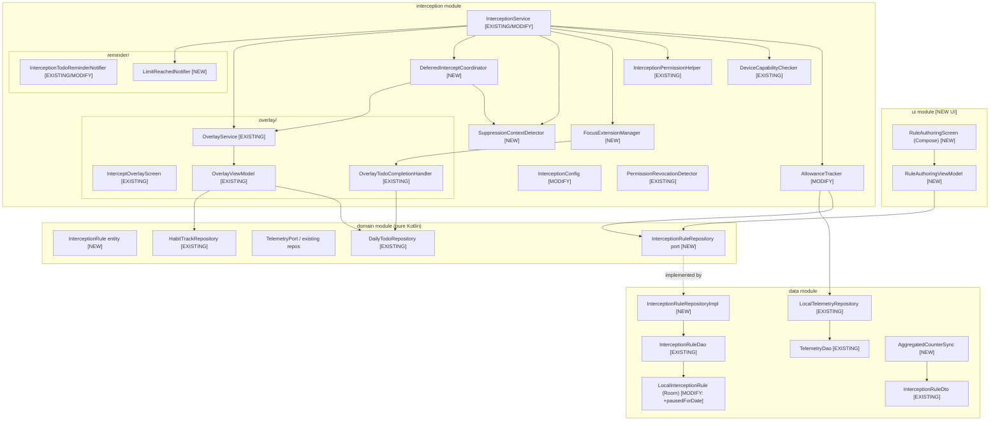
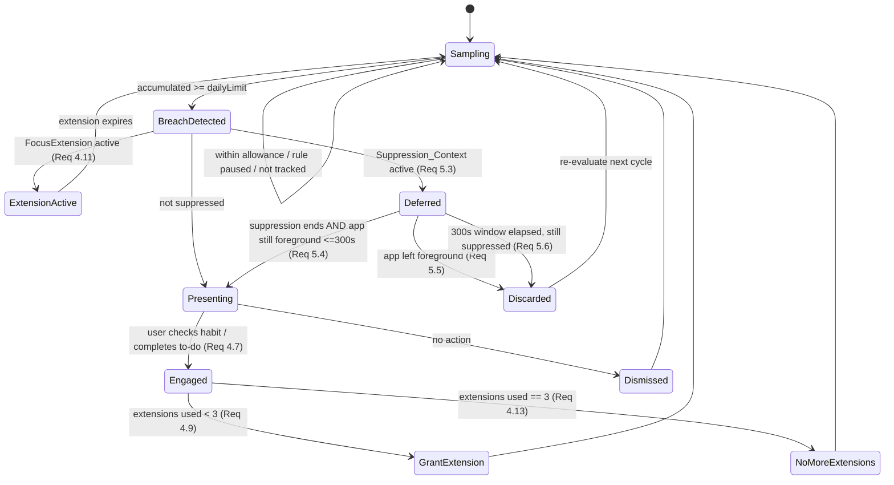

# Design Document: Screen-Time Interception Engine

## Overview

The Screen-Time Interception Engine is an Android-only feature that samples the current foreground app, attributes elapsed time to user-authored monitoring **Rules**, and — when a Rule's daily limit is breached — notifies the user and presents an **Intercept_Screen** surfacing goals, a habit checkpoint, and today's to-dos. Raw per-sample telemetry never leaves the device; only aggregated counters may sync, and only with explicit consent.

A substantial implementation **already exists** in the Android `interception` and `data` modules. This document describes the **actual current architecture**, then explicitly identifies the **gaps** between the refined requirements (Requirements 1–6) and the shipped code. Design components are labeled **[EXISTING]**, **[MODIFY]**, or **[NEW]** so that implementation planning targets real deltas rather than a greenfield rewrite.

### Current state at a glance

| Capability | Requirement(s) | Status |
|---|---|---|
| Foreground sampling loop (foreground service, coroutine `delay()`, 3–30s configurable) | 1.1, 1.2, 4.1 | **[EXISTING]** `InterceptionService`, `InterceptionConfig` |
| Per-app/day accumulation + depletion detection | 1.4, 4.4 | **[EXISTING]** `AllowanceTracker` |
| Midnight reset via injectable `Clock` + timezone | 1.4 (day boundary) | **[EXISTING]** `AllowanceTracker` |
| Android Go detection | 5.1 | **[EXISTING]** `DeviceCapabilityChecker` |
| Permission checks + revocation detection | 1.7, 4.14 | **[EXISTING]** `InterceptionPermissionHelper`, `PermissionRevocationDetector` |
| Full-screen overlay Intercept_Screen | 4.5–4.8 | **[EXISTING]** `overlay/*` |
| Limit-reached notification | 4.4 | **[EXISTING]** `InterceptionTodoReminderNotifier` (see gap: it fires task list, not the single "open Intercept_Screen" action) |
| Rule_Authoring_Screen (list/search/time picker/validation/save/edit/pause/delete) | 2.*, 3.2–3.4, 3.6 | **[NEW]** — no UI exists |
| Domain-layer `InterceptionRule` entity + repository port | 3.1, 3.8, 3.9 | **[NEW]** — rule only exists as Room entity |
| Focus_Extension (grant on action, 1–15 min, 3/day cap, "no extensions left") | 4.9–4.13 | **[NEW]** — only a once-per-day `depletedToday` set exists |
| Suppression_Context detection + 300s deferral state machine | 5.2–5.6 | **[NEW]** — none exists |
| Pause-for-today with midnight auto-resume | 3.5 | **[MODIFY]** — entity has `isActive` but no `pausedForDate` |
| Sampling-interval **reject + retain** semantics | 1.3 | **[MODIFY]** — currently silently clamps via `coerceIn` |
| Persist ≥ once/60s + failure-retry | 1.5, 1.6 | **[MODIFY]** — currently persists every poll, no retry contract |
| Consent-gated aggregated sync + revocation cancel | 6.4, 6.5 | **[NEW]** — local-only store exists, sync flow unspecified |

## Architecture

The feature spans the three required Android Clean Architecture layers. Dependency direction is `ui → domain ← data` and `interception → {domain, data}`. Repository interfaces (ports) live in `domain`; implementations live in `data`. The `interception` module hosts the runtime engine, overlay, and reminders and depends on the domain ports.



### Key architectural decisions

1. **Introduce a domain-owned `InterceptionRule` entity + `InterceptionRuleRepository` port [NEW].** The rule currently lives only as the Room entity `LocalInterceptionRule`, which violates the project's Clean Architecture rule (domain owns entities and repository interfaces; data implements them). All Rule CRUD flows through the domain port, and `user_id` scoping (Requirement 3.8) is enforced at the repository boundary so no query can return or mutate another user's Rule.
2. **Extract Focus_Extension logic into a dedicated `FocusExtensionManager` [NEW]** rather than overloading `AllowanceTracker`. The tracker's current `depletedToday` set implements a coarse once-per-day trigger; the requirement (4.9–4.13) needs grace windows, an action-triggered grant, and a 3/day cap with distinct messaging. Separating this keeps the tracker focused on accumulation and keeps the extension state machine independently testable.
3. **Model Suppression_Context handling as an explicit deferral state machine (`DeferredInterceptCoordinator` [NEW])** driven by `SuppressionContextDetector` [NEW]. The 300s deferral, discard-on-foreground-loss, and discard-on-timeout rules (5.3–5.6) are stateful and safety-critical; an explicit state machine makes each transition testable in isolation.
4. **Keep raw telemetry local-only [EXISTING], add a consent-gated aggregation path [NEW].** `LocalTelemetryRepository` already has no network dependency. A separate `AggregatedCounterSync` component reads aggregated counters (never raw events), gated by a consent flag, and cancels in-flight work on consent revocation (6.4, 6.5).

## Module / Package Layout

```
domain/  (pure Kotlin — no Android deps)
  entity/InterceptionRule.kt                         [NEW]
  entity/FocusExtensionState.kt                      [NEW]
  repository/InterceptionRuleRepository.kt           [NEW port]
  (existing) entity/DailyTodoItem, HabitCheckpoint, GoalProfile, EfficiencyScore
  (existing) repository/DailyTodoRepository, HabitTrackRepository, ChangeLogRepository

data/
  local/entity/LocalEntities.kt                      [MODIFY: LocalInterceptionRule +pausedForDate]
  local/dao/InterceptionRuleDao.kt                   [MODIFY: add pause/list-with-paused queries]
  local/dao/TelemetryDao.kt                          [EXISTING]
  repository/InterceptionRuleRepositoryImpl.kt       [NEW]
  repository/LocalTelemetryRepository.kt             [EXISTING]
  repository/AggregatedCounterSync.kt                [NEW]
  remote/dto/InterceptionRuleDto.kt                  [EXISTING]

interception/
  InterceptionService.kt                             [MODIFY]
  InterceptionConfig.kt                              [MODIFY: reject vs clamp + focusExtension config]
  AllowanceTracker.kt                                [MODIFY: pause skip, 60s persistence, retry]
  FocusExtensionManager.kt                           [NEW]
  SuppressionContextDetector.kt                      [NEW]
  DeferredInterceptCoordinator.kt                    [NEW]
  DeviceCapabilityChecker.kt                         [EXISTING]
  InterceptionPermissionHelper.kt                    [EXISTING]
  PermissionRevocationDetector.kt                    [EXISTING]
  InterceptionContext.kt                             [EXISTING test abstraction]
  overlay/ (OverlayService, InterceptOverlayScreen, OverlayViewModel,
            OverlayUiState, OverlayTodoCompletionHandler)   [EXISTING]
  reminder/ (InterceptionTodoReminderNotifier [MODIFY], ClientReminderEngine,
             AlarmManagerReminderScheduler, ReminderNotificationScheduler, ...)  [EXISTING]
  reminder/LimitReachedNotifier.kt                   [NEW]

ui/  (rule authoring — net new)
  interception/RuleAuthoringScreen.kt                [NEW]
  interception/RuleAuthoringViewModel.kt             [NEW]
  interception/RuleAuthoringUiState.kt               [NEW]
  interception/InstalledAppsProvider.kt              [NEW]
```

## Components and Interfaces

### Existing components (documented as-is)

#### `InterceptionService` **[EXISTING / MODIFY]** — `com.dopashift.interception`
Persistent foreground `Service`. Polls `UsageStatsManager.queryUsageStats` on a coroutine `delay()` loop at `InterceptionConfig.pollIntervalMs`, selects the most-recently-used package (`maxByOrNull { lastTimeUsed }`), and calls `AllowanceTracker.onForegroundDetected(pkg, elapsedSeconds)`. Registers an `OnAllowanceDepleted` listener that starts `OverlayService` and fires `InterceptionTodoReminderNotifier`. Verifies `Settings.canDrawOverlays` each poll; stops self on `SecurityException` or revoked overlay permission. Uses `START_STICKY` and `FOREGROUND_SERVICE_TYPE_SPECIAL_USE` on API 34+. Skips its own package.
**Modifications:** route depletion through `DeferredInterceptCoordinator` (suppression check) and `FocusExtensionManager` (grace/cap) before showing the overlay; emit the limit-reached notification with a single "open Intercept_Screen" action via `LimitReachedNotifier` (Requirement 4.4/4.5).

#### `InterceptionConfig` **[EXISTING / MODIFY]** — `com.dopashift.interception`
`data class(pollIntervalMs: Long = 5000)`; `MIN=3000`, `MAX=30000`; validates range in `init`; `fromSeconds(seconds)` clamps.
**Modifications:** add `focusExtensionMinutes: Int = 5` (constrained 1–15) and a `setSamplingIntervalSeconds()` operation that **rejects** out-of-range values and retains the previous valid value (Requirement 1.3, 4.10) rather than silently clamping.

#### `AllowanceTracker` **[EXISTING / MODIFY]** — `@Singleton`
Accumulates foreground seconds per app/day via `LocalTelemetryRepository`; looks up the Rule via `InterceptionRuleDao.findActiveByPackageName`; compares accumulated vs `dailyAllowanceMinutes * 60`; injectable `java.time.Clock` + `userTimeZone` for midnight reset; `depletedToday` set prevents duplicate triggers per day; `OnAllowanceDepleted` functional listener; `AllowanceStatus` enum `{NOT_TRACKED, WITHIN_ALLOWANCE, DEPLETED}`.
**Modifications:** (a) skip accumulation and interception for a Rule that is paused-for-today (Requirement 3.5); (b) call the Rule lookup through the new `InterceptionRuleRepository` port; (c) satisfy the ≥ once/60s persistence contract and failure-retry (1.5, 1.6) — batch in-memory accumulation and flush at ≥60s with retry-on-next-cycle instead of writing every poll.

#### `DeviceCapabilityChecker` **[EXISTING]** — `@Singleton`
`ActivityManager.isLowRamDevice` → `DeviceSupport.Supported | Unsupported(reason)`. Also has an `InterceptionContext` overload for tests. Satisfies Requirement 5.1 (the 5-second inform-and-disable is enforced at startup in `onStartCommand`).

#### `InterceptionPermissionHelper` **[EXISTING]** — `@Singleton`
Checks `PACKAGE_USAGE_STATS` (`AppOpsManager.OPSTR_GET_USAGE_STATS`) and `SYSTEM_ALERT_WINDOW` (`Settings.canDrawOverlays`); builds Settings intents (`ACTION_USAGE_ACCESS_SETTINGS`, `ACTION_MANAGE_OVERLAY_PERMISSION`); `PermissionStatus(hasUsageStats, hasOverlay)` with `allGranted`. Supports Requirements 1.1, 4.1–4.3.

#### `PermissionRevocationDetector` **[EXISTING]** — `@Singleton, DefaultLifecycleObserver`
Polls permission status every 5s while the activity is resumed; fires a notification + `OnPermissionRevokedListener` on granted→revoked transition; `requiresVisibleOverlayBeforeForegroundService()` returns true on API 35+. Supports Requirements 1.7, 4.14.

#### `overlay/` **[EXISTING]**
`OverlayService` manages a `TYPE_APPLICATION_OVERLAY` window hosting Compose (implements `LifecycleOwner`/`ViewModelStoreOwner`/`SavedStateRegistryOwner`). `InterceptOverlayScreen` renders goals + habit checkpoint + today's to-dos. `OverlayViewModel`/`OverlayUiState` hold state. `OverlayTodoCompletionHandler` completes a to-do and appends a `ChangeLogEntry` through the same pipeline as the normal Daily Tasks screen (Requirement 4.7, 4.8). Satisfies Requirements 4.5–4.8.
**Integration point for [NEW] work:** the overlay must return an **engagement result** (did the user check a habit or complete a to-do?) so `FocusExtensionManager` can decide whether to grant an extension (4.9).

#### `reminder/InterceptionTodoReminderNotifier` **[EXISTING / MODIFY]** — `@Singleton`
Builds an inbox-style notification of the top 5 pending to-dos when allowance depletes.
**Modification (localization gap):** its title/summary strings are currently hardcoded English (e.g., `"You have N pending tasks"`, `"Time's up on your app — tackle these instead"`). These must move to `strings.xml` (en/hi/mr). Additionally, Requirement 4.4 specifies a limit-reached notification offering **a single action to open the Intercept_Screen**; that specific notification is introduced as `LimitReachedNotifier` [NEW], keeping the task-summary notifier as a complementary reminder.

### New components

#### `InterceptionRule` **[NEW]** — `com.dopashift.domain.entity` (pure Kotlin)
Domain entity owning the Rule concept:
```kotlin
data class InterceptionRule(
    val id: UUID,
    val userId: UUID,
    val appPackageName: String,
    val dailyLimitMinutes: Int,      // 1..480 (Req 2.6)
    val enabled: Boolean,            // maps to isActive
    val pausedForDate: LocalDate?,   // non-null => paused for that calendar day (Req 3.5)
    val createdAt: Instant
) {
    init {
        require(dailyLimitMinutes in 1..480) { "daily limit out of range" }
    }
    fun isPausedOn(today: LocalDate): Boolean = pausedForDate == today
}
```

#### `InterceptionRuleRepository` **[NEW port]** — `com.dopashift.domain.repository`
```kotlin
interface InterceptionRuleRepository {
    suspend fun save(userId: UUID, rule: InterceptionRule): Result<Unit>   // create/update
    suspend fun findActiveByPackage(userId: UUID, pkg: String): InterceptionRule?
    suspend fun listForUser(userId: UUID): List<InterceptionRule>
    fun observeForUser(userId: UUID): Flow<List<InterceptionRule>>
    suspend fun updateDailyLimit(userId: UUID, ruleId: UUID, minutes: Int): Result<Unit>
    suspend fun pauseForToday(userId: UUID, ruleId: UUID, today: LocalDate): Result<Unit>
    suspend fun delete(userId: UUID, ruleId: UUID): Result<Unit>
}
```
Every method takes the authenticated `userId` and the implementation cross-checks it against the stored `userId` (Requirement 3.8). CRUD returns `Result` so failures preserve prior state and surface an error (3.9, 6.1).

#### `InterceptionRuleRepositoryImpl` **[NEW]** — `com.dopashift.data.repository`
Implements the port over `InterceptionRuleDao`, mapping `InterceptionRule ↔ LocalInterceptionRule`. All reads/writes filter by `userId`; a write for a `ruleId` whose stored `userId` differs from the caller's is rejected. Writes go to Room first (offline-first); failures return `Result.failure` without mutating state.

#### `FocusExtensionManager` **[NEW]** — `@Singleton` — `com.dopashift.interception`
Owns Focus_Extension state per app per calendar day:
```kotlin
class FocusExtensionManager(private val clock: Clock, private var timeZone: ZoneId) {
    // configurable 1..15 min (Req 4.10), default 5 (Req 4.9)
    fun grantIfEngaged(pkg: String, engaged: Boolean, config: InterceptionConfig): GrantResult
    fun isExtensionActive(pkg: String, now: Instant): Boolean            // Req 4.11
    fun extensionsUsedToday(pkg: String): Int                            // cap 3 (Req 4.12)
    fun canGrantMore(pkg: String): Boolean                              // Req 4.13
}
sealed interface GrantResult {
    data class Granted(val expiresAt: Instant, val remaining: Int) : GrantResult
    data object NoActionRecorded : GrantResult      // engagement not satisfied
    data object CapReached : GrantResult            // 3/day exhausted -> "no extensions left"
}
```
Grants an extension only when at least one action was recorded (4.9), suppresses re-triggering while active (4.11), caps at 3/day (4.12), and signals `CapReached` so the overlay/notification can show the localized "no additional extensions available today" message (4.13). Resets per-app counters at the local midnight boundary (shared clock/timezone with `AllowanceTracker`).

#### `SuppressionContextDetector` **[NEW]** — `com.dopashift.interception`
Detects an active Suppression_Context (Requirement 5.2): active call (`TelephonyManager` call state / `AudioManager.MODE_IN_CALL`), active navigation (nav app foreground / ongoing navigation notification signal), ringing alarm or timer, and the emergency dialer. Exposes `fun isSuppressed(now: Instant): SuppressionResult` where `SuppressionResult` names the active context (for logging/telemetry) or `None`. Per **OQ-3**, third-party video-call apps are explicitly out of scope for v1; only `TelephonyManager`/system navigation/alarm signals are used.

#### `DeferredInterceptCoordinator` **[NEW]** — `com.dopashift.interception`
Implements the deferral state machine (Requirements 5.3–5.6). When a breach occurs while suppressed, it defers presentation up to 300s, re-checks on each monitoring cycle, presents within 2s once suppression ends **and** the Monitored_App is still foreground (5.4), discards if the app left the foreground (5.5), and discards + re-evaluates if the 300s window elapses while still suppressed (5.6). See the state machine diagram below.

#### `LimitReachedNotifier` **[NEW]** — `com.dopashift.interception.reminder`
Posts the limit-reached notification (Requirement 4.4) with a single action (PendingIntent) that opens the Intercept_Screen for the associated app (4.5). Localized strings.

#### `RuleAuthoringScreen` / `RuleAuthoringViewModel` / `RuleAuthoringUiState` / `InstalledAppsProvider` **[NEW]** — `ui`
The Rule_Authoring_Screen (Requirement 2 in full, plus 3.2–3.4, 3.6). Lists installed launchable apps with icon + label, sorted alphabetically (2.1); excludes system-critical apps — this app, launcher, dialer, settings (2.8); case-insensitive search with empty-result state preserving selections (2.2, 2.3); per-app time picker defaulting to 30 whole minutes, constrained 1–480, rejecting invalid entries and retaining the last valid value with a range message (2.5–2.7); save requires ≥1 app each with a valid limit (2.9, 2.10). Displays existing Rules with limit and enabled/paused state (3.2), edits persist within 2s (3.3), invalid edits are rejected with the prior value retained (3.4), delete requires confirmation (3.6). All strings localized (en/hi/mr).

## Data Models

### `LocalInterceptionRule` (Room) **[MODIFY]** — table `interception_rules`
Existing fields: `id`, `userId`, `goalId?`, `appPackageName?`, `siteDomain?`, `dailyAllowanceMinutes`, `isActive = true`, `createdAt`; indexed on `userId`.
**Add:** `pausedForDate: String?` (ISO `LocalDate`; non-null means the Rule is paused for that calendar day — Requirement 3.5). Requires a Flyway-equivalent Room migration (schema version bump + `ALTER TABLE interception_rules ADD COLUMN pausedForDate TEXT`).

### `InterceptionRule` (domain) **[NEW]**
As defined above — the pure-Kotlin source of truth. `dailyLimitMinutes` maps to `dailyAllowanceMinutes`, `enabled` to `isActive`, `pausedForDate` one-to-one.

### `LocalTelemetryEvent` (Room) **[EXISTING]** — table `telemetry_events`
`id`, `appPackageName`, `foregroundSeconds`, `date` (ISO `LocalDate`), `recordedAt`. Local-only; never transmitted (Requirements 6.2, 6.3). 90-day retention via `deleteOlderThan`.

### Focus_Extension state **[NEW]** (in-memory in `FocusExtensionManager`)
```kotlin
data class FocusExtensionState(
    val packageName: String,
    val date: LocalDate,
    val extensionsGranted: Int,          // 0..3
    val activeUntil: Instant?            // null when no active extension
)
```
Held in memory (extensions are ephemeral, day-scoped); reset at midnight. No sync.

### Aggregated sync payload **[NEW]**
`AggregatedCounterSync` sends only aggregated counts / diagnostic summaries derived from telemetry (never `LocalTelemetryEvent` rows), reusing `InterceptionRuleDto` for rule metadata. Gated by a consent flag stored in DataStore (Requirements 6.4, 6.5).

## State Machine: Interception & Deferral




## Error Handling

| Failure | Handling | Requirement |
|---|---|---|
| Room write fails (Rule CRUD or counter flush) | Repository returns `Result.failure`; prior persisted state untouched; UI surfaces a localized error indication; caller may retry | 3.9, 6.1 |
| Telemetry persistence flush fails | `AllowanceTracker` keeps the in-memory accumulated value and retries on the next flush cycle (no data loss, no double-count) | 1.6 |
| Usage-access / overlay / notification permission revoked at runtime | Detected within the poll cycle (`Settings.canDrawOverlays` per poll) and by `PermissionRevocationDetector` (≤5s); service stops sampling / stops foreground and fires a localized notification | 1.7, 4.14 |
| `SecurityException` during `queryUsageStats` | Caught in the poll loop; service stops itself | 1.7 |
| Android Go / low-RAM device | `DeviceCapabilityChecker` returns `Unsupported`; service refuses to start and informs the user within 5s; interception disabled | 5.1 |
| Suppression_Context active at breach | Presentation deferred (never shown while suppressed); discarded on timeout or foreground loss | 5.2–5.6 |
| Cross-user Rule access attempt | Repository rejects: read returns null, write returns `Result.failure`; owner's data unchanged | 3.8 |
| Invalid sampling interval requested | Rejected; previous valid interval retained (no silent clamp) | 1.3 |
| Invalid daily limit entered/edited | Rejected; last valid value retained; localized range message shown | 2.7, 3.4 |
| Focus_Extension cap reached | `GrantResult.CapReached`; Intercept_Screen still presented; localized "no extensions left today" message | 4.13 |
| Overlay window `addView` fails | Caught; `OverlayService` stops itself (fails safe — no crash, no stuck window) | 4.5 |

All exceptions are logged via Timber; secret/PII redaction is handled at the logging-framework level per project security rules (no telemetry package names or user IDs logged at info level in plaintext where avoidable).

## Localization

All user-facing strings live in `res/values/strings.xml` (en) with matching `res/values-hi/` and `res/values-mr/` entries, per the project localization rules. Missing translations fall back to English; no raw keys or blank strings are ever rendered. Backend-generated text is out of scope (this is an on-device feature). User-entered content (none here — Rules reference app packages, not free text) would be stored as entered.

Strings requiring localization (all must be added to en/hi/mr in the same change):
- Rule_Authoring_Screen: title, search hint, empty-result message, time-picker label, "1–480 whole minutes" range message, save success, "at least one app with a valid daily limit is required" message, delete confirmation.
- Permission rationale (Requirement 4.3) and permission-revoked notification.
- Limit-reached notification (`LimitReachedNotifier`) title/text and the open-Intercept action label (Requirement 4.4).
- Intercept_Screen section headers (goals, habit checkpoint, today's to-dos) and action labels.
- "No additional Focus Extensions available today" message (Requirement 4.13).
- Android Go "features unavailable" message (Requirement 5.1).

**Localization gap flagged in existing code:** `InterceptionTodoReminderNotifier` currently hardcodes English strings (`"You have N pending tasks"`, `"Time's up on your app — tackle these instead"`). These must be migrated to `strings.xml` resources across all three locales as part of this feature. `PermissionRevocationDetector` similarly hardcodes its notification text and must be localized.

## Security & Privacy

- **User scoping (Requirement 3.8):** Every Rule operation flows through `InterceptionRuleRepository`, which takes the authenticated `userId` and cross-checks it against each row's stored `userId`. No operation accepts a client-supplied ID alone. `InterceptionRuleDao.findActiveByUserId(userId)` already scopes list reads; per-id operations gain the same cross-check in the repository implementation.
- **Raw telemetry stays on-device (Requirements 1.8, 1.9, 6.2, 6.3):** `LocalTelemetryRepository` has no network dependency by design. `AggregatedCounterSync` reads only aggregated counts/diagnostic summaries and is structurally prevented from referencing raw `LocalTelemetryEvent` rows.
- **Consent-gated sync (Requirements 6.4, 6.5):** Aggregated sync only runs when the user's consent flag (DataStore) is true. On revocation, in-flight and queued sync work is cancelled immediately and no further sync occurs until consent is re-granted.
- **Auth:** Identity comes from the app's existing Keycloak/OIDC session; this feature introduces no custom auth.
- **Permissions:** `PACKAGE_USAGE_STATS` and `SYSTEM_ALERT_WINDOW` are user-granted via Settings only (never silently), with a rationale shown first (4.3).

## Testing Strategy

The project uses **Kotest** for property-based testing (existing PBT tests: `AllowanceDepletionPropertyTest`, `MidnightAllowanceResetPropertyTest`, `OverlayEngagementPropertyTest`) alongside JUnit-style unit tests and instrumented tests. This feature is **suitable for PBT**: the accumulation, validation, extension-cap, and deferral logic are pure(ish) functions over generated inputs with clear invariants. UI rendering (Rule_Authoring_Screen, overlay layout), system-service integration (UsageStatsManager, permission grants), and one-shot notification wiring are **not** PBT candidates and use unit/instrumented/wiring tests instead.

**Dual approach:**
- **Property tests (Kotest, ≥100 iterations each):** accumulation monotonicity, interval integrity, limit validation, save/load round-trip, pause-for-today, delete-stops-accumulation, user-scoping isolation, overlay change-log equivalence, Focus_Extension grant/cap/active-window, suppression safety, deferral timing, aggregated-sync payload purity, consent revocation. Each test is tagged `// Feature: screen-time-interception-engine, Property {N}: {text}` and references its design property.
- **Unit / example tests:** config defaults, time-picker default (30), empty-search state, delete confirmation gate, notification content and single action, permission-rationale ordering, Settings intent actions.
- **Instrumented / wiring tests (existing `InterceptionIntegrationTest`, `InterceptionServiceWiringTest`):** foreground-service lifecycle, permission-revocation stop behavior, Android Go refusal, `UsageStatsManager` polling, overlay window display.
- **Fakes (existing `TestFakes`):** in-memory rule/telemetry repositories, injectable `Clock` + `ZoneId`, `InterceptionContext` fake for permission/low-RAM simulation, fault-injecting repository for failure paths.

Property tests use the injectable `java.time.Clock` and `userTimeZone` already present in `AllowanceTracker` (and mirrored in `FocusExtensionManager`) to make time-dependent properties (midnight reset, extension expiry, 300s deferral) deterministic. JaCoCo coverage gate (80%) applies.

## Correctness Properties

*A property is a characteristic or behavior that should hold true across all valid executions of a system — essentially, a formal statement about what the system should do. Properties serve as the bridge between human-readable specifications and machine-verifiable correctness guarantees.*

### Property 1: Accumulation equals the sum of increments (monotonic)
*For any* tracked app and any sequence of foreground poll increments within a single calendar day, the accumulated foreground seconds equals the sum of those increments and is non-decreasing across the sequence.
**Validates: Requirements 1.4**

### Property 2: Sampling interval integrity (reject and retain)
*For any* current valid sampling interval and *any* requested interval outside 3000–30000 ms, the effective stored interval remains unchanged (equal to the prior valid value); *for any* requested interval within range, the effective interval equals the request.
**Validates: Requirements 1.2, 1.3**

### Property 3: Persistence cadence and failure retention
*For any* poll timeline spanning at least 60 seconds, at least one persistence flush occurs; and *for any* accumulated value whose flush fails, the in-memory value is preserved unchanged and a flush is re-attempted on the next cycle.
**Validates: Requirements 1.5, 1.6**

### Property 4: Installed-app list is sorted and complete, excluding critical apps
*For any* set of installed launchable apps, the Rule_Authoring_Screen list is a case-insensitive alphabetical ordering by label containing exactly the launchable apps minus the system-critical packages (this app, launcher, dialer, settings).
**Validates: Requirements 2.1, 2.8**

### Property 5: Search filters to case-insensitive label matches
*For any* set of apps and *any* search query, the filtered result set equals exactly the apps whose label contains the query under case-insensitive matching.
**Validates: Requirements 2.2**

### Property 6: Daily-limit validation (accept in range, reject-and-retain otherwise)
*For any* prior valid daily limit and *any* candidate value (on either the create or the edit path), the value is accepted only if it is a whole number in 1–480 minutes; otherwise it is rejected and the stored limit remains equal to the prior valid value.
**Validates: Requirements 2.6, 2.7, 3.4**

### Property 7: Save requires at least one app with a valid limit
*For any* proposed selection, the save succeeds and persists exactly the selected rules if and only if there is at least one selected app and every selected app has a valid daily limit; otherwise the persisted store is unchanged.
**Validates: Requirements 2.9, 2.10**

### Property 8: Rule persistence round-trip
*For any* valid `InterceptionRule`, saving it and then reloading it (via find/list) returns an equivalent rule preserving package, daily limit, enabled/paused state, and created_at.
**Validates: Requirements 3.1, 3.2, 3.3**

### Property 9: Pause-for-today suppresses then auto-resumes
*For any* Rule paused for calendar day D, while the device local date equals D the engine attributes no accumulation and triggers no interception for that Rule; for any local date after D the Rule behaves as enabled.
**Validates: Requirements 3.5**

### Property 10: Deleting a Rule stops accumulation
*For any* Rule, after it is deleted, subsequent foreground detections for its package are reported as not tracked and add no further accumulated time.
**Validates: Requirements 3.7**

### Property 11: User scoping isolation
*For any* two distinct users u1 and u2 and *any* Rule owned by u1, every read/update/delete/pause operation issued as u2 returns empty/failure and leaves u1's Rule unchanged.
**Validates: Requirements 3.8**

### Property 12: Local-store write failures preserve prior state
*For any* Rule or counter write whose underlying store operation fails, the prior persisted state is preserved and a failure result (surfacing an error indication) is returned.
**Validates: Requirements 3.9, 6.1**

### Property 13: Intercept_Screen content completeness
*For any* user data state, the Intercept_Screen UI state includes the user's goals, a habit checkpoint, and today's to-dos.
**Validates: Requirements 4.6**

### Property 14: Overlay action uses the same pipeline as normal completion
*For any* to-do completed from the Intercept_Screen, the resulting persisted state and appended change-log entry are equivalent to completing the same to-do from the standard Daily Tasks screen.
**Validates: Requirements 4.8**

### Property 15: Focus_Extension granted only on recorded engagement
*For any* depletion event and *any* engagement flag, a Focus_Extension is granted if and only if at least one action was recorded (and the daily cap is not yet reached), with expiry equal to the depletion time plus the configured duration.
**Validates: Requirements 4.9**

### Property 16: Focus_Extension duration bounds
*For any* requested Focus_Extension duration, the effective configured duration is accepted only if it is within 1–15 minutes inclusive; otherwise it is rejected and the prior valid duration is retained.
**Validates: Requirements 4.10**

### Property 17: Active extension suppresses re-triggering
*For any* Focus_Extension granted at time t0 with duration d, for all times in the half-open interval [t0, t0+d) the Intercept_Screen is suppressed for that app, and at t0+d it is no longer suppressed on that account.
**Validates: Requirements 4.11**

### Property 18: Extension cap never exceeds three per day, with cap signalling
*For any* number of engaged depletion events for an app within a single calendar day, the count of granted extensions never exceeds 3; the fourth engaged depletion yields a cap-reached outcome (no new grant) while the Intercept_Screen is still presented.
**Validates: Requirements 4.12, 4.13**

### Property 19: Never present the Intercept_Screen during a Suppression_Context
*For any* breach that occurs while any Suppression_Context is active, the interception state never transitions to Presenting for as long as the suppression remains active.
**Validates: Requirements 5.2**

### Property 20: Deferral holds up to the window bound
*For any* breach at time t0 while suppressed, the intercept remains deferred (not presented) for all times in [t0, min(suppression-end, t0+300s)).
**Validates: Requirements 5.3**

### Property 21: Deferred intercept presents only when suppression clears in time and app is foreground
*For any* deferred intercept, it transitions to Presenting on the next cycle after suppression ends if and only if the elapsed time is ≤ 300s and the Monitored_App is still in the foreground; if the app is no longer foreground, or the 300s window elapses while still suppressed, the intercept is discarded without presenting.
**Validates: Requirements 5.4, 5.5, 5.6**

### Property 22: Aggregated sync payload contains no raw telemetry
*For any* telemetry and rule state with consent granted, the produced sync payload contains only aggregated counts / diagnostic summaries and no raw per-sample telemetry rows.
**Validates: Requirements 6.3, 6.4**

### Property 23: Consent revocation cancels sync and halts further syncing
*For any* in-flight or queued aggregated sync, setting consent to revoked cancels that work and causes all subsequent sync attempts to be no-ops until consent is re-granted.
**Validates: Requirements 6.5**

## Requirements Traceability

| Requirement (AC) | Design component(s) | Status |
|---|---|---|
| 1.1 sample at configurable interval, default 5s | `InterceptionService` poll loop, `InterceptionConfig` | EXISTING |
| 1.2 constrain interval 3–30s | `InterceptionConfig` | MODIFY (Property 2) |
| 1.3 reject out-of-range, retain previous | `InterceptionConfig.setSamplingIntervalSeconds` | MODIFY (Property 2) |
| 1.4 attribute elapsed time per day | `AllowanceTracker`, `LocalTelemetryRepository` | EXISTING (Property 1) |
| 1.5 persist ≥ once/60s | `AllowanceTracker` flush cadence | MODIFY (Property 3) |
| 1.6 retain + retry on persistence failure | `AllowanceTracker` | MODIFY (Property 3) |
| 1.7 usage-access revoked → stop + notify | `InterceptionService`, `PermissionRevocationDetector` | EXISTING |
| 1.8 raw telemetry on-device only | `LocalTelemetryRepository` | EXISTING |
| 1.9 exclude telemetry from transmission | `LocalTelemetryRepository`, `AggregatedCounterSync` | EXISTING + NEW (Property 22) |
| 2.1 list apps sorted by label | `RuleAuthoringViewModel`, `InstalledAppsProvider` | NEW (Property 4) |
| 2.2 case-insensitive search filter | `RuleAuthoringViewModel` | NEW (Property 5) |
| 2.3 empty-result state, retain selections | `RuleAuthoringScreen` | NEW |
| 2.4 select 0..N apps | `RuleAuthoringViewModel` | NEW |
| 2.5 time picker, default 30 min | `RuleAuthoringScreen` | NEW |
| 2.6 constrain limit 1–480 | `RuleAuthoringViewModel`, `InterceptionRule.init` | NEW (Property 6) |
| 2.7 reject invalid limit, retain + message | `RuleAuthoringViewModel` | NEW (Property 6) |
| 2.8 exclude system-critical apps | `InstalledAppsProvider` | NEW (Property 4) |
| 2.9 confirm valid selection → persist + success | `RuleAuthoringViewModel`, `InterceptionRuleRepository` | NEW (Property 7) |
| 2.10 block invalid save, retain + message | `RuleAuthoringViewModel` | NEW (Property 7) |
| 3.1 persist Rule fields | `InterceptionRuleRepositoryImpl`, `LocalInterceptionRule` | NEW impl over EXISTING DAO (Property 8) |
| 3.2 display Rule fields + state | `RuleAuthoringScreen` | NEW (Property 8) |
| 3.3 edit valid limit persist ≤2s | `InterceptionRuleRepository.updateDailyLimit` | NEW (Property 8) |
| 3.4 reject invalid edit, retain + error | `RuleAuthoringViewModel` | NEW (Property 6) |
| 3.5 pause for today → suppress + auto-resume | `LocalInterceptionRule.pausedForDate`, `AllowanceTracker` skip | MODIFY (Property 9) |
| 3.6 delete requires confirmation | `RuleAuthoringScreen` | NEW |
| 3.7 deleted Rule stops accumulation ≤1 interval | `AllowanceTracker`, `InterceptionRuleRepository` | MODIFY (Property 10) |
| 3.8 scope CRUD to user_id, no cross-user | `InterceptionRuleRepositoryImpl` | NEW (Property 11) |
| 3.9 CRUD failure preserves state + error | `InterceptionRuleRepositoryImpl` | NEW (Property 12) |
| 4.1 foreground service while enabled + granted | `InterceptionService` | EXISTING |
| 4.2 open USAGE_STATS grant screen | `InterceptionPermissionHelper` | EXISTING |
| 4.3 rationale before grant screen | `RuleAuthoringScreen` / permission flow | NEW |
| 4.4 breach → limit-reached notification, single action | `LimitReachedNotifier` | NEW |
| 4.5 tap notification → Intercept_Screen | `LimitReachedNotifier` PendingIntent, `OverlayService` | NEW + EXISTING |
| 4.6 Intercept_Screen shows goals/habit/todos | `InterceptOverlayScreen`, `OverlayViewModel` | EXISTING (Property 13) |
| 4.7 record habit-check / to-do actions | `InterceptOverlayScreen`, `OverlayTodoCompletionHandler` | EXISTING |
| 4.8 recorded action → same local pipeline | `OverlayTodoCompletionHandler`, `ChangeLogRepository` | EXISTING (Property 14) |
| 4.9 ≥1 action → grant extension default 5 min | `FocusExtensionManager` | NEW (Property 15) |
| 4.10 extension duration 1–15 min | `InterceptionConfig`, `FocusExtensionManager` | NEW (Property 16) |
| 4.11 active extension suppresses re-trigger | `FocusExtensionManager`, `DeferredInterceptCoordinator` | NEW (Property 17) |
| 4.12 cap 3 extensions/app/day | `FocusExtensionManager` | NEW (Property 18) |
| 4.13 after 3 → present without extension + notice | `FocusExtensionManager` (CapReached), Intercept_Screen | NEW (Property 18) |
| 4.14 USAGE_STATS/notification revoked → stop + notify | `InterceptionService`, `PermissionRevocationDetector` | EXISTING |
| 5.1 Android Go → inform ≤5s + disable | `DeviceCapabilityChecker`, `InterceptionService` | EXISTING |
| 5.2 suppress Intercept_Screen during Suppression_Context | `SuppressionContextDetector`, `DeferredInterceptCoordinator` | NEW (Property 19) |
| 5.3 defer up to 300s | `DeferredInterceptCoordinator` | NEW (Property 20) |
| 5.4 suppression ends + foreground → present ≤2s | `DeferredInterceptCoordinator` | NEW (Property 21) |
| 5.5 suppression ends + not foreground → discard | `DeferredInterceptCoordinator` | NEW (Property 21) |
| 5.6 300s elapsed still suppressed → discard + re-eval | `DeferredInterceptCoordinator` | NEW (Property 21) |
| 6.1 write to Local_Store, failure preserves + error | `InterceptionRuleRepositoryImpl`, `LocalTelemetryRepository` | NEW + EXISTING (Property 12) |
| 6.2 retain raw telemetry on-device | `LocalTelemetryRepository` | EXISTING |
| 6.3 exclude telemetry from remote transmission | `LocalTelemetryRepository`, `AggregatedCounterSync` | EXISTING + NEW (Property 22) |
| 6.4 consent → sync aggregated only, never raw | `AggregatedCounterSync`, consent flag (DataStore) | NEW (Property 22) |
| 6.5 revoke consent → cancel in-flight + cease | `AggregatedCounterSync` | NEW (Property 23) |

### Open questions carried from requirements

- **OQ-1:** Focus_Extension cap fixed at 3/day, non-configurable for v1 (extension *duration* is configurable 1–15 min; the *count* is not). Reflected in `FocusExtensionManager`.
- **OQ-2:** App "productive vs distracting" classification for the Efficiency_Score is out of scope for this engine's design; it belongs to the parent Efficiency_Score spec. This engine's Rule data is the intended input signal.
- **OQ-3:** Suppression_Context uses `TelephonyManager`/system navigation/alarm signals only; third-party video-call apps are out of scope for v1 (`SuppressionContextDetector` documents this limitation).
